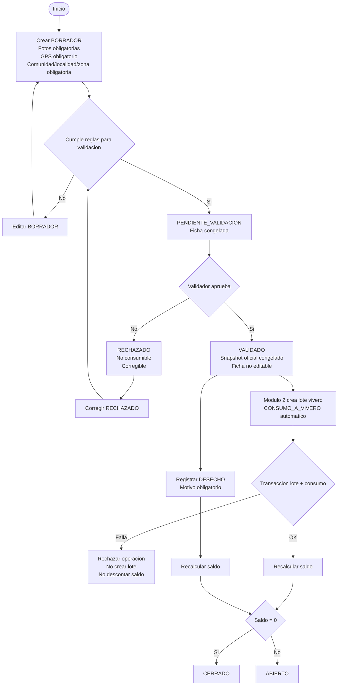
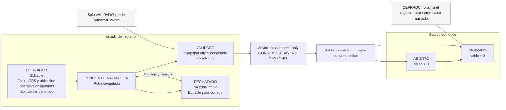

# Flujo Operativo - Modulo 1: Recoleccion

## 1. Proposito operativo

El modulo Recoleccion registra el origen del material biologico y crea el lote origen que alimenta al Modulo 2 - Vivero.

El objetivo operativo es:

- crear un lote origen confiable,
- registrar evidencia fotografica y ubicacion estructurada,
- revisar formalmente el registro antes de habilitar consumo,
- controlar el saldo disponible del lote origen,
- mantener trazabilidad entre Recoleccion y Vivero.

En este modulo no se gestionan plantas vivas; eso empieza en Vivero.

## 2. Conceptos minimos

### Recoleccion como lote origen

Una recoleccion representa el lote origen de semillas o esquejes. Puede abastecer uno o varios lotes de Vivero siempre que cada consumo quede registrado como movimiento de saldo.

### Estado del registro vs estado operativo

El modulo separa dos estados:

- Estado del registro: `BORRADOR`, `PENDIENTE_VALIDACION`, `VALIDADO`, `RECHAZADO`.
- Estado operativo: `ABIERTO` o `CERRADO`, derivado del saldo.

`ABIERTO` y `CERRADO` no se eligen manualmente.

### Snapshot oficial

Los snapshots de identidad existen desde `BORRADOR`. En `BORRADOR` y `RECHAZADO` pueden recalcularse desde fuentes vivas. Al aprobar la validacion quedan congelados como identidad oficial y no se recalculan.

Snapshots minimos:

- `nombre_cientifico_snapshot`
- `nombre_comercial_snapshot`
- `variedad_snapshot`
- `nombre_comunidad_snapshot`
- `nombre_recolector_snapshot`

### Saldo

El saldo se conserva con la regla:

```text
saldo_actual = cantidad_inicial + SUM(delta_movimientos)
```

El sistema no permite saldo negativo. Si el saldo llega a 0, el estado operativo pasa a `CERRADO`.

### Movimiento de inventario

`RECOLECCION_MOVIMIENTO` registra solo operaciones que afectan saldo.

Movimientos activos en MVP:

- `CONSUMO_A_VIVERO`
- `DESECHO`

Fuera del MVP:

- `CORRECCION`

`CORRECCION` puede evaluarse como posibilidad futura, pero no es una accion disponible del MVP y no habilita edicion de recolecciones validadas.

### Integracion con Vivero

Vivero solo puede consumir una recoleccion `VALIDADO`, `ABIERTO` y con saldo suficiente. La creacion del lote de vivero y el descuento del saldo deben ocurrir en una misma transaccion logica: si una parte falla, la otra no se persiste.

## 3. Flujo principal del modulo

### 3.1 Crear BORRADOR

Una recoleccion nace siempre en `BORRADOR`.

Datos minimos para guardar:

- fecha de recoleccion obligatoria, no futura y maximo 45 dias retroactiva,
- tipo de material: `SEMILLA` o `ESQUEJE`,
- especie desde catalogo,
- metodo de recoleccion desde catalogo,
- cantidad inicial mayor a 0,
- unidad canonica derivada: `G` o `UNIDAD`,
- recolector,
- vivero de almacenamiento,
- latitud valida,
- longitud valida,
- comunidad/localidad/zona valida por catalogo o valor controlado permitido,
- minimo 1 foto de Lugar,
- minimo 1 foto de Total recolectado.

No se permite guardar un borrador sin evidencia minima ni ubicacion minima. Pais puede tener valor por defecto `BOLIVIA`; departamento y provincia pueden existir como estructura administrativa si estan en catalogo.

### 3.2 Completar evidencia y ubicacion

Mientras la ficha esta en `BORRADOR` o `RECHAZADO`, el usuario puede corregir datos, fotos y ubicacion.

Reglas de evidencia:

- Lugar: minimo 1 foto, maximo 5.
- Total recolectado: minimo 1 foto, maximo 5.
- Formatos permitidos: JPG y PNG.
- Tamano maximo por foto: 5 MB.

Reglas de ubicacion:

- `latitud` en rango `[-90, 90]` con 6 decimales.
- `longitud` en rango `[-180, 180]` con 6 decimales.
- `comunidad`, `localidad` o `zona` es obligatoria.
- Si comunidad/localidad/zona no existe en catalogo, no se inventa como texto libre; se resuelve por catalogo o por valor controlado permitido por el sistema.

### 3.3 Solicitar validacion

Puede solicitar validacion un registro en `BORRADOR` o `RECHAZADO` si cumple las reglas minimas.

Al solicitar validacion:

- el estado pasa a `PENDIENTE_VALIDACION`,
- se registra `SOLICITUD_VALIDACION` en `RECOLECCION_HISTORIAL`,
- la ficha queda congelada mientras se revisa.

### 3.4 Aprobar o rechazar validacion

El `VALIDADOR` revisa registros en `PENDIENTE_VALIDACION`.

Si aprueba:

- el estado pasa a `VALIDADO`,
- se registran `usuario_validacion` y `fecha_validacion`,
- se registra `VALIDACION_APROBADA`,
- se congelan los snapshots oficiales,
- el registro queda compatible con anclaje blockchain,
- la ficha deja de ser editable.

Si rechaza:

- el estado pasa a `RECHAZADO`,
- se registra `VALIDACION_RECHAZADA`,
- el registro no puede alimentar Vivero,
- la ficha puede corregirse y reenviarse a validacion.

### 3.5 Consumo automatico desde Vivero

El consumo hacia Vivero no es una accion manual del modulo Recoleccion. Ocurre cuando el Modulo 2 crea un lote de vivero usando una recoleccion como origen.

Condiciones:

- `estado_registro = VALIDADO`,
- `estado_operativo = ABIERTO`,
- saldo suficiente,
- unidad del consumo igual a la unidad canonica de la recoleccion,
- snapshots oficiales ya congelados.

Efecto:

- se crea el lote de vivero,
- se registra `CONSUMO_A_VIVERO` con delta negativo,
- se descuenta saldo,
- se enlaza `recoleccion_id -> lote_vivero_id`,
- el lote de vivero hereda los snapshots oficiales de Recoleccion.

El lote de vivero selecciona su propio `vivero_id`; no lo hereda automaticamente desde `RECOLECCION.vivero_id`.

### 3.6 Desecho parcial o total

`DESECHO` registra una perdida real del lote origen.

Debe incluir:

- cantidad descartada,
- delta negativo,
- unidad igual a la unidad canonica de la recoleccion,
- motivo obligatorio,
- usuario y fecha/hora del movimiento.

Si el desecho deja el saldo en 0, el estado operativo pasa a `CERRADO`.

## 4. Diagrama del flujo principal



## 5. Maquina de estados



## 6. Reglas bloqueantes para implementacion

- Toda recoleccion nace en `BORRADOR`.
- `BORRADOR` requiere evidencia minima, latitud, longitud y comunidad/localidad/zona desde la creacion.
- Solo `VALIDADO` puede alimentar Vivero.
- `PENDIENTE_VALIDACION` congela la ficha.
- `RECHAZADO` no habilita consumo, pero permite corregir y reenviar.
- `VALIDADO` no permite editar la ficha.
- Soft delete solo se permite en `BORRADOR`.
- La persistencia oficial de unidades es solo `UNIDAD` y `G`.
- `kg` solo puede existir como input; nunca se persiste.
- `ESQUEJE` solo admite `UNIDAD`, entero estricto y sin decimales.
- `SEMILLA` puede persistirse en `G` o `UNIDAD`.
- El saldo nunca puede quedar negativo.
- `CONSUMO_A_VIVERO` y `DESECHO` usan delta negativo.
- La creacion del lote de vivero y el consumo de recoleccion deben ser atomicos.

## 7. Acciones minimas del modulo

- Crear borrador.
- Editar borrador.
- Eliminar borrador con soft delete.
- Consultar detalle.
- Listar por estado.
- Solicitar validacion.
- Aprobar validacion.
- Rechazar validacion.
- Registrar desecho.
- Consultar historial.
- Consultar movimientos de saldo.

## 8. Enums funcionales del modulo

- `estado_registro_recoleccion = [BORRADOR, PENDIENTE_VALIDACION, VALIDADO, RECHAZADO]`
- `estado_operativo_recoleccion = [ABIERTO, CERRADO]`
- `tipo_material_origen = [SEMILLA, ESQUEJE]`
- `unidad_medida = [UNIDAD, G]`
- `tipo_historial_recoleccion = [BORRADOR_CREADO, SOLICITUD_VALIDACION, VALIDACION_APROBADA, VALIDACION_RECHAZADA, BORRADOR_ELIMINADO]`
- `tipo_movimiento_recoleccion = [CONSUMO_A_VIVERO, DESECHO]`

Movimientos activos en MVP:

- `CONSUMO_A_VIVERO`
- `DESECHO`

Fuera del MVP:

- `CORRECCION`

No documentar otros movimientos como acciones operativas del modulo.

## 9. Casos borde operativos

- Intentar consumir una recoleccion no validada: rechazar.
- Intentar consumir una recoleccion cerrada: rechazar.
- Intentar consumir mas saldo del disponible: rechazar.
- Intentar editar una recoleccion validada: rechazar.
- Intentar eliminar una recoleccion que no esta en `BORRADOR`: rechazar.
- Intentar solicitar validacion sin fotos minimas: rechazar.
- Intentar solicitar validacion sin latitud o longitud: rechazar.
- Intentar solicitar validacion sin comunidad/localidad/zona valida: rechazar.
- Intentar registrar `ESQUEJE` con decimal: rechazar.
- Intentar persistir `kg`: rechazar.
- Intentar mezclar `G` y `GR`: rechazar.
- Intentar registrar movimiento con unidad distinta a la unidad canonica: rechazar.
- Si falla la creacion del lote de vivero: no descontar saldo.
- Si falla el descuento de saldo: no crear lote de vivero.

## 10. Lectura rapida del historial

El timeline minimo del modulo se interpreta asi:

- `RECOLECCION.created_at`: momento de creacion del borrador.
- `RECOLECCION_HISTORIAL`: ciclo de vida del registro, incluyendo solicitud, aprobacion, rechazo y soft delete.
- `RECOLECCION.fecha_validacion`: momento materializado de aprobacion.
- `RECOLECCION_MOVIMIENTO.created_at`: consumos hacia Vivero y desechos.

`RECOLECCION_HISTORIAL` no reemplaza los movimientos de saldo, y `RECOLECCION_MOVIMIENTO` no debe usarse como historial general de edicion.
