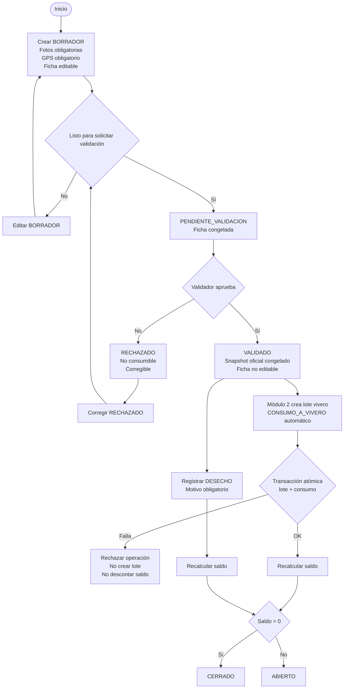
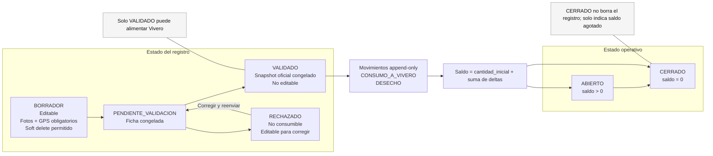

# Diagramas — Módulo 1 Recolección

Estos diagramas resumen el flujo principal y la separación entre estado del registro y estado operativo. Las reglas canónicas viven en `01_reglas_de_negocio_recoleccion.md`.

## 1. Flujo principal

## 2. Máquina de estados

