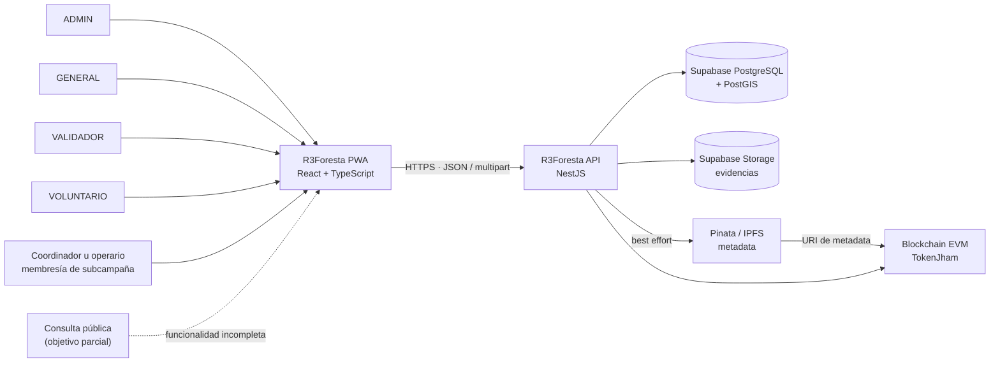
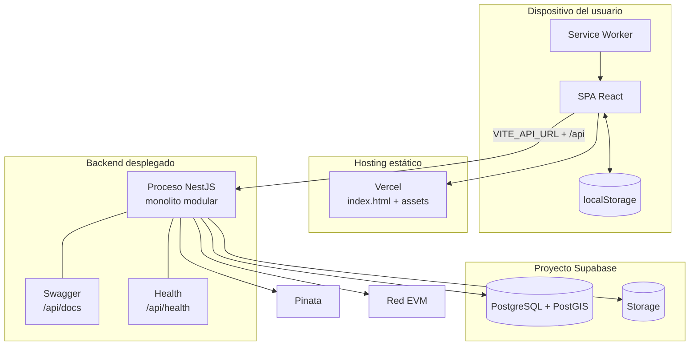
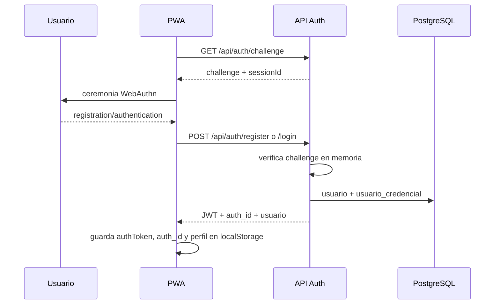
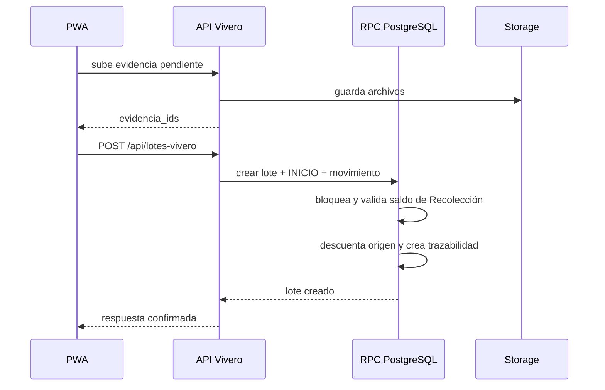

# Arquitectura integral — R3Foresta

> Estado observado: 2026-07-23.
>
> Esta revisión contrasta los repositorios `r3foresta-docs` (`0217f11`),
> `Backend-r3foresta` (`f7c691a`) y `pwa-r3foresta` (`562a97e`). Describe la
> implementación actual y separa expresamente las mejoras propuestas.
>
> No reemplaza las reglas funcionales, los ADR ni la inspección del esquema
> aplicado en Supabase. Para distinguir diseño, implementación y producción,
> consultar también [`ESTADO.md`](ESTADO.md).

## 1. Resumen ejecutivo

R3Foresta usa una arquitectura distribuida de tres capas principales:

1. una **SPA/PWA modular por funcionalidades**, construida con React y Vite;
2. un **monolito modular REST**, construido con NestJS;
3. una **persistencia relacional administrada en Supabase**, con PostgreSQL,
   PostGIS y Storage.

La trazabilidad se modela con una arquitectura de datos híbrida:

- el estado actual se materializa para las consultas operativas;
- los eventos, movimientos e historiales se conservan como registros
  append-only;
- los snapshots protegen la lectura histórica frente a cambios de catálogos;
- las operaciones que conservan saldos se ejecutan en funciones PostgreSQL
  atómicas;
- IPFS y blockchain complementan la auditoría, pero no son la fuente de verdad
  operativa.

En términos simples:

```text
React PWA
  → API REST NestJS
      → PostgreSQL/PostGIS + Supabase Storage
      → Pinata/IPFS + blockchain en hitos específicos
```

El sistema **no** es:

- una arquitectura de microservicios;
- event sourcing puro;
- una aplicación offline-first;
- una aplicación en la que blockchain autoriza la operación principal.

La decisión arquitectónica central es adecuada para el MVP: protege los saldos
y la cadena de custodia sin introducir la complejidad de microservicios,
proyecciones event-sourced o sincronización offline. La principal debilidad
actual no está en el modelo de dominio, sino en la frontera de seguridad:
WebAuthn emite un JWT, pero la sesión del frontend y la mayoría de los endpoints
siguen confiando en `x-auth-id` sin validar globalmente ese token.

## 2. Alcance del sistema

La cadena operativa implementada es:

```text
M1 Recolección
  → M2 Vivero
      → asignación física
          → M3 Plantación
```

El sistema cubre actualmente:

- usuarios, perfiles, roles y passkeys;
- plantas, viveros, comunidades, ubicaciones y organizaciones;
- recolecciones con ubicación, evidencia, validación, snapshots y saldo;
- lotes de vivero, eventos, evidencia, saldo vivo y cierre;
- asignaciones físicas desde Vivero hacia subcampañas;
- campañas, subcampañas, equipo, plan por especie y polígonos;
- registro inicial de plantación con GPS, evidencia y consumo de asignaciones;
- metadata en IPFS y anclaje blockchain de recolecciones validadas.

Existen superficies visibles todavía incompletas:

- la vista de CO₂ es un placeholder;
- la ruta de escaneo es un placeholder;
- no existe aún una experiencia pública completa de transparencia M3;
- el mantenimiento avanzado y el paso a monitoreo histórico no están cerrados;
- la operación offline con sincronización diferida no está implementada.

## 3. Fuentes de verdad y ownership

No existe una única fuente que pueda contestar simultáneamente qué se diseñó,
qué está programado y qué está desplegado. Se debe usar la fuente
correspondiente a cada pregunta.

| Pregunta | Fuente autoritativa |
|---|---|
| ¿Qué comportamiento quiere el producto? | módulos `00`–`03`, contratos `90-contratos-integracion/` y ADR bajo `decisiones/` |
| ¿Qué está implementado o confirmado en producción? | [`ESTADO.md`](ESTADO.md) |
| ¿Qué estructura de datos se pretende mantener? | [`database/00_database_schema.md`](database/00_database_schema.md) |
| ¿Qué contrato HTTP acepta hoy el backend? | controllers, DTOs y Swagger de `Backend-r3foresta` |
| ¿Qué transacción ejecuta hoy una operación crítica? | última migración que redefine su RPC y el service que la invoca |
| ¿Qué flujo consume hoy el usuario? | rutas, pantallas, APIs y services de `pwa-r3foresta` |

Responsabilidad de los repositorios:

| Repositorio | Responsabilidad |
|---|---|
| `r3foresta-docs` | dominio, contratos entre módulos, ADR, esquema canónico y estado vivo |
| `Backend-r3foresta` | API, autorización, casos de uso, persistencia, migraciones e integraciones externas |
| `pwa-r3foresta` | experiencia de usuario, formularios, navegación, validación UX y consumo de la API |

Reglas para resolver divergencias:

1. El frontend nunca redefine una regla de negocio como autoridad.
2. El DTO implementado define qué acepta realmente el endpoint.
3. La última definición aplicada de una RPC define la transacción real.
4. El esquema narrativo no confirma por sí solo qué existe en producción.
5. Una diferencia entre contrato y código se registra como drift; no se corrige
   silenciosamente el contrato para hacerlo coincidir con el bug.

## 4. Contexto del sistema



### 4.1 Actores y permisos

Los roles globales son:

- `ADMIN`;
- `GENERAL`;
- `VALIDADOR`;
- `VOLUNTARIO`.

`COORDINADOR` y `OPERARIO` no son roles globales. Son membresías dentro de
`SUBCAMPANIA_EQUIPO`. Esta diferencia importa: una persona puede tener un rol
global y, al mismo tiempo, una responsabilidad contextual dentro de una
subcampaña.

La UI oculta o muestra acciones según el usuario, pero la autorización final
debe ejecutarse en Backend y, cuando corresponda, volver a comprobarse dentro
de la transacción PostgreSQL.

### 4.2 Límites de confianza

Hay cuatro límites que no deben confundirse:

1. **Navegador:** todo lo almacenado o calculado aquí es controlable por el
   cliente.
2. **API:** valida forma, identidad, permisos y orquesta casos de uso.
3. **Base de datos:** conserva invariantes transaccionales, saldos y relaciones.
4. **Servicios externos:** IPFS y blockchain aportan evidencia adicional, no
   disponibilidad ni consistencia del núcleo.

## 5. Vista de contenedores y despliegue



El frontend contiene `vercel.json` con una reescritura global a `index.html`,
necesaria para que React Router resuelva rutas profundas. `ESTADO.md` confirma
que frontend y backend están desplegados, pero el repositorio Backend no
incluye un manifiesto de infraestructura que permita reconstruir su plataforma
de despliegue.

La topología actual puede escalar horizontalmente solo con cautela:

- la API es mayormente stateless;
- los challenges WebAuthn viven en memoria de un proceso;
- una segunda instancia no puede verificar un challenge generado por la
  primera sin almacenamiento compartido o afinidad de sesión;
- los efectos Pinata/blockchain no tienen una cola compartida ni un outbox.

## 6. Arquitectura del frontend

### 6.1 Stack

- React 19;
- TypeScript 5.9 en modo `strict`;
- Vite 7;
- React Router 6;
- Tailwind CSS 3;
- Leaflet y React Leaflet;
- `@passwordless-id/webauthn`;
- `browser-image-compression` para imágenes no auditables;
- service worker manual y manifest web app.

No hay Redux, Zustand, TanStack Query, Axios ni otra capa global de estado o
cache de servidor. La aplicación usa estado React, contextos y hooks propios.

### 6.2 Composición

```text
src/
├── App.tsx                 router y composición de pantallas
├── main.tsx                BrowserRouter, AuthProvider y service worker
├── api/                    llamadas HTTP de bajo nivel
├── services/               parseo, mapeo y casos de uso del cliente
├── modules/                funcionalidades y pantallas
│   ├── auth/
│   ├── recolecciones/
│   ├── vivero/
│   ├── plantacion/
│   ├── comunidades/
│   ├── organizaciones/
│   ├── plantas/
│   ├── map/
│   ├── home/
│   └── user_profile/
├── components/             UI y navegación compartidas
├── contexts/               sesión global
├── hooks/                  comportamiento transversal
├── routes/                 guards de navegación
├── config/                 constantes de dominio/UX
├── types/                  contratos compartidos
└── utils/                  fechas, ubicación, imágenes y borradores
```

La intención es feature-first. Vivero y Plantación se acercan al flujo:

```text
Pantalla
  → hook o service de funcionalidad
      → función de src/api
          → fetch
```

La aplicación todavía usa variantes:

- Recolecciones concentra tipos, validaciones, mapeo y `fetch` en un service
  grande;
- Perfil ejecuta `fetch` desde su service local;
- catálogos menores combinan API y service de distintas maneras;
- cada grupo implementa por separado base URL, headers, parsing y errores.

Por ello, la modularidad funcional existe, pero aún no existe una
infraestructura HTTP común.

### 6.3 Router y superficies funcionales

`App.tsx` importa las pantallas de forma síncrona y define estas áreas:

| Área | Ruta base | Estado |
|---|---|---|
| Autenticación | `/auth` | passkey real en `/auth/login`; ruta paralela mock en `/auth/register` |
| Inicio | `/app/home` | implementada |
| Recolecciones | `/app/collections` | listado, alta, edición de borrador, evidencia, validación y detalle |
| Vivero | `/app/vivero` | lotes, eventos, timeline, asignación y devolución |
| Plantación | `/app/planting` | campañas, subcampañas y plantación inicial |
| Comunidades | `/app/comunidades` | catálogo |
| Organizaciones | `/app/organizaciones` | catálogo y logos |
| Plantas | `/app/plantas` | catálogo |
| Mapa/reporte | `/app/map`, `/app/report` | mapa; `report` reutiliza la misma pantalla |
| CO₂ | `/app/co2` | placeholder |
| Escaneo | `/app/scan` | placeholder |

Toda ruta `/app` pasa por `ProtectedRoute`. Este guard solo verifica que exista
un usuario en `AuthContext`; no valida criptográficamente el JWT. Tampoco hay
todavía rutas públicas completas para la transparencia de M3.

### 6.4 Estado de cliente

El estado se divide en:

- `AuthContext` para usuario y sesión aparente;
- estado local por pantalla;
- hooks de carga por funcionalidad;
- borradores de formulario en `localStorage`, con TTL;
- tipos de contrato duplicados localmente desde respuestas Backend.

Los borradores no almacenan archivos binarios. Fotos y evidencias deben
mantenerse en memoria hasta subirlas. No hay cache normalizada, invalidación
central, reintento automático ni control global de concurrencia.

### 6.5 Acceso HTTP

`VITE_API_URL` representa el origen del Backend, por ejemplo
`http://localhost:3000`. Las capas del frontend agregan `/api`.

Las peticiones usan:

- JSON para consultas y comandos sin archivos;
- `multipart/form-data` para fotos;
- `Authorization: Bearer <JWT>` en varias APIs;
- `x-auth-id: <auth_id>` en las operaciones autenticadas;
- `Content-Type: application/json` cuando no hay `FormData`.

No se debe fijar manualmente el `Content-Type` de `FormData`, porque el
navegador genera el boundary.

El frontend repite hoy:

- resolución de `VITE_API_URL`;
- lectura de `authToken` y `auth_id`;
- creación de headers;
- parsing de errores;
- aceptación de respuestas envueltas o planas.

La evolución recomendada es un cliente HTTP único que conserve services y
mappers por módulo, sin trasladar reglas de negocio al navegador.

### 6.6 Evidencias e imágenes

La arquitectura distingue:

- **evidencia auditable:** se envía como archivo original;
- **imagen no probatoria:** puede optimizarse en el cliente;
- **preview:** es solo una representación local o una URL servida por Backend.

Vivero y Plantación usan un patrón de evidencia pendiente:

1. la PWA sube uno o más archivos;
2. Backend los guarda con vínculo provisional;
3. devuelve IDs de evidencia;
4. el comando final incluye esos IDs;
5. la RPC valida y vincula la evidencia dentro de la operación.

Si el comando final falla, el cliente debe conservar el formulario y limpiar
la evidencia provisional cuando el contrato lo permita. `bucket` y
`ruta_archivo` no deben interpretarse como URLs públicas.

### 6.7 Geografía

Leaflet permite capturar y visualizar coordenadas y polígonos. La PWA valida
rangos básicos y puede dar feedback visual, pero PostGIS es quien calcula la
relación entre GPS y polígono.

La implementación vigente de Plantación **no bloquea** un GPS fuera del
polígono: registra `gps_dentro_poligono = false` y la distancia. Esto coincide
con el contexto servido por Backend y el frontend actual, pero contradice el
enunciado general de `RN-PLA-32` que todavía describe un bloqueo. Es una
decisión de producto pendiente de reconciliar, no una regla que la UI deba
adivinar.

### 6.8 PWA y operación offline

La aplicación es instalable porque incluye:

- manifest;
- iconos;
- prompt de instalación;
- registro de service worker;
- modo `standalone`.

El service worker solo precachea `/` y `/manifest.webmanifest`. Para cualquier
GET intenta cache, luego red y, ante fallo, devuelve `/`.

Consecuencias:

- no existe cache explícita de los bundles emitidos por Vite;
- no existe cache de datos por módulo;
- no hay IndexedDB, cola de comandos, Background Sync ni resolución de
  conflictos;
- una petición GET de API fallida puede recibir `index.html` como fallback y
  provocar un error de parseo JSON;
- formularios con fotos no sobreviven íntegramente a una recarga offline.

Por tanto, “PWA” significa actualmente **instalable y con shell mínimo**, no
offline-first.

### 6.9 Calidad y tamaño

Los comandos disponibles son:

```text
npm run dev
npm run lint
npm run build
npm run preview
```

No hay pruebas automatizadas ni scripts separados de `test` o `typecheck`.
`npm run build` ejecuta `tsc -b` antes de empaquetar.

Verificación de esta revisión:

- `npm run lint`: correcto;
- `npm run build`: correcto;
- 2023 módulos transformados;
- bundle principal: 952.78 kB sin gzip, 234.94 kB gzip;
- vendor Leaflet: 166.72 kB sin gzip;
- no existe lazy loading por ruta.

Las pantallas más grandes superan 1,000 líneas y el service de Plantación
supera 1,100. La estructura modular es correcta, pero algunos módulos necesitan
dividir casos de uso, mappers, hooks y subpantallas para evitar que la
modularidad sea solo una organización de carpetas.

## 7. Arquitectura del backend

### 7.1 Stack y arranque

- NestJS 11;
- TypeScript 5.7;
- Node.js, sin versión fijada todavía en `engines`;
- Express como plataforma HTTP;
- `class-validator` y `class-transformer`;
- `@supabase/supabase-js`;
- PostGIS;
- WebAuthn y JWT;
- Pinata/IPFS;
- ethers.js y contrato `TokenJham`;
- Jest y Supertest.

`src/main.ts` configura:

- prefijo global `/api`;
- Swagger en `/api/docs`;
- validación global con `whitelist`, `forbidNonWhitelisted` y `transform`;
- límite de 5 MB para JSON y URL encoded;
- exclusión de `multipart/form-data` de esos parsers;
- CORS para orígenes configurados, locales y cualquier `*.vercel.app`;
- health check en `/api/health`.

### 7.2 Monolito modular

`AppModule` compone los contextos en un único proceso:

| Contexto | Módulos |
|---|---|
| M1 | `recolecciones` |
| M2 | `lotes-vivero` |
| M3 | `campanias`, `subcampanias`, `plantaciones`, `organizaciones` |
| Maestros | `plantas`, `viveros`, `ubicaciones`, `comunidades`, `metodos-recoleccion`, `users` |
| Infraestructura | `supabase`, `auth`, `evidencias-trazabilidad`, `pinata`, `blockchain`, `pingrepet` |

Los contextos con mayor lógica usan capas:

```text
src/<modulo>/
├── api/             controller, DTO, Swagger y adaptación HTTP
├── application/     casos de uso y orquestación
├── domain/          enums y policies puras
└── tests/           pruebas del contexto
```

Los catálogos e integraciones pequeñas mantienen una estructura plana. Esta
combinación es razonable: no obliga a crear capas sin comportamiento, pero
reserva un lugar claro para la lógica compleja.

### 7.3 Flujo de petición

```text
Controller
  → DTO o parser multipart
  → identidad y autorización
  → service de aplicación
  → consulta Supabase o RPC PostgreSQL
  → mapeo de respuesta
  → HTTP
```

Los controllers no deben conservar reglas de saldo. Las policies expresan
reglas puras; los services coordinan; las RPC protegen transacciones que cruzan
varias filas o agregados.

### 7.4 Consistencia transaccional

Las operaciones críticas se trasladan a PostgreSQL:

- crear un lote y consumir saldo de Recolección;
- registrar Embolsado, Merma, Despacho o Descarte;
- asignar físicamente stock a una subcampaña;
- consumir asignaciones al plantar;
- devolver plantas al lote;
- cancelar subcampañas;
- desactivar campañas y cancelar hijas elegibles.

Estas RPC usan validaciones, locks y escritura múltiple en una única
transacción. El service de aplicación y la última migración que define la
función forman un solo contrato de implementación.

No toda operación usa RPC. Algunos flujos de Recolección coordinan varias
llamadas Supabase y rollback compensatorio desde TypeScript. Este patrón es
menos fuerte ante caída de proceso o red que una transacción única.

### 7.5 Integraciones externas

Supabase cumple dos responsabilidades principales:

- PostgreSQL/PostGIS como persistencia;
- Storage como repositorio de evidencia.

La autenticación de usuarios no delega la ceremonia WebAuthn a Supabase Auth:
Backend verifica la passkey y persiste usuario y credencial en `usuario` y
`usuario_credencial`.

Pinata recibe JSON de metadata, no todas las fotos originales. La blockchain
recibe la URI de metadata y datos de trazabilidad. En la implementación actual,
este anclaje se ejecuta al aprobar una Recolección.

## 8. Arquitectura de identidad y sesión

### 8.1 Flujo WebAuthn implementado



El login principal de `/auth/login` usa este flujo real. La pantalla también
permite crear una passkey real.

### 8.2 Sesión operativa actual

Después del login:

- varias APIs envían JWT y `x-auth-id`;
- otras, como Perfil, envían solo `x-auth-id`;
- la mayoría del Backend resuelve al usuario directamente desde `x-auth-id`;
- no existe un guard JWT global;
- `ProtectedRoute` confía en el usuario cacheado;
- si la actualización de perfil falla, `AuthContext` conserva la sesión local;
- el logout de `AuthContext` elimina usuario y `auth_id`, pero no
  `authToken`.

Además, `/auth/register` usa un flujo mock de email/contraseña que genera un
`auth_id` local y no registra una identidad válida en Backend. Es una ruta
paralela distinta del registro real que aparece dentro de `/auth/login`.

### 8.3 Modelo objetivo

La frontera objetivo debe ser:

```text
WebAuthn exitoso
  → JWT firmado
      → guard global valida firma, expiración y claims
          → request.user.auth_id
              → autorización por rol/membresía consultada en BD
```

`x-auth-id` debería desaparecer del cliente productivo o quedar disponible
solo bajo un modo de desarrollo explícito. El frontend puede conservar un
perfil cacheado para UX, pero nunca usarlo como prueba de autenticación.

## 9. Arquitectura de datos

### 9.1 Patrón híbrido

R3Foresta materializa estado y conserva historia:

| Necesidad | Patrón |
|---|---|
| listar lotes activos rápidamente | estado actual en tabla principal |
| explicar cómo cambió el saldo | movimientos/eventos append-only |
| preservar nombres históricos | snapshots |
| conservar saldo entre módulos | RPC transaccional |
| validar ubicación de campo | PostGIS |
| adjuntar prueba fotográfica | entidad común de evidencia + Storage |
| auditoría externa | metadata IPFS + blockchain |

No se reconstruye cada lote desde cero para atender una lectura. Esta decisión
reduce complejidad, pero obliga a proteger estrictamente la concordancia entre
estado materializado e historial.

### 9.2 Agregados principales

#### M1 — Recolección

`RECOLECCION` es el lote origen. Mantiene:

- estado de registro;
- estado operativo;
- cantidad inicial, unidad y saldo;
- planta, recolector, vivero y ubicación;
- snapshots congelados al validar;
- evidencia, historial y movimientos.

#### M2 — Lote de vivero

`LOTE_VIVERO` es el agregado central de maduración. Mantiene:

- una sola Recolección origen;
- cantidad inicial en proceso;
- plantas vivas desde Embolsado;
- saldo vivo materializado;
- estado y motivo de cierre;
- eventos append-only;
- evidencia por evento.

#### Frontera M2 → M3

`ASIGNACION_VIVERO_SUBCAMPANIA` representa una entrega física. Su saldo es:

```text
saldo_asignado_disponible
= cantidad_asignada
- cantidad_consumida
- cantidad_devuelta
- cantidad_mermada
```

`cantidad_asignada` es inmutable. La asignación descuenta el lote al salir
físicamente del vivero. La plantación consume la asignación y **no** descuenta
otra vez el lote. Una devolución incrementa `cantidad_devuelta` y repone el
saldo del lote.

#### M3 — Campaña, Subcampaña y Plantación

- `CAMPANIA` agrupa estrategia y organizaciones.
- `SUBCAMPANIA` define plan, equipo, zona/polígono y ejecución.
- `SUBCAMPANIA_META_ESPECIE` define el plan por especie.
- `SUBCAMPANIA_EQUIPO` define responsabilidades contextuales.
- `REGISTRO_PLANTACION` registra una jornada/operación en campo.
- `REGISTRO_PLANTACION_DETALLE` conserva consumo exacto por asignación y lote.
- historiales y eventos registran transiciones relevantes.

El estado de Campaña es derivado desde sus subcampañas. No debe convertirse en
una segunda fuente manual de verdad.

### 9.3 Invariantes transversales

- Un lote de vivero tiene una sola Recolección origen.
- Los eventos operativos no se editan ni eliminan.
- Un snapshot no se recalcula desde un catálogo actual.
- `kg` es una unidad de entrada; la persistencia usa `G` o `UNIDAD`.
- `ESQUEJE` usa `UNIDAD` entera.
- Desde Embolsado, el saldo vivo usa `UNIDAD`.
- No existe conversión automática de gramos a plantas vivas.
- El frontend nunca confirma un saldo antes de la respuesta Backend.
- Blockchain no invalida una operación base ya persistida.

### 9.4 Drift de migraciones

El repositorio Backend contiene migraciones numeradas `001`–`057` y
`r3foresta-docs` mantiene su copia documental. Persisten dos diferencias que
impiden declarar reproducible el esquema desde una base vacía:

1. `tipo_planta` y `planta.tipo_planta_id` no se reconstruyen completamente;
2. la evolución de `destino_tipo_vivero` parte de `DONACION_COMUNIDAD`, pero el
   contrato vivo separa `DONACION` y `PLANTACION_COMUNIDAD`.

La migración `050` ya fue sincronizada entre ambos repositorios durante la
auditoría. Para cerrar la reproducibilidad se necesitan nuevas migraciones
idempotentes y una prueba de replay; no se deben reescribir migraciones ya
aplicadas como mecanismo de despliegue.

## 10. Flujos críticos de extremo a extremo

### 10.1 Recolección

```text
BORRADOR
  → PENDIENTE_VALIDACION
      ├─ VALIDADO
      └─ RECHAZADO → corrección → nuevo envío
```

La PWA captura datos, ubicación y fotos. Backend valida DTO, permisos y
evidencia. Al aprobar:

1. congela snapshots;
2. sella la Recolección como `VALIDADO`;
3. construye metadata;
4. intenta subirla a Pinata;
5. intenta mintear el NFT;
6. guarda referencias de blockchain si el efecto externo fue exitoso.

Los pasos externos son best effort y no revierten la aprobación.

### 10.2 Recolección → Vivero



`INICIO`, el movimiento `CONSUMO_A_VIVERO` y el descuento del origen son una
sola operación lógica. La PWA no debe dividirlos en comandos independientes.

### 10.3 Ciclo de Vivero

```text
INICIO
  ├─ DESCARTE_PRE_EMBOLSADO → CIERRE_AUTOMATICO
  └─ EMBOLSADO
       ├─ ADAPTABILIDAD*
       ├─ MERMA*
       ├─ DESPACHO manual*
       ├─ ASIGNACION_SUBCAMPANIA*
       ├─ DEVOLUCION_PLANTACION*
       └─ saldo 0 → CIERRE_AUTOMATICO
```

Separaciones semánticas:

- `INICIO` es material en proceso, no plantas vivas.
- `EMBOLSADO` registra la primera observación de plantas vivas.
- `DESCARTE_PRE_EMBOLSADO` cierra material que nunca produjo saldo vivo.
- `MERMA` reduce solo el stock que permanece físicamente en el vivero.
- `DESPACHO` representa una salida manual no asociada a una subcampaña.
- `ASIGNACION_SUBCAMPANIA` es una entrega física hacia M3.
- `DEVOLUCION_PLANTACION` repone stock desde M3.

La UI vigente ofrece `DONACION`, `VENTA` y `OTRO` para nuevos despachos
manuales. La asignación usa una acción y endpoint independientes.

### 10.4 Vivero → Plantación

```mermaid
sequenceDiagram
    participant V as PWA Vivero
    participant A as API
    participant D as PostgreSQL
    participant P as PWA Plantación

    V->>A: POST lote/asignaciones + evidencia
    A->>D: RPC de asignación física
    D->>D: descuenta saldo del lote
    D->>D: crea asignación + eventos M2/M3
    D-->>A: asignación disponible
    A-->>V: confirmación

    P->>A: GET subcampaña/plantacion/context
    A-->>P: plan + permisos + asignaciones
    P->>P: distribuye cantidades FIFO estable
    P->>A: POST registros-plantacion + detalles
    A->>D: RPC de plantación
    D->>D: consume asignaciones; no toca lote otra vez
    D-->>P: registro + consumos + resultado GPS
```

El frontend agrupa cantidades por especie para la UX y luego resuelve detalles
por asignación en orden `fecha_asignacion ASC, asignacion_id ASC`. La
persistencia conserva el origen exacto.

### 10.5 Devolución y cancelación

Una devolución:

1. bloquea y valida la asignación;
2. incrementa `cantidad_devuelta`;
3. incrementa el saldo del lote;
4. registra evento de devolución en M2;
5. registra evento de devolución en M3.

Cancelar una subcampaña sin plantación inicial devuelve primero sus saldos
asignados disponibles. La desactivación masiva de una Campaña aplica la misma
semántica a todas las hijas elegibles dentro de una única transacción.

## 11. Contratos de integración

### 11.1 Convenciones HTTP

- prefijo Backend: `/api`;
- documentación interactiva: `/api/docs`;
- health: `/api/health`;
- JSON para contratos normales;
- multipart para evidencia e imágenes;
- fechas ISO;
- IDs numéricos para entidades de dominio;
- `auth_id` opaco para identidad;
- errores de negocio expresados mediante estado HTTP y `message`.

El `ValidationPipe` elimina campos no permitidos y, con
`forbidNonWhitelisted`, rechaza payloads que intenten enviar propiedades fuera
del DTO. Por ello, un contrato escrito que no coincida con el DTO no es
consumible aunque parezca correcto en documentación.

### 11.2 Validación por capa

| Capa | Responsabilidad |
|---|---|
| PWA | UX, campos requeridos visibles, formato, preview y prevención de errores obvios |
| DTO/Backend | forma del contrato, tipos, rangos básicos y presencia |
| Service/policy | rol, membresía, estado y elegibilidad |
| PostgreSQL/RPC | concurrencia, saldos, unicidad, relaciones y atomicidad |

Las validaciones frontend son una ayuda. Nunca sustituyen la revalidación
Backend/DB.

### 11.3 Operaciones repetibles

Los eventos y comandos de saldo no aceptan hoy una clave de idempotencia
end-to-end. Un doble toque, retry de red o reenvío después de timeout puede
generar una segunda operación si ambas solicitudes llegan.

Hasta implementar idempotencia:

- la PWA debe deshabilitar el submit durante el request;
- después de timeout debe reconsultar estado antes de repetir;
- Backend debe mantener constraints y locks;
- las operaciones críticas deben registrar suficiente referencia para detectar
  duplicados operativos.

Esto reduce riesgo, pero no equivale a idempotencia durable.

## 12. Seguridad

### 12.1 Controles existentes

- passkeys WebAuthn con verificación de usuario;
- JWT firmado después de autenticación;
- DTOs y validación global;
- autorización por rol o membresía en módulos principales;
- secretos solo en Backend;
- `SUPABASE_SERVICE_ROLE_KEY` no se expone a la PWA;
- límites de tipo/tamaño y número de archivos;
- CORS configurado;
- transacciones PostgreSQL para saldos.

### 12.2 Riesgos priorizados

| Prioridad | Riesgo | Consecuencia |
|---|---|---|
| P0 | `x-auth-id` se acepta sin validación JWT global | suplantación de identidad si la API es accesible |
| P0 | mint, Pinata y endpoints de diagnóstico sin protección | uso de wallet/servicios privados y exposición de datos |
| P0 | `/auth/register` crea sesión mock | acceso aparente sin identidad Backend válida |
| P0 | `JWT_SECRET` tiene fallback en código | tokens predecibles si falta configuración |
| P1 | logout no elimina siempre `authToken` | credencial residual en el navegador |
| P1 | sesión restaurada desde cache aun si falla Backend | UI autenticada con sesión no verificada |
| P1 | challenges WebAuthn en memoria | fallos o pérdida al reiniciar/escalar |
| P1 | JWT y perfil en `localStorage` | exposición ante XSS |
| P1 | logs verbosos incluyen objetos de autenticación/respuestas | fuga de datos sensibles en consola o logs |
| P1 | CORS admite cualquier `*.vercel.app` | superficie mayor de la necesaria; CORS no autentica |

Orden recomendado de corrección:

1. instalar guard JWT global y derivar identidad desde el token;
2. proteger o retirar endpoints de diagnóstico e integración privilegiada;
3. eliminar el registro mock y unificar login/registro;
4. unificar cierre/restauración de sesión;
5. mover challenges a almacenamiento compartido;
6. reducir logs y fijar política de datos sensibles;
7. restringir orígenes productivos.

## 13. Disponibilidad, consistencia y recuperación

### 13.1 Lo que está protegido

- saldos M1, M2 y M3 dentro de RPC;
- asignación, consumo y devolución bajo locks;
- cancelación/desactivación masiva atómica;
- evidencia validada por IDs en varias operaciones críticas;
- historial append-only;
- cierre automático de lotes.

### 13.2 Lo que todavía es best effort

- Pinata;
- mint y confirmación blockchain;
- algunas secuencias Supabase coordinadas desde TypeScript;
- limpieza de evidencia provisional;
- reintentos desde el cliente.

No existe:

- outbox transaccional;
- worker de reintentos;
- dead-letter queue;
- reconciliador Pinata/blockchain;
- clave de idempotencia;
- sincronización offline;
- estrategia documentada de backup/restore o RPO/RTO en los repositorios.

La evolución correcta para los efectos externos es:

```text
transacción de dominio
  + evento outbox
      → worker idempotente
          → Pinata / blockchain
              → estado de integración y reintentos
```

## 14. Observabilidad

Backend usa `Logger` de Nest en varios módulos y `console.*` en otros.
Frontend usa `console.*` ampliamente. Swagger y `/api/health` ayudan a
diagnóstico manual.

No se observan en los repositorios:

- logs estructurados con correlación;
- request ID propagado PWA → API → RPC;
- métricas de negocio o técnicas;
- tracing distribuido;
- alertas;
- captura central de errores frontend;
- panel de operaciones externas fallidas.

Métricas mínimas recomendadas:

- latencia y error por endpoint;
- tasa de 401/403/409/422;
- conflictos de saldo;
- evidencia provisional huérfana;
- validaciones pendientes;
- asignaciones sin consumo/devolución;
- operaciones Pinata/blockchain pendientes o fallidas;
- GPS fuera de polígono;
- errores del service worker y parseos HTML/JSON.

## 15. Configuración

### 15.1 Frontend

| Variable | Uso |
|---|---|
| `VITE_API_URL` | origen del Backend, sin `/api` |

No deben existir secretos en variables `VITE_*`: Vite las incorpora al bundle
público.

### 15.2 Backend

| Variable | Uso |
|---|---|
| `SUPABASE_URL` | proyecto Supabase |
| `SUPABASE_KEY` | cliente normal del Backend |
| `SUPABASE_SERVICE_ROLE_KEY` | operaciones administrativas |
| `JWT_SECRET` | firma y validación futura del JWT |
| `PINATA_JWT` | autenticación con Pinata |
| `GATEWAY_URL` | lectura de metadata IPFS |
| `RPC_URL` | proveedor blockchain |
| `PRIVATE_KEY` | wallet firmante |
| `CONTRACT_ADDRESS` | contrato `TokenJham` |
| `PORT` | puerto HTTP |
| `CORS_ORIGINS` | orígenes adicionales |
| `UBICACION_VIEW_NAME` | vista territorial opcional |

Los servicios externos son obligatorios para el arranque actual aunque su
funcionalidad no sea necesaria para todas las rutas. Conviene degradar de forma
controlada los adaptadores opcionales para que una caída de Pinata o RPC no
impida servir consultas del núcleo.

## 16. Pruebas y gates

### 16.1 Backend

- build Nest;
- 42 suites y 415 pruebas unitarias verificadas en esta auditoría;
- suites de integración;
- e2e HTTP;
- e2e DB y RPC;
- pruebas específicas P0.

Integración y e2e pueden requerir servicios externos o escribir datos, por lo
que deben ejecutarse en un entorno controlado.

### 16.2 Frontend

- TypeScript estricto durante build;
- ESLint;
- build Vite;
- sin unitarios;
- sin pruebas de componentes;
- sin e2e;
- sin verificación automatizada del service worker.

### 16.3 Gate mínimo recomendado

```text
Docs:
  enlaces + Mermaid + sincronía de migraciones

Frontend:
  lint + build + unitarios de services/mappers + e2e del flujo tocado

Backend:
  build + unitarios + integración/RPC afectada + e2e del endpoint

DB:
  replay desde cero + upgrade desde versión anterior + concurrencia
```

Una modificación de saldo M1–M3 no está completa si solo pasa pruebas de UI o
service; debe probar la RPC y el contrato HTTP.

## 17. Riesgos y deuda arquitectónica

### P0 — antes de ampliar exposición

1. Unificar identidad con JWT validado y eliminar la confianza productiva en
   `x-auth-id`.
2. Proteger integraciones privilegiadas y endpoints de diagnóstico.
3. Eliminar el registro mock y la sesión aparente.
4. Configurar `JWT_SECRET` obligatorio sin fallback.

### P1 — integridad y operación

1. Cerrar el replay de migraciones para `tipo_planta` y
   `destino_tipo_vivero`.
2. Alinear `RF-VIV-05`: Backend exige hoy `destino_referencia` para todo
   despacho y no exige `comunidad_destino_id` para `DONACION`, contrario al
   contrato canónico.
3. Resolver la divergencia GPS: regla escrita bloqueante frente a
   implementación que registra advertencia.
4. Incorporar idempotencia para eventos y comandos de saldo.
5. Implementar outbox/reintentos para Pinata y blockchain.
6. Mover challenges WebAuthn a almacenamiento compartido.
7. Evitar que el service worker responda HTML a una petición de API.
8. Unificar cliente HTTP, errores y ciclo de sesión.

### P2 — mantenibilidad y evolución

1. Agregar pruebas frontend.
2. Dividir pantallas y services de más de 1,000 líneas.
3. Implementar lazy loading por ruta y optimizar imágenes/bundle.
4. Fijar versión de Node en ambos repositorios de código.
5. Documentar infraestructura Backend y estrategia de rollback.
6. Añadir observabilidad estructurada.
7. Implementar la vista pública M3 y separar sus datos de las áreas operativas.

## 18. Decisiones que deben preservarse

Salvo un ADR nuevo, los cambios deben conservar:

- monolito modular Backend antes que microservicios prematuros;
- módulos frontend por funcionalidad;
- PostgreSQL como fuente de verdad;
- RPC para operaciones que conservan saldos;
- un origen por lote de vivero;
- eventos append-only;
- saldo materializado más historia auditable;
- snapshots inmutables;
- evidencia desacoplada del evento;
- separación entre Despacho manual y Asignación;
- asignación física antes de Plantación;
- consumo M3 sin segundo descuento al lote;
- PostGIS como autoridad del cálculo geográfico;
- blockchain como auditoría complementaria, no dependencia operativa.

## 19. Regla de impacto para cambios

| Cambio | Artefactos mínimos |
|---|---|
| campo o enum visible | regla/ADR + schema/migración + DTO/Swagger + tipo frontend + UI + pruebas |
| transición de estado | regla + policy + RPC/service + historial + UI + pruebas |
| operación de saldo | contrato entre módulos + RPC + locks + respuesta + refresco UI + concurrencia |
| evidencia | contrato multipart + Storage + vínculo DB + preview UI + limpieza |
| autenticación | WebAuthn/JWT + guard + sesión PWA + CORS + pruebas de acceso |
| despliegue | variables + migración + orden de rollout + rollback + `ESTADO.md` |

Ningún cambio de contrato debe desplegarse de forma unilateral si Backend y PWA
deben cambiar coordinadamente.

## 20. Estructura objetivo, sin reescritura total

La arquitectura no necesita migrar a microservicios para resolver sus riesgos.
La evolución recomendada es incremental:

```text
PWA modular
  ├─ router con lazy loading
  ├─ sesión única
  ├─ cliente HTTP común
  ├─ services/mappers por dominio
  └─ pruebas y estrategia offline explícita

Monolito modular NestJS
  ├─ guard JWT global
  ├─ autorización consistente
  ├─ services de aplicación enfocados
  ├─ adaptadores externos detrás de outbox
  └─ logs/métricas estructurados

PostgreSQL/PostGIS
  ├─ esquema reproducible
  ├─ RPC transaccionales
  ├─ constraints e índices
  └─ replay y pruebas de concurrencia
```

Este rumbo conserva lo que ya funciona —dominio modular, trazabilidad híbrida
y consistencia de saldos— y concentra el esfuerzo en seguridad, confiabilidad
de integración, mantenibilidad del frontend y operación verificable.

## 21. Referencias

- [`ESTADO.md`](ESTADO.md)
- [`CLAUDE.md`](CLAUDE.md)
- [`database/00_database_schema.md`](database/00_database_schema.md)
- [`decisiones/README.md`](decisiones/README.md)
- [`90-contratos-integracion/README.md`](90-contratos-integracion/README.md)
- [`01-recoleccion-module/README.md`](01-recoleccion-module/README.md)
- [`02-vivero-module/README.md`](02-vivero-module/README.md)
- [`03-plantacion-module/README.md`](03-plantacion-module/README.md)
- [`glosario.md`](glosario.md)
- [`Backend-r3foresta/ARCHITECTURE.md`](https://github.com/R3foresta/Backend-r3foresta/blob/main/ARCHITECTURE.md)
- [`pwa-r3foresta`](https://github.com/R3foresta/pwa-r3foresta)
