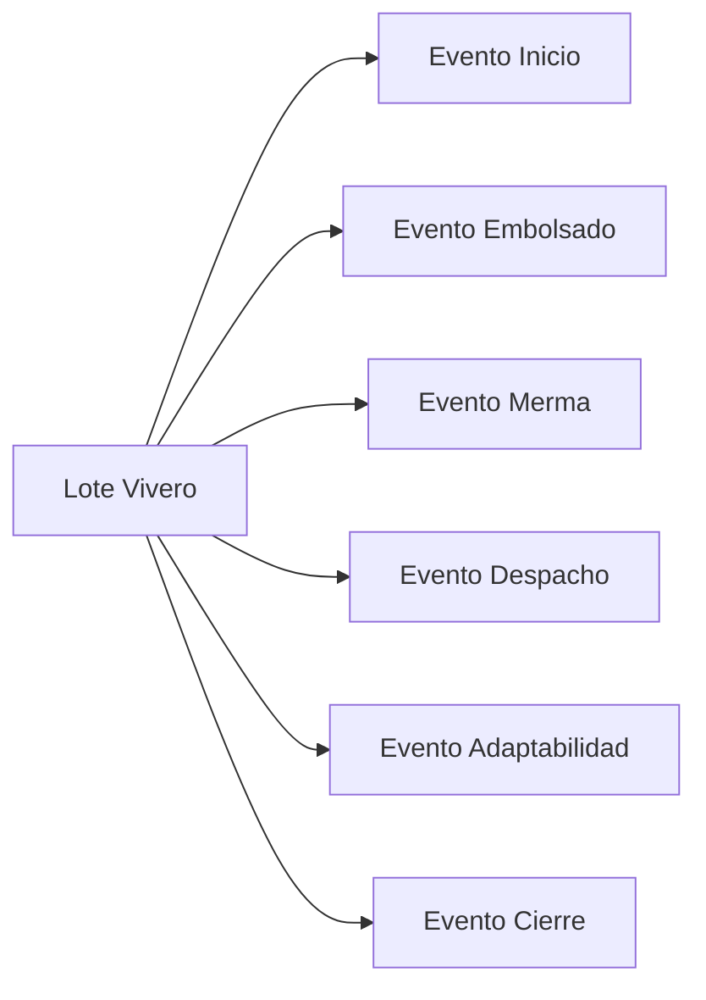
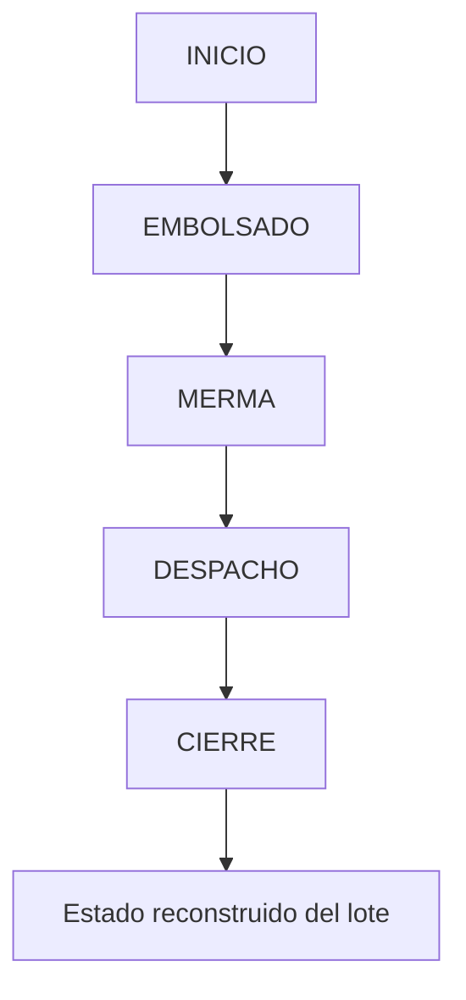
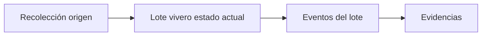
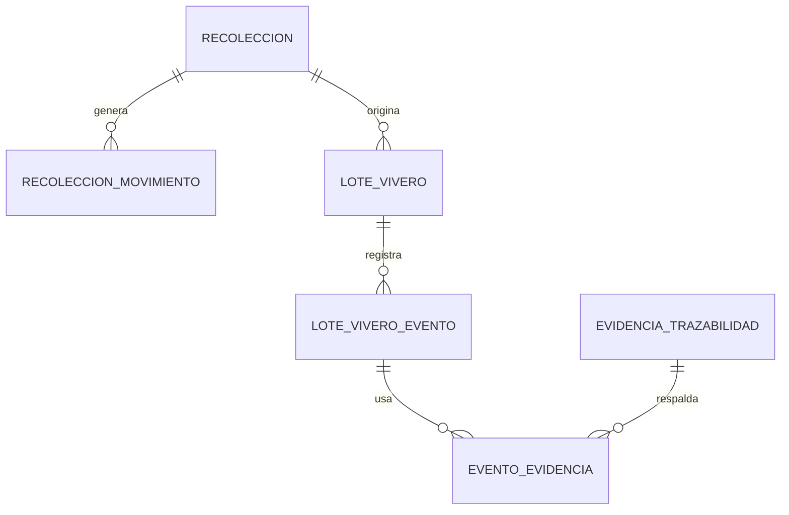

# Planeación de arquitectura de base de datos — Módulo 2 Vivero (MVP)

## Objetivo

Definir, de forma breve y entendible, las alternativas principales para estructurar la base de datos del módulo **Vivero**, explicar por qué algunas opciones no convienen para un **MVP**, y justificar la arquitectura recomendada.

El contexto funcional del módulo obliga a proteger especialmente estos puntos:

- trazabilidad fuerte desde un **lote origen único**,
- consumo atómico entre **Recolección** y **Vivero**,
- alineación estricta entre `RECOLECCION_MOVIMIENTO`, `LOTE_VIVERO` y `EVENTO_LOTE_VIVERO` en `INICIO`,
- herencia explícita de snapshots congelados desde `RECOLECCION` hacia `LOTE_VIVERO`,
- historial **append-only** de eventos,
- control confiable del **saldo vivo**,
- evidencias obligatorias por evento,
- convención oficial de unidades persistidas `UNIDAD | G`,
- y cierre automático del lote cuando el saldo llega a cero.

---

## Alternativa 1: Modelo totalmente normalizado

### Idea

Separar cada parte del proceso en muchas tablas específicas. Por ejemplo, una tabla para el lote, otra para embolsado, otra para merma, otra para despacho, otra para adaptabilidad, otra para cierre, etc.

### Ventaja

Es una estructura muy formal, estricta y relacionalmente ordenada.

### Por qué no conviene como MVP

Aunque se ve sólida en papel, para un MVP agrega demasiada complejidad técnica demasiado pronto. Cada nuevo evento obliga a más tablas, más relaciones, más joins y más validaciones distribuidas. Eso retrasa el backend, hace más pesada la consulta del historial y complica una necesidad muy importante del módulo: ver el ciclo del lote como una secuencia simple y auditable.

En resumen, **es correcta a nivel teórico, pero lenta para arrancar**.

### Ejemplo simplificado

### Problema práctico

El historial del lote queda repartido en demasiados lugares. Para reconstruir la historia completa, el sistema tiene que unir muchas tablas incluso para operaciones simples.

---

## Alternativa 2: Event Sourcing puro

### Idea

Guardar casi todo como eventos. El lote actual no se mantiene como estado operativo principal, sino que se reconstruye leyendo el historial completo de eventos.

### Ventaja

Es muy fuerte para auditoría y se alinea bien con una visión de trazabilidad completa.

### Por qué no conviene como MVP

Para un MVP puede ser una arquitectura demasiado sofisticada. Obliga a resolver desde el inicio proyecciones, reconstrucción de estado, concurrencia y lógica de lectura más compleja. Además, este módulo necesita consultas operativas rápidas como: lotes activos, saldo actual, motivo de cierre, vivero, especie y origen. Todo eso es más costoso si el estado siempre depende de recomputar eventos.

En resumen, **es potente, pero demasiado avanzada para la primera fase**.

### Ejemplo simplificado

### Problema práctico

Para responder algo tan simple como “¿cuál es el saldo vivo actual?” el sistema depende de reconstruir o proyectar el estado desde la secuencia de eventos.

---

## Alternativa 3: Modelo híbrido operacional + auditable

### Idea

Tener una tabla principal del **lote de vivero** con el estado actual operativo, y otra tabla de **eventos del lote** para conservar el historial inmutable.

### Ventaja

Combina lo mejor de ambos enfoques:

- mantiene consultas rápidas para la operación diaria,
- conserva historial auditable,
- facilita el timeline,
- permite controlar saldo actual sin recalcular todo siempre,
- y sigue siendo suficientemente simple para un MVP.

### Por qué sí conviene como MVP

Porque el módulo necesita dos cosas al mismo tiempo:

Por un lado, una lectura rápida del estado actual del lote para trabajar en pantallas operativas.
Por otro lado, una historia completa de eventos para sostener la trazabilidad.

El modelo híbrido resuelve ambas necesidades sin sobreconstruir.

### Ejemplo simplificado

### Lógica simplificada

- `lote_vivero` guarda el estado operativo actual.
- `lote_vivero_evento` guarda el historial append-only.
- `evidencia_trazabilidad` respalda cada evento obligatorio.
- `recoleccion` guarda snapshots oficiales de identidad al validar; esos snapshots son la fuente de herencia hacia `lote_vivero`.
- un snapshot, en este contexto, es una copia congelada del dato relevante para que el historial no cambie si luego se edita `PLANTA` u otra tabla maestra.
- el saldo actual se actualiza transaccionalmente al registrar cada evento.
- la unidad persistida se restringe a `UNIDAD` o `G`; `kg` solo existe como input y se normaliza antes de persistir.

---

## Arquitectura recomendada

Para este MVP, la alternativa recomendada es el **modelo híbrido operacional + auditable**.

### Razones de decisión

Se escoge esta arquitectura porque protege el núcleo del producto sin volverlo innecesariamente complejo. Permite:

- iniciar rápido el desarrollo,
- mantener trazabilidad fuerte desde un solo lote origen,
- ejecutar la creación del lote y el descuento del origen en una sola transacción,
- registrar eventos sin sobrescribir historial,
- consultar listados operativos de forma simple,
- y dejar preparada la evolución futura hacia validaciones más complejas, correcciones auditadas o integraciones blockchain.

---

## Estructura conceptual recomendada

---

## Resumen ejecutivo

Las tres alternativas son técnicamente válidas, pero no tienen el mismo costo ni el mismo valor para esta etapa.

El modelo totalmente normalizado ofrece orden, pero vuelve lento el arranque.
El event sourcing puro ofrece mucha trazabilidad, pero exige una complejidad que todavía no se justifica.
El modelo híbrido, en cambio, permite construir un MVP sólido, entendible y extensible, manteniendo el equilibrio correcto entre operación diaria, integridad del dato y auditoría.

Por eso, para esta fase, **la arquitectura recomendada es una tabla operativa de lote + una tabla de eventos + una relación clara con evidencias y con el lote origen de Recolección**.

Restricciones explícitas del MVP:

- no hay correcciones operativas una vez registrado el evento; el modelo sigue append-only sin `CORRECCION` activa en esta fase,
- `CONSUMO_A_VIVERO` y `DESECHO` usan `delta` negativo,
- `EMBOLSADO` no convierte automáticamente gramos en plantas vivas; registra un conteo observado en `UNIDAD`.
- en Recolección, el snapshot oficial se congela solo al aprobar la validación; antes de eso puede recalcularse en borrador,
- el naming oficial del dato comercial congelado es `nombre_comercial_snapshot`.
