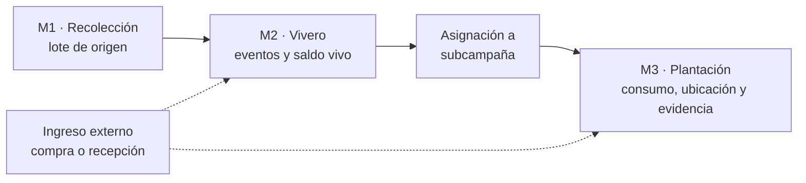
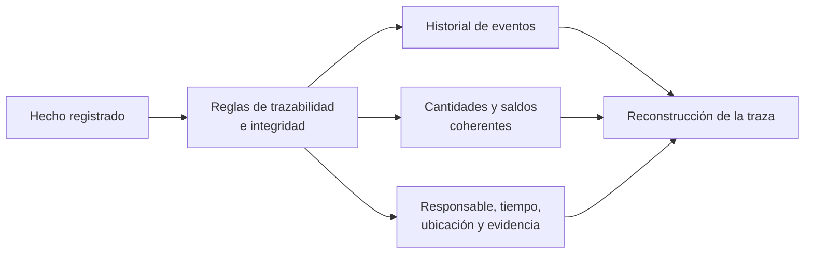
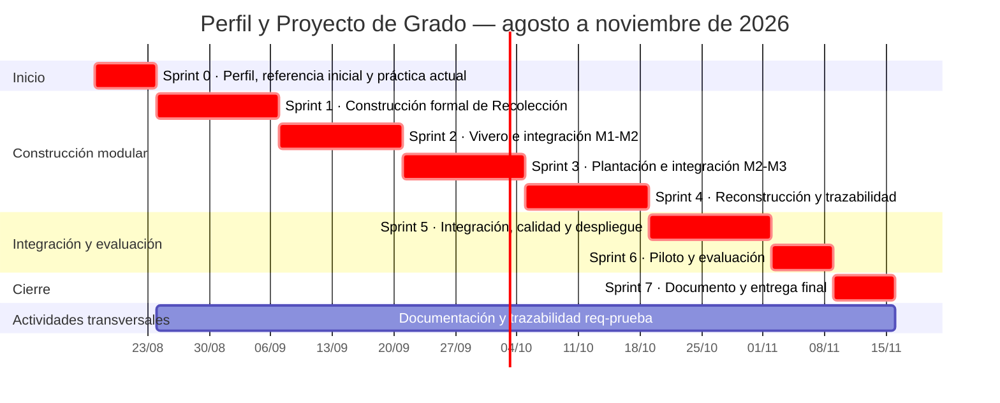

## Resumen

La Fundación R3Foresta para la Bioregeneración de Ecosistemas y la Economía Circular desarrolla actividades de reforestación con la participación de comunidades, voluntarios y empresas patrocinadoras. En estas actividades, las semillas recolectadas atraviesan procesos de vivero hasta convertirse en plantas destinadas a la plantación. En la práctica actual, fotografías, mensajes, publicaciones en redes sociales, cuadernos y otros registros documentan parcialmente estos procesos, pero la información no se conserva bajo una estructura común que permita relacionar procedencia, cantidades, responsables, ubicaciones y evidencias entre las diferentes etapas. Esta fragmentación dificulta reconstruir el recorrido de las semillas y plantas y presentar información consistente a los actores interesados.

El proyecto tiene como objetivo desarrollar y evaluar un sistema de trazabilidad que registre los eventos ocurridos desde el origen o ingreso del material vegetal al proceso hasta el registro de su plantación. La solución articulará los módulos de Recolección, Vivero y Plantación, conservará las relaciones entre sus registros y permitirá reconstruir el recorrido con información y evidencia contrastable.

La investigación será aplicada y tecnológica: construirá el sistema y evaluará su funcionamiento en el caso de R3Foresta. El desarrollo seguirá un proceso iterativo e incremental de agosto a noviembre de 2026. La evaluación combinará la verificación técnica de los requerimientos y reglas de consistencia, la reconstrucción de trazas, la comparación con la práctica actual y un piloto cuya cobertura dependerá de las operaciones y participantes disponibles. Se analizarán la información recuperable, la coherencia de cantidades y saldos, el tiempo de reconstrucción y la carga de registro. El alcance concluye con el registro de la plantación; el sistema no realiza monitoreo posterior ni certifica plantaciones, supervivencia, captura de carbono o créditos de carbono.

**Palabras clave:** trazabilidad, cadena de custodia, material vegetal, reforestación, eventos, integridad de datos, R3Foresta.

---

## Índice general

1. Introducción
2. Antecedentes
3. Planteamiento del problema
4. Objetivos
5. Justificación
6. Alcances y límites
7. Marco teórico preliminar
8. Marco metodológico
9. Propuesta de solución y aporte de ingeniería
10. Temario tentativo del documento final
11. Cronograma de actividades
12. Recursos y presupuesto
13. Referencias bibliográficas

## Índice de tablas

- Tabla 1. Aspectos previstos para la evaluación.
- Tabla 2. Métricas e instrumentos de evaluación.
- Tabla 3. Correspondencia entre objetivos y resultados.
- Tabla 4. Cronograma resumido.
- Tabla 5. Presupuesto monetario previsto.

## Índice de figuras

- Figura 1. Árbol de causas y efectos.
- Figura 2. Recorrido principal del material vegetal.
- Figura 3. Relación entre eventos, reglas de consistencia y reconstrucción.
- Figura 4. Diagrama de Gantt, agosto–noviembre de 2026.

---

## 1. Introducción

La reforestación comprende un conjunto de etapas sucesivas en las que las semillas, hasta convertirse en plantas, pasan por distintos procesos, ubicaciones y responsables antes de llegar a su plantación. En este recorrido, el material es recolectado, germinado, trasladado por diferentes actores y posteriormente destinado a ser plantado. Cada etapa genera información relacionada con su procedencia, cantidades, responsables, tiempos, ubicaciones y evidencias, cuya continuidad permite conocer cómo el material vegetal avanza a través del proceso. En adelante, se utilizará _material vegetal_ como denominación general para las semillas, plantas y demás unidades de propagación comprendidas en estas etapas.

La necesidad de mantener esta continuidad de información da lugar al concepto de trazabilidad. Esta no consiste únicamente en almacenar inventarios, registros o fotografías de forma aislada, sino en conservar la información y las relaciones necesarias para reconstruir el recorrido de un elemento a través de las distintas etapas de una cadena. Olsen y Borit (2013) la relacionan con la capacidad de acceder a información sobre un objeto a lo largo de su ciclo de vida.

Asimismo, en una cadena de custodia deben registrarse los movimientos y cambios bajo reglas explícitas; sin embargo, la existencia de un sistema no verifica por sí sola la veracidad de las declaraciones realizadas por sus usuarios (International Organization for Standardization [ISO], 2020). Por esta razón, el presente trabajo plantea una trazabilidad reconstruible mediante evidencia contrastable, sin pretender constituirse en una certificación independiente.

El caso de estudio corresponde a la **Fundación R3Foresta para la Bioregeneración de Ecosistemas y la Economía Circular**. R3Foresta se presenta como una iniciativa y plataforma de acción socioambiental creada en 2019, dedicada a la bioregeneración de ecosistemas estratégicos y al fortalecimiento de las comunidades vinculadas con ellos. Su misión oficial es desarrollar, implementar y expandir un modelo integral de bioregeneración mediante soluciones ambientales medibles, innovadoras, participativas y económicamente sostenibles; su visión es convertirse en un referente regional e internacional mediante una red de territorios, comunidades y proyectos que integre naturaleza, tecnología, innovación, economía circular y desarrollo humano (R3Foresta, 2026).

El modelo institucional combina dimensiones ecológica, comunitaria, científico-tecnológica y económica, y comprende los componentes R3Carbon, R3Water, R3Bio y R3F10. Dentro de R3Carbon se desarrolla una aplicación destinada a registrar la historia del material vegetal; el nombre oficial confirmado para ella es **R3foresta App**. La Fundación vincula este desarrollo con aspiraciones de seguimiento y medición ambiental. El alcance académico del presente proyecto es más acotado: concluye con el registro de la plantación y no mide captura de CO2, no comprueba supervivencia posterior, no implementa una metodología de monitoreo, reporte y verificación de carbono y no genera créditos de carbono.

La práctica actual de R3Foresta conserva información y evidencias de sus actividades mediante fotografías, redes sociales, servicios de mensajería, cuadernos y el conocimiento de los responsables. Sin embargo, estos registros se encuentran dispersos y no necesariamente comparten identificadores, unidades o reglas que permitan relacionarlos y conciliar las cantidades registradas entre las diferentes etapas. Esta situación afecta tanto la gestión interna como la información proporcionada a las empresas patrocinadoras, que requieren conocer cuántos árboles fueron destinados a una plantación, dónde fueron plantados y qué evidencias respaldan su ejecución. En este contexto, disponer de una trazabilidad reconstruible y respaldada por evidencia adquiere relevancia tanto para la gestión de dichos procesos como para sustentar la información comunicada a terceros.

Ante esta situación, el proyecto propone desarrollar y evaluar un sistema de trazabilidad que integre los procesos de _recolección, vivero y plantación_. El sistema permitirá registrar los eventos y cambios que atraviesa el material vegetal desde su origen o ingreso al proceso hasta su plantación, vinculando información sobre cantidades, responsables, tiempos, ubicaciones y evidencias. A partir de estos registros, será posible reconstruir su recorrido a través de las distintas etapas y contrastar la información asociada a cada una de ellas. El alcance concluye con el registro de la plantación y no incluye el monitoreo posterior de los árboles. De esta manera, el sistema busca proporcionar una base estructurada para la gestión interna de R3Foresta y para respaldar la información comunicada a terceros.

## 2. Antecedentes

De acuerdo con la información institucional proporcionada para este proyecto, R3Foresta cuenta con una estructura compuesta por la Asamblea General de Fundadores, el Directorio, la Dirección o Gerencia Ejecutiva, direcciones específicas y unidades técnicas, y programas, proyectos, equipos especializados y personal técnico. La denominación exacta de estos niveles deberá contrastarse con el Estatuto Orgánico antes de representar el organigrama definitivo en el documento final.

El resumen institucional confirma que R3Foresta fue creada en 2019 y que su modelo evolucionó desde la acción ambiental directa hacia la integración de reforestación, agua, biodiversidad, residuos, alimentación, tecnología y comunidades. También describe líneas de economía circular relacionadas con residuos orgánicos, plásticos, papel, cartón y aluminio (R3Foresta, 2026). Una declaración institucional previa mencionó pruebas piloto de clasificación de aproximadamente diecinueve categorías de materiales; como el documento oficial no confirma ese número, el lugar, el periodo ni sus responsables, ese detalle se conserva en la ficha de investigación pendiente de respaldo y no se utiliza como antecedente técnico directo del sistema de material vegetal.

En la dimensión científico-tecnológica, R3Foresta plantea incorporar medición, monitoreo, trazabilidad, digitalización e innovación. El documento oficial sitúa la aplicación en desarrollo dentro de R3Carbon y describe una cadena institucional que abarca desde la recolección de semillas o material vegetal hasta la plantación, el seguimiento y la medición (R3Foresta, 2026). **R3foresta App**, en el alcance evaluado por este trabajo, se limita a Recolección, Vivero y Plantación y a la reconstrucción de los registros producidos en esas etapas.

La revisión de trabajos académicos y sistemas similares avanza desde las experiencias más cercanas al ámbito forestal boliviano hacia los fundamentos y mecanismos de trazabilidad aplicables al problema de R3Foresta.

En Bolivia, Limachi Mamani (2020) desarrolló un sistema de registro y geolocalización de viveros para la Autoridad de Fiscalización y Control Social de Bosques y Tierra. El trabajo administra viveros, especies y volúmenes de producción, y demuestra la pertinencia de emplear sistemas georreferenciados en la gestión forestal del país. Su unidad principal de registro, sin embargo, es el vivero; por ello, el aporte se concentra en identificar y localizar unidades productivas y no en reconstruir el recorrido del material vegetal desde su procedencia hasta la plantación.

La digitalización de viveros ha avanzado también en el contexto latinoamericano. Salamanca Contreras (2024) implementó un sistema web para el control interno y el inventario de un vivero comercial y reportó mejoras en la exactitud del inventario y el cumplimiento de despachos. Mayorga Vásquez et al. (2022), por su parte, propusieron un sistema web para procesos administrativos y productivos de viveros. Estos trabajos muestran que existencias, producción y despachos pueden gestionarse digitalmente, pero permanecen centrados en la administración interna del vivero: no relacionan de extremo a extremo la procedencia del material vegetal, sus transferencias hacia actividades de reforestación y la evidencia geográfica de la plantación.

Para superar una visión limitada al inventario, la literatura internacional aporta fundamentos sobre qué debe conservar un sistema de trazabilidad. Moe (1998) distinguió la trazabilidad interna de aquella que enlaza distintas etapas de una cadena y resaltó la necesidad de definir unidades rastreables. Olsen y Borit (2013) situaron la trazabilidad en la posibilidad de acceder a información sobre objetos considerados a lo largo de su ciclo de vida, mientras que Dabbene et al. (2014) examinaron los problemas de identificación, granularidad, transformación y recuperación de genealogía en cadenas físicas. Aunque estas contribuciones proceden principalmente del ámbito agroalimentario, permiten establecer que reconstruir una cadena requiere conservar tanto las unidades y sus atributos como las relaciones producidas cuando cambian, se agrupan o se transfieren.

Sobre esa base conceptual, Thakur et al. (2011) mostraron que los eventos de negocio pueden representar estados, movimientos y transformaciones, separando los datos maestros de los hechos ocurridos. Solanki y Brewster (2014) profundizaron esta representación al modelar transformaciones que vinculan unidades de entrada y salida, de modo que los eventos relacionados permitan recuperar su procedencia. El principio es transferible a R3Foresta porque un historial enlazado puede explicar los cambios de saldo y las relaciones entre unidades de material vegetal. Su aplicación requiere, no obstante, reglas propias para registrar la transformación biológica observada, la mortalidad o merma, las asignaciones parciales y la vinculación del lote con una ubicación de plantación. Esta transferencia conceptual no implica implementar literalmente EPCIS ni adoptar los procesos del dominio agroalimentario de las fuentes.

La representación histórica tampoco basta si los movimientos y las cantidades pueden quedar inconexos o si la capacidad de reconstrucción solo se presupone. ISO 22095:2020 proporciona terminología y modelos generales para la cadena de custodia, pero aclara que un sistema no demuestra por sí mismo la veracidad de las declaraciones registradas (ISO, 2020). Desde una perspectiva empírica, Donnelly et al. (2012) evaluaron sistemas de trazabilidad mediante un ejercicio de retiro simulado que exigía recuperar el origen y la información asociada a los lotes. Este enfoque respalda la necesidad de comprobar la reconstrucción mediante preguntas, fuentes recuperadas, vacíos y tiempo empleado, sin trasladar a R3Foresta el contexto de inocuidad alimentaria. En conjunto, estos antecedentes muestran que la trazabilidad requiere relacionar los eventos con reglas de consistencia y evidencia, y que su recuperabilidad debe evaluarse en la práctica.

Entre las fuentes revisadas no se identificó una solución que integrara, dentro de un mismo flujo, la procedencia del material vegetal, sus transformaciones, los movimientos entre etapas, la consistencia de cantidades y saldos y la evidencia asociada a la plantación, de forma que permitiera reconstruir posteriormente su cadena de custodia. Esta síntesis se limita al conjunto y alcance de la búsqueda bibliográfica realizada y no afirma la inexistencia absoluta de soluciones similares.

## 3. Planteamiento del problema

### 3.1. Situación problemática

R3Foresta realiza actividades de reforestación con comunidades, voluntarios y organizaciones patrocinadoras. Según el diagnóstico institucional preliminar proporcionado para este proyecto, el seguimiento anterior a R3foresta App dependía de registros individuales, documentación de campo y diferentes fuentes de información. Entre las fuentes inicialmente identificadas se encuentran fotografías, publicaciones en redes sociales, conversaciones de mensajería, cuadernos, notas y la memoria de las personas involucradas. Esta caracterización deberá confirmarse mediante el inventario documental, las entrevistas y la reconstrucción de trazas históricas. Mientras no concluya ese diagnóstico, la dispersión, pérdida, duplicación o dificultad de recuperación se tratarán como aspectos preliminares por comprobar y no como frecuencias o efectos ya demostrados.

El proceso comienza con la recolección de semillas, continúa con su manejo en vivero y concluye con la plantación de las plantas obtenidas. También puede ingresar material vegetal adquirido o recibido de terceros directamente en Vivero o Plantación. En estos casos es necesario registrar el ingreso externo como un hecho del historial, conservar los datos de procedencia disponibles y relacionar los eventos posteriores hasta la plantación.

Durante el recorrido cambian la ubicación, el responsable, el estado, la agrupación y, en ciertos procesos, la unidad de medida del material vegetal. Las semillas recolectadas pueden expresarse en gramos o unidades de propagación, mientras que el saldo vivo del vivero y la plantación se expresan en unidades de plantas. Este cambio no es una conversión aritmética automática, sino el resultado observado de un proceso biológico. También pueden ocurrir mermas, descartes, devoluciones, cierres y asignaciones parciales.

Cuando las salidas y entradas se registran de manera separada, o cuando un saldo puede alterarse sin conservar el hecho que lo explica, aparecen riesgos de registros incompletos, doble asignación, doble consumo y cantidades difíciles de conciliar. De manera similar, una fotografía o coordenada guardada fuera del hecho operativo puede perder su relación con la especie, cantidad, fecha y responsable que debía respaldar.

La consecuencia principal es una capacidad limitada para reconstruir la cadena de custodia con evidencia contrastable. Esto afecta las decisiones internas sobre disponibilidad y pérdidas, así como la capacidad de respaldar la información comunicada a empresas patrocinadoras y aliados. El problema es informacional: el sistema puede fortalecer la consistencia y recuperabilidad de lo registrado, pero no puede garantizar por sí solo que una declaración del operador sea físicamente verdadera.

### 3.2. Árbol de causas y efectos

Las causas se formulan como planteamientos preliminares y serán confirmadas, modificadas o descartadas mediante entrevistas, inventario documental y reconstrucción de casos históricos.

**Figura 1. Árbol de causas y efectos.**


### 3.3. Problema central

> En la práctica actual de R3Foresta, la información sobre el recorrido del material vegetal, desde su origen o ingreso al proceso hasta su plantación, se conserva en registros dispersos que no comparten una estructura ni relaciones comunes; esta fragmentación limita la reconstrucción de la cadena de custodia, la comprobación de la consistencia de cantidades y saldos y la presentación de evidencia contrastable a los actores interesados.

### 3.4. Formulación del problema

#### Pregunta general

> ¿Cómo desarrollar, en el caso R3Foresta, un sistema de trazabilidad que permita reconstruir con evidencia contrastable el recorrido del material vegetal desde su origen o ingreso al proceso hasta el registro de su plantación, y qué diferencias presenta frente a la práctica de registro actual en capacidad de reconstrucción y carga operativa?

#### Preguntas específicas

1. ¿Qué procesos, actores, datos, estados, eventos, unidades de medida y reglas de negocio intervienen en Recolección, Vivero y Plantación, incluidas las variantes de ingreso de material vegetal adquirido o recibido de terceros?
2. ¿Qué modelo de información y reglas de integridad permite relacionar los orígenes, movimientos, transformaciones, saldos, responsables y evidencias de la cadena de custodia?
3. ¿Cómo implementar e integrar los módulos de Recolección, Vivero y Plantación y sus variantes de ingreso externo sin perder la historia de procedencia del material vegetal?
4. ¿En qué medida la solución cumple los requerimientos y preserva las invariantes definidas mediante pruebas funcionales y técnicas?
5. ¿Qué capacidad presenta la solución para reconstruir trazas con evidencia contrastable y qué carga operativa genera respecto de la práctica actual de R3Foresta?

## 4. Objetivos

### 4.1. Objetivo general

Desarrollar y evaluar un sistema de trazabilidad para la cadena de custodia del material vegetal utilizado por R3Foresta, desde su recolección o recepción externa hasta su manejo en vivero y plantación, que permita reconstruir con evidencia contrastable su procedencia, movimientos, cantidades, responsables y destino.

### 4.2. Objetivos específicos

1. **Analizar** los procesos, actores, datos, estados, eventos, unidades de medida, requerimientos y reglas de negocio de Recolección, Vivero y Plantación, incluidas las variantes de ingreso de material vegetal adquirido o recibido de terceros.
2. **Diseñar** un modelo de trazabilidad e integridad que relacione orígenes, entidades, eventos, transformaciones, cantidades, saldos, responsables y evidencias, y que formalice las reglas aplicables a las transferencias y transformaciones entre etapas.
3. **Implementar** los módulos de Recolección, Vivero y Plantación, incorporando el ingreso de material vegetal adquirido o recibido de terceros directamente en Vivero o Plantación, con sus datos de procedencia y su registro en el historial.
4. **Verificar** el cumplimiento de los requerimientos y de las invariantes de consistencia mediante pruebas funcionales y técnicas.
5. **Evaluar**, en el contexto del estudio de caso, la capacidad de reconstrucción con evidencia contrastable y la carga operativa de la solución, comparándolas con la práctica actual caracterizada en R3Foresta.

## 5. Justificación

R3Foresta necesita reconstruir el recorrido del material vegetal que recibe o produce para conocer su procedencia, las cantidades disponibles, las pérdidas ocurridas, las asignaciones y transferencias realizadas y su destino final. Cuando esta información se conserva en formularios, inventarios o evidencias independientes, resulta difícil establecer posteriormente qué ocurrió con una cantidad o lote determinado a medida que atravesó las etapas de recolección, vivero y plantación. Por ello, la organización requiere conservar relaciones trazables entre el origen, los movimientos y el destino del material vegetal.

Atender esta necesidad requiere una solución informática orientada a la trazabilidad, pues el registro aislado de datos no garantiza la conservación de las relaciones necesarias para explicar el recorrido del material. La información generada en las diferentes etapas debe mantener vínculos entre las cantidades, los movimientos realizados, los responsables, las fechas y las ubicaciones correspondientes. De este modo, los registros podrán ser consultados como partes de un mismo recorrido y no como constancias aisladas cuya correspondencia dependa de una reconstrucción manual.

Disponer de información reconstruible y respaldada permitirá a R3Foresta relacionar las cantidades administradas con su procedencia y destino, identificar los actores involucrados y recuperar la evidencia asociada a las actividades registradas. Esta capacidad permitirá presentar información consistente y contrastable ante comunidades, voluntarios, empresas patrocinadoras y aliados, además de facilitar la rendición de cuentas entre los actores involucrados. La trazabilidad propuesta respaldará las actividades registradas, sin constituir por sí misma una certificación de supervivencia de las plantas, recuperación ecológica o captura de carbono.

Desde la perspectiva académica, el proyecto permitirá vincular el análisis del dominio con un modelo de trazabilidad, reglas de integridad, una implementación verificable y una evaluación aplicada en un caso real. Su ejecución es viable porque aprovecha infraestructura disponible en planes gratuitos y concentra el gasto monetario en conectividad, trabajo de campo y herramientas de apoyo. Los posibles beneficios de tiempo o costo no se asumirán de antemano: se observarán durante la comparación con la práctica actual y se informarán junto con la carga operativa que introduzca la solución.

## 6. Alcances y límites

### 6.1. Alcance funcional

El proyecto mantendrá tres módulos operativos:

1. **Recolección:** registro de las semillas o unidades de propagación recolectadas, su especie, cantidad y unidad de medida, fecha, responsable, ubicación y evidencia.
2. **Vivero:** recepción y manejo del material vegetal, registro de eventos biológicos y operativos, mermas, descartes, saldo vivo, despacho y cierre.
3. **Plantación:** asignación de plantas a una subcampaña y registro de la cantidad plantada, responsables, fecha, ubicación y evidencia.

El sistema podrá registrar material vegetal adquirido o recibido de terceros que ingrese directamente en Vivero o Plantación. El historial distinguirá este ingreso externo de una recolección realizada por R3Foresta y conservará, según la información disponible, el tipo de ingreso, el proveedor o la organización de procedencia, la especie, la cantidad y unidad, la fecha, el responsable de la recepción y la evidencia documental asociada. Estas variantes se resolverán dentro de los tres módulos existentes y no constituirán un módulo adicional.

También se encuentran dentro del alcance:

- reconstrucción del origen y recorrido del material vegetal;
- historial de eventos que explique sus cambios de estado, cantidades y ubicación;
- reglas orientadas a prevenir cantidades negativas, asignaciones o consumos superiores al disponible, doble asignación, doble consumo y saldos incoherentes;
- mantenimiento de la coherencia de cantidades y saldos durante transferencias y transformaciones del material vegetal;
- evidencia fotográfica, temporal y geográfica vinculada con el evento correspondiente.

### 6.2. Alcance de la evaluación

La evaluación se orientará primero a demostrar propiedades observables del sistema y, posteriormente, a comparar sus resultados con la forma en que R3Foresta conserva y reconstruye actualmente la información.

**Tabla 1. Aspectos previstos para la evaluación.**

| Aspecto a evaluar | Qué se busca comprobar | Evidencia prevista |
|---|---|---|
| Reconstrucción de la trazabilidad | Que la información registrada permita reconstruir de manera comprensible y consistente el origen, las etapas recorridas, los eventos, los cambios de estado, las cantidades, las transformaciones, las pérdidas, los responsables, la ubicación y el destino del material vegetal | Consultas o ejercicios de reconstrucción sobre trazas registradas, historial de eventos y evidencias asociadas |
| Integridad de cantidades y saldos | Que las reglas implementadas prevengan o detecten cantidades negativas, consumo o asignación superior al disponible, doble consumo, doble asignación, saldos incoherentes y pérdida de relación entre material de origen y resultante | Resultados de pruebas funcionales y técnicas, registros de eventos y conciliación de cantidades |
| Utilización durante una operación real | Que el sistema pueda utilizarse durante una actividad operativa de R3Foresta, procurando incluir una actividad real de plantación cuando el calendario institucional lo permita | Registros generados por el sistema, observación directa, registros de campo y evidencia disponible |
| Comparación con la situación actual | Qué diferencias existen en la información recuperable, los vacíos, las fuentes necesarias, el tiempo de reconstrucción, la claridad del historial y la explicación de cantidades y saldos | Censo de trazas elegibles del periodo documental, fuentes existentes y trazas paralelas o comparables generadas con la propuesta |
| Carga operativa y experiencia de los participantes | Qué esfuerzo requiere registrar y recuperar la información de trazabilidad con la solución propuesta, considerando las diferencias observables respecto de la práctica actual | Tiempo de registro y reconstrucción, cantidad de pasos, observación y retroalimentación de los participantes |

La evaluación se realizará con actividades y participantes coordinados con R3Foresta, priorizando la observación de actividades reales.

### 6.3. Fuera del alcance

Quedan fuera del proyecto:

- certificación, emisión o comercialización de bonos o créditos de carbono;
- cálculo de biomasa, CO₂ equivalente, adicionalidad, permanencia o línea base de carbono;
- certificación independiente de plantaciones o autenticidad forense de fotografías;
- monitoreo, crecimiento, mantenimiento o seguimiento ecológico posteriores al registro de la plantación;
- garantía de supervivencia de las plantas después de su plantación;
- blockchain, NFT, contratos inteligentes, IPFS y anclajes criptográficos;
- integración con mercados de carbono o sistemas externos de certificación;
- operación nacional o despliegue masivo;

La aspiración de R3Foresta de participar en mecanismos de carbono se reconoce únicamente como contexto organizacional de largo plazo. No es un resultado ni una promesa del presente Proyecto de Grado.

Los prototipos o componentes técnicos anteriores relacionados con blockchain, NFT o IPFS podrán existir en repositorios históricos, pero no formarán parte de la construcción académica, la matriz de cumplimiento, la evaluación ni las conclusiones de la solución presentada.

### 6.4. Limitaciones

- **Disponibilidad de información histórica:** los registros anteriores pueden estar incompletos, distribuidos entre diferentes fuentes o presentar niveles de detalle desiguales. Se delimitará un periodo documental, se inventariarán las actividades identificables y se incluirán todas las trazas que cumplan los criterios definidos; las exclusiones y sus motivos quedarán registradas.
- **Disponibilidad de operaciones reales:** la posibilidad de observar recolección, vivero o plantación depende del calendario operativo y de los ciclos propios de R3Foresta durante el periodo del Proyecto de Grado. Las etapas que no puedan observarse se evaluarán mediante casos controlados y se informarán como tales.
- **Disponibilidad de participantes:** la cantidad definitiva de participantes dependerá de las personas disponibles y autorizadas por R3Foresta durante la evaluación.
- **Alcance del estudio de caso:** la evaluación se realizará dentro del contexto de R3Foresta. No busca inferencia estadística ni permite afirmar que los resultados sean automáticamente generalizables a todas las organizaciones forestales.
- **Limitación de las evidencias digitales:** fotografías, coordenadas, fechas y otros datos respaldan el registro con el cual están asociados, pero no certifican por sí solos que la situación física o la cantidad declarada sea absolutamente correcta.
- **Sitio del piloto:** el lugar concreto todavía no está confirmado; se seleccionará según la disponibilidad de una actividad real, la accesibilidad logística, la autorización correspondiente y la posibilidad de observar adecuadamente el proceso.

## 7. Marco teórico preliminar

### 7.1. Material vegetal, trazabilidad y cadena de custodia

La Organización de las Naciones Unidas para la Alimentación y la Agricultura incluye dentro del material reproductivo forestal las semillas, las partes de plantas y las plantas producidas a partir de ellas. Para iniciativas de reforestación recomienda documentar, entre otros datos, la fuente, la cantidad, los tratamientos, la distribución y los lugares donde el material se utiliza; también señala la importancia de conservar información del proveedor cuando el material es adquirido (Food and Agriculture Organization of the United Nations [FAO], s. f.). En este proyecto, la expresión *material vegetal* abarca esas unidades durante el periodo comprendido entre su recolección o ingreso externo y el registro de su plantación.

La trazabilidad permite recuperar información sobre un objeto y seguir sus relaciones a lo largo de una cadena. Moe (1998) diferencia la trazabilidad interna de aquella que enlaza distintas etapas y actores, mientras que Olsen y Borit (2013) la definen a partir de la posibilidad de acceder a información sobre los objetos considerados durante su ciclo de vida. La cadena de custodia complementa este concepto al conservar relaciones de procedencia, transferencia y responsabilidad. ISO 22095:2020 establece, sin embargo, que la existencia de una cadena de custodia no demuestra por sí sola la veracidad de las declaraciones registradas (ISO, 2020). Por ello, R3Foresta buscará reconstruir registros respaldados por evidencia, no certificar de manera independiente los hechos físicos.

### 7.2. Unidades trazables, eventos y procedencia

Un sistema de trazabilidad necesita identificar las unidades consideradas, conservar sus atributos y registrar las relaciones que se producen cuando se agrupan, dividen o transforman (Olsen & Borit, 2018). En R3Foresta estas unidades pueden representarse mediante un registro de origen, un lote de vivero, una asignación o una plantación. Su identidad informática no implica que permanezcan físicamente inalteradas: el modelo debe conservar las relaciones suficientes para explicar de dónde provienen y qué ocurrió con ellas.

Un evento representa un hecho ocurrido sobre esas unidades, por ejemplo una recepción, un embolsado, una merma, una asignación, una devolución o una plantación. Thakur et al. (2011) muestran que los eventos pueden relacionar objetos, tiempo, lugar y motivo, y Solanki y Brewster (2014) explican cómo una transformación vincula entradas con salidas para recuperar su procedencia. El modelo PROV distingue entidades, actividades y agentes, y permite expresar uso, generación, derivación y responsabilidad dentro de una cadena de procedencia (World Wide Web Consortium [W3C], 2013). Estos referentes se utilizarán como base conceptual; el proyecto no queda obligado a implementar EPCIS, PROV-O ni una arquitectura de *event sourcing*.

El diseño distinguirá una transferencia, que mueve material entre responsables, lugares o etapas, de una transformación, que puede cambiar su estado, cantidad o unidad de medida. Tampoco atribuirá a una compra o recepción externa una recolección que no ocurrió: ese material iniciará su historial con los datos de procedencia disponibles y con el hecho de ingreso correspondiente.

### 7.3. Integridad de cantidades y operaciones

La reconstrucción del historial pierde utilidad si las cantidades, saldos y relaciones pueden quedar en estados incoherentes. Una invariante es una condición que debe preservarse antes y después de una operación, como mantener un saldo no negativo, impedir una asignación superior al disponible, evitar el doble consumo y conservar la correspondencia entre el material de origen y el resultante. El diseño por contrato permite expresar precondiciones, poscondiciones e invariantes (Meyer, 1992), y la trazabilidad de requerimientos permite relacionar estas condiciones con reglas, decisiones y pruebas durante la evolución del sistema (Gotel & Finkelstein, 1994).

Una operación entre etapas puede modificar simultáneamente el historial, la disponibilidad y las relaciones de procedencia. La teoría de transacciones identifica propiedades de atomicidad, consistencia, aislamiento y durabilidad para evitar resultados parciales y controlar interacciones simultáneas (Härder & Reuter, 1983). El Perfil compromete las propiedades observables —coherencia, ausencia de estados parciales y prevención de consumos duplicados—, pero deja para el diseño la elección y justificación de transacciones, restricciones, bloqueos u otros mecanismos concretos.

### 7.4. Evidencia, información geográfica y reconstrucción

La evidencia adquiere valor de trazabilidad cuando se relaciona con el evento que pretende respaldar. Fotografías, fechas, ubicaciones y documentos de procedencia pueden ayudar a contrastar quién registró un hecho, cuándo y dónde ocurrió y qué material estuvo involucrado. La información geográfica permite asociar puntos de recolección o plantación con lugares o áreas definidas, pero una coordenada o una fotografía no certifica por sí sola la autenticidad del hecho ni la cantidad declarada.

La capacidad de reconstrucción debe comprobarse intentando recuperar el recorrido, no suponerse por la sola existencia del sistema. Donnelly et al. (2012) evaluaron sistemas de trazabilidad mediante un retiro simulado que exigía recuperar el origen y la información vinculada con los lotes. R3Foresta adapta ese principio mediante preguntas de procedencia, eventos, cantidades, responsables, destino, ubicación y evidencia. La evaluación específica de estas propiedades se complementará con criterios de adecuación funcional, fiabilidad, capacidad de interacción, seguridad y mantenibilidad tomados como referencia del modelo ISO/IEC 25010:2023 (ISO, 2023).

## 8. Marco metodológico

### 8.1. Diseño de la investigación

La investigación será **aplicada y tecnológica** porque construirá un artefacto de software para atender un problema operativo. Se adoptará la **ciencia del diseño**, que vincula la construcción y evaluación de un artefacto con un problema organizacional (Hevner et al., 2004). El proceso seguirá las actividades de DSRM: identificación del problema, definición de objetivos, diseño y desarrollo, demostración, evaluación y comunicación (Peffers et al., 2007). El artefacto académico comprenderá el modelo de trazabilidad e integridad, sus reglas e invariantes, los tres módulos integrados, el mecanismo de reconstrucción y la evidencia obtenida al verificar y evaluar la solución; no se reducirá a las pantallas de la aplicación.

R3Foresta se estudiará como un **caso único embebido**. El caso será el diseño, construcción y evaluación del proceso digital de trazabilidad del material vegetal en R3Foresta durante la ventana académica formal; la Fundación constituirá el contexto organizacional y las trazas de cadena de custodia serán las unidades embebidas. La elección de un solo caso se justifica por su relación directa con el problema, el acceso autorizado a sus procesos y registros y la profundidad requerida para estudiar la interacción entre organización, operación y artefacto. Este diseño permite combinar documentos, registros, observación, entrevistas y resultados técnicos (Runeson & Höst, 2009). El enfoque será mixto y descriptivo: utilizará conteos, porcentajes, tiempos y resultados de pruebas junto con observaciones y dificultades reportadas. Los resultados describirán el caso y no se generalizarán estadísticamente. Este planteamiento mantiene el carácter de investigación, programación y diseño exigido para un Proyecto de Grado de licenciatura (Comité Ejecutivo de la Universidad Boliviana, s. f.).

### 8.2. Unidades de análisis y participantes

Una **traza de cadena de custodia** es el conjunto de registros relacionados que permite reconstruir el recorrido del material vegetal desde su origen o ingreso hasta el registro de la plantación. Para caracterizar la práctica actual se acordará con R3Foresta un periodo documental acotado según el tiempo y las fuentes accesibles. Dentro de ese periodo se inventariarán las actividades identificables y se incluirán todas las trazas que cumplan criterios previamente definidos. Por tanto, no se promete una cantidad fija ni se pretende revisar todo el historial de la organización: se realizará un censo del corpus documental delimitado y accesible.

Si una traza está incompleta, la reconstrucción llegará hasta el último punto respaldado y registrará los vacíos; las exclusiones y sus motivos también quedarán documentados. Los participantes sí se seleccionarán de manera intencional según su relación con el proceso, disponibilidad y autorización. Cuando sea viable, una persona distinta de quien registró los datos realizará la reconstrucción para reducir la influencia de la memoria del registrador.

Antes de la recolección se delimitarán además los procesos, sitios, actores y fuentes incluidos. El diseño embebido requerirá varias trazas y concluirá con una síntesis del caso completo. Si solo resultara disponible una unidad de análisis, se revisará la denominación metodológica en lugar de conservar una clasificación que la evidencia no sostenga.

### 8.3. Metodología de desarrollo

El software se desarrollará de manera **iterativa e incremental mediante ocho sprints**. Este enfoque amplía una base funcional mediante incrementos sucesivos (Basili & Turner, 1975; Larman & Basili, 2003) y es compatible con la aplicación iterativa e incremental de los procesos de ciclo de vida sin imponer una metodología específica (International Organization for Standardization et al., 2026). SWEBOK v4.0a se utilizará como referencia general de prácticas de Ingeniería de Software (IEEE Computer Society, 2025).

La ejecución formal abarcará del **17 de agosto al 15 de noviembre de 2026**. Comprenderá planificación; construcción de Recolección, Vivero y Plantación; ambas integraciones; reconstrucción transversal; calidad; piloto; evaluación y cierre documental. El detalle se presenta en el cronograma de la sección 11 para evitar repetir aquí cada sprint.

La construcción partirá de una **referencia inicial académica del repositorio** y deberá quedar demostrada dentro del semestre. Los prototipos anteriores podrán utilizarse como referencia técnica y evidencia de factibilidad, pero no como la construcción formal presentada. Cada sprint conservará evidencia proporcionada a su alcance: versión inicial y final, requerimientos abordados, cambios principales, migraciones, pruebas críticas, demostración y decisiones relevantes.

Cada incremento incluirá, según su alcance, selección de requisitos y riesgos, análisis, diseño, construcción, integración, pruebas, demostración, actualización documental y retrospectiva. El seguimiento registrará lo planificado y lo realizado, la evidencia disponible, las desviaciones, las decisiones adoptadas, las incidencias críticas y las horas académicas. Estos controles respaldarán la ejecución, pero no constituirán una metodología de investigación adicional.

El postulante será responsable del análisis, diseño, implementación, evaluación y documentación. Los colaboradores y agentes de inteligencia artificial brindarán apoyo delimitado; sus aportes serán revisados por el postulante y no sustituirán las decisiones del dominio ni la responsabilidad autoral humana.

### 8.4. Evaluación, instrumentos y análisis

**Tabla 2. Métricas e instrumentos de evaluación.**

| Dimensión | Métrica o criterio | Instrumento |
|---|---|---|
| Cumplimiento funcional | Requerimientos satisfechos | Matriz requerimiento–prueba |
| Integridad | Resultado de las pruebas sobre saldos, doble consumo y estados parciales | Pruebas unitarias, de integración, concurrencia y fallo inducido |
| Reconstrucción de la trazabilidad | Trazas con origen, eventos, transformaciones, cantidades, relaciones y destino recuperables | Guía de reconstrucción |
| Evidencia | Ítems respaldados / ítems requeridos | Lista de cotejo documental |
| Eficiencia de reconstrucción | Tiempo para responder el mismo conjunto de preguntas | Cronometraje de la situación actual y la propuesta |
| Carga operativa | Tiempo de registro, acciones, reintentos y dificultades | Observación, telemetría disponible y cuestionario |
| Percepción | Claridad y facilidad reportadas | Cuestionario breve y entrevista |

La evaluación combinará verificación técnica formativa durante los incrementos y evaluación operativa descriptiva en la situación actual y el piloto. Para caracterizar la **práctica actual**, se intentará responder un conjunto común de preguntas de procedencia, especie, cantidad, fecha, responsable, destino, ubicación y evidencia. Se distinguirá la información encontrada en documentos de aquella complementada mediante la memoria de los responsables. El mismo instrumento se aplicará después a las trazas generadas por la **propuesta**.

Cuando sea posible, una actividad real se registrará en paralelo con la práctica habitual y con R3Foresta. Si no fuera viable, el contraste se realizará con trazas de complejidad semejante y se declarará que no son equivalentes. Las rutas que no ocurran durante el piloto se evaluarán como casos controlados, no como validación de campo.

Antes de recolectar datos se definirán los criterios para clasificar cada ítem como completo, parcial, ausente o contradictorio; qué se considerará evidencia recuperable; el inicio y fin del cronometraje; y los reintentos, errores o solicitudes de ayuda. El análisis será descriptivo y reportará conteos, porcentajes, medianas, rangos y hallazgos cualitativos, sin pruebas de significación ni afirmaciones causales generalizables. Los resultados se integrarán por traza.

### 8.5. Consideraciones éticas

Antes de entrevistas y observaciones se explicará el propósito académico y se obtendrá consentimiento informado. El uso de datos operativos será coordinado con R3Foresta antes del piloto. Los nombres o ubicaciones podrán incorporarse únicamente cuando sean pertinentes y exista consentimiento; los datos personales no necesarios se omitirán. Los registros de prueba se mantendrán diferenciados de los datos operativos. El protocolo del Proyecto de Grado definirá almacenamiento, acceso, seudonimización, conservación y eliminación de entrevistas, fotografías y coordenadas; los permisos funcionales del sistema no sustituyen estas reglas de investigación.

## 9. Propuesta de solución y aporte de ingeniería

### 9.1. Descripción general

La propuesta integra los procesos de Recolección, Vivero y Plantación para registrar los eventos que atraviesa el material vegetal hasta su plantación. El recorrido podrá comenzar con una recolección de R3Foresta o con un ingreso externo por compra o recepción de terceros en Vivero o Plantación. En el sistema, el material se representará mediante registros y relaciones entre su procedencia, los lotes, las asignaciones y las plantaciones. La información sobre especies, actores y lugares contextualizará los hechos ocurridos, mientras que las cantidades y saldos disponibles deberán conservar relación con la historia que los explica.

**Figura 2. Recorrido principal del material vegetal.**



### 9.2. Modelo orientado a eventos, relaciones y consistencia

Cada cambio relevante deberá conservar el hecho que lo produjo y relacionarlo con el material involucrado, las cantidades de entrada o salida, el material resultante cuando exista, el responsable, la fecha, la ubicación y la evidencia disponible. Los saldos actuales deberán poder explicarse mediante los eventos anteriores y las reglas de consistencia deberán prevenir asignaciones, consumos o resultados incoherentes. Una corrección no deberá borrar la historia explicativa; su tratamiento concreto se definirá durante el diseño.

**Figura 3. Relación entre eventos, reglas de consistencia y reconstrucción.**



### 9.3. Integración entre etapas

Los puntos críticos son aquellos en los que el material vegetal se mueve o cambia entre etapas. La integración entre Recolección y Vivero deberá conservar la relación entre el material de origen y el material recibido o resultante. La integración entre Vivero y Plantación deberá relacionar las asignaciones y salidas con la disponibilidad y el destino registrado.

El diseño distinguirá las transferencias, que conservan una relación directa de cantidad, de las transformaciones, que pueden producir un cambio de estado, cantidad o unidad de medida. En ambos casos deberán mantenerse relaciones suficientes para explicar el recorrido y evitar salidas sin destino, consumos duplicados o saldos incoherentes. La elección de transacciones, bloqueos u otros mecanismos se justificará en las fases posteriores de diseño e implementación.

### 9.4. Resultados esperados

- modelo consolidado de procesos, actores, entidades, eventos y reglas;
- módulos operativos estabilizados;
- origen y recorrido reconstruibles del material vegetal;
- matriz de trazabilidad entre requerimientos, reglas, invariantes y pruebas;
- resultados de verificación técnica;
- caracterización de la situación actual, evaluación del piloto y contraste descriptivo;
- documentación de limitaciones y recomendaciones.

## 10. Temario tentativo del documento final

```text
Introducción
  Sección independiente que se redactará al finalizar todos los capítulos

Capítulo I — Marco introductorio
  1.1 Antecedentes institucionales, operativos y trabajos similares
  1.2 Planteamiento del problema
  1.3 Objetivos
  1.4 Justificación
  1.5 Alcances y límites
  1.6 Aportes esperados
  1.7 Diseño metodológico
  1.8 Organización del documento

Capítulo II — Marco teórico y conceptual
  2.1 Material vegetal y procesos de reforestación
  2.2 Trazabilidad y cadena de custodia
  2.3 Eventos, transformaciones y procedencia
  2.4 Integridad de cantidades y saldos
  2.5 Evidencia e información geográfica
  2.6 Reconstrucción y evaluación de la trazabilidad
  2.7 Síntesis conceptual adoptada por R3Foresta

Capítulo III — Marco aplicativo
  Análisis, diseño, construcción e integración de la solución
  Estructura interna pendiente de definición

Capítulos posteriores
  Verificación y evaluación de resultados
  Conclusiones y recomendaciones
  Denominación y numeración pendientes de definición

Referencias bibliográficas
Anexos
```

**Tabla 3. Correspondencia entre objetivos y resultados.**

| Objetivo | Resultado principal | Sección prevista |
|---|---|---|
| 1. Analizar | Procesos, requerimientos y reglas definidos | Capítulo III, sección por definir |
| 2. Diseñar | Modelo de trazabilidad, invariantes y contratos | Capítulo III, sección por definir |
| 3. Implementar | Tres módulos integrados | Capítulo III, sección por definir |
| 4. Verificar | Matriz de pruebas y resultados técnicos | Capítulo posterior de verificación y evaluación, por definir |
| 5. Evaluar | Situación actual, piloto, reconstrucción, contraste y carga operativa | Capítulo posterior de verificación y evaluación, por definir |

## 11. Cronograma de actividades

La ejecución formal comienza el 17 de agosto y concluye el 15 de noviembre de 2026. El cronograma incluye el ciclo completo de análisis, desarrollo, integración, pruebas, evaluación y documentación. Las fechas representan compromisos académicos prospectivos; los prototipos anteriores se utilizarán únicamente como referencia técnica y evidencia de factibilidad, no como construcción formal.

**Tabla 4. Cronograma resumido.**

| Sprint y periodo | Objetivo y actividades principales | Incremento verificable |
|---|---|---|
| Sprint 0 · 17–23 ago | Inicio, perfil, backlog, referencia inicial académica del repositorio, arquitectura, instrumentos iniciales y caracterización de la práctica actual | Perfil, referencia inicial, plan de ejecución y caracterización inicial disponibles |
| Sprint 1 · 24 ago–6 sep | Iniciar la construcción formal: analizar, construir, probar y documentar Recolección | M1 construido desde la referencia inicial y revisado |
| Sprint 2 · 7–20 sep | Desarrollar Vivero, eventos, saldos y contrato M1→M2 | M2 y primera integración cerrados |
| Sprint 3 · 21 sep–4 oct | Desarrollar Plantación, asignaciones y contrato M2→M3 | M3 y segunda integración cerrados |
| Sprint 4 · 5–18 oct | Consolidar reconstrucción y trazabilidad transversal | Recorrido completo reconstruible entre los tres módulos |
| Sprint 5 · 19 oct–1 nov | Integración transversal, interfaz y experiencia de uso, seguridad, pruebas y despliegue | Versión candidata para piloto |
| Sprint 6 · 2–8 nov | Ejecutar el piloto, evaluar la propuesta y compararla con la situación actual | Evidencia operativa y técnica analizada |
| Sprint 7 · 9–15 nov | Redactar resultados, conclusiones, anexos y entrega | Proyecto de Grado concluido |

**Figura 4. Diagrama de Gantt, agosto–noviembre de 2026.**



## 12. Recursos y presupuesto

### 12.1. Recursos humanos

- postulante, como responsable principal del análisis, desarrollo, evaluación y documentación;
- tutora académica, para orientación y revisión;
- personal y participantes de R3Foresta, para información del proceso y piloto;
- apoyo puntual de colaboradores, limitado a las contribuciones que se declararán en el documento final.

Las horas del postulante y colaboradores se consideran aporte en especie. Se registrarán durante los sprints para documentar el esfuerzo, pero no se monetizan en este presupuesto porque no existe una tarifa institucional definida.

### 12.2. Recursos tecnológicos y materiales

- computadora portátil y teléfonos móviles propios, como aporte en especie;
- repositorios Git y GitHub;
- PostgreSQL/PostGIS, Supabase, Vercel y Render en planes gratuitos;
- herramientas de programación, prueba, documentación y diagramación;
- agentes de inteligencia artificial mediante una suscripción mensual alternada entre Claude Code y Codex, sin mantener ambas simultáneamente;
- conexión a Internet y datos móviles;
- transporte y alimentación para aproximadamente 20 visitas de campo.

No se contempla dominio personalizado: se utilizará el subdominio de Vercel. Tampoco se presupuestan servicios blockchain, IPFS o redes RPC porque se encuentran fuera del alcance.

### 12.3. Presupuesto

**Tabla 5. Presupuesto monetario previsto.**

| Concepto | Cálculo | Moneda | Subtotal |
|---|---:|---:|---:|
| Agentes de IA: suscripción alternada entre Claude Code y Codex | 4 meses × USD 20, agosto–noviembre de 2026 | USD | 80 |
| Supabase, Vercel, Render y GitHub | Planes gratuitos | USD | 0 |
| Dominio personalizado | No requerido | USD | 0 |
| Transporte de campo | 20 visitas × Bs 20–35 | Bs | 400–700 |
| Alimentación de campo | 20 visitas × Bs 20 | Bs | 400 |
| Datos móviles | 20 visitas × Bs 3 | Bs | 60 |
| Internet, agosto–noviembre | 4 meses × Bs 50 | Bs | 200 |
| Equipos y horas de trabajo | Aporte en especie, no monetizado | — | — |
| **Total en dólares** |  | **USD** | **80** |
| **Total en bolivianos** |  | **Bs** | **1.060–1.360** |

El postulante financiará el 100 % de los desembolsos monetarios. R3Foresta aportará acceso al contexto operativo y participación, sin aporte económico comprometido. El presupuesto corresponde exclusivamente a la ejecución formal agosto–noviembre; los gastos exploratorios anteriores se consideran costos hundidos y no se imputan al Proyecto de Grado. Los costos se presentan en sus monedas originales para evitar una conversión sujeta a variaciones. La impresión no se incluye porque la entrega actual es digital y la cantidad de copias físicas todavía no está definida.

## 13. Referencias bibliográficas

Basili, V. R., & Turner, A. J. (1975). Iterative enhancement: A practical technique for software development. *IEEE Transactions on Software Engineering, SE-1*(4), 390–396. https://doi.org/10.1109/TSE.1975.6312870

Comité Ejecutivo de la Universidad Boliviana. (s. f.). *Reglamento general de tipos y modalidades de graduación*. https://www.umsa.bo/documents/1811251/1811998/5%2BREGLAMENTO%2BDE%2BTIPOS%2BY%2BMODALIDADES%2BDE%2BGRADUACI%C3%93N.pdf/e959340f-87f2-ef65-e2df-f52ef89a2a53

Dabbene, F., Gay, P., & Tortia, C. (2014). Traceability issues in food supply chain management: A review. *Biosystems Engineering, 120*, 65–80. https://doi.org/10.1016/j.biosystemseng.2013.09.006

Donnelly, K. A.-M., Karlsen, K. M., & Dreyer, B. (2012). A simulated recall study in five major food sectors. *British Food Journal, 114*(7), 1016–1031. https://doi.org/10.1108/00070701211241590

Food and Agriculture Organization of the United Nations. (s. f.). *Forest reproductive material*. Sustainable Forest Management Toolbox. Recuperado el 19 de agosto de 2026, de https://www.fao.org/sustainable-forest-management-toolbox/modules/forest-reproductive-material/en

Gotel, O. C. Z., & Finkelstein, A. C. W. (1994). An analysis of the requirements traceability problem. *Proceedings of the 1st International Conference on Requirements Engineering*, 94–101. https://doi.org/10.1109/ICRE.1994.292398

Härder, T., & Reuter, A. (1983). Principles of transaction-oriented database recovery. *ACM Computing Surveys, 15*(4), 287–317. https://doi.org/10.1145/289.291

Hevner, A. R., March, S. T., Park, J., & Ram, S. (2004). Design science in information systems research. *MIS Quarterly, 28*(1), 75–105. https://doi.org/10.2307/25148625

IEEE Computer Society. (2025). *Guide to the Software Engineering Body of Knowledge (SWEBOK Guide), version 4.0a*. https://www.computer.org/education/bodies-of-knowledge/software-engineering/v4

International Organization for Standardization. (2020). *Chain of custody—General terminology and models* (ISO Standard No. 22095:2020). https://www.iso.org/standard/72532.html

International Organization for Standardization. (2023). *Systems and software engineering—Systems and software Quality Requirements and Evaluation (SQuaRE)—Product quality model* (ISO/IEC Standard No. 25010:2023). https://www.iso.org/standard/78176.html

International Organization for Standardization, International Electrotechnical Commission, & Institute of Electrical and Electronics Engineers. (2026). *Systems and software engineering—Software life cycle processes* (ISO/IEC/IEEE Standard No. 12207:2026). https://www.iso.org/standard/90219.html

Larman, C., & Basili, V. R. (2003). Iterative and incremental development: A brief history. *Computer, 36*(6), 47–56. https://doi.org/10.1109/MC.2003.1204375

Limachi Mamani, F. Z. (2020). *Sistema de registro geolocalización de viveros en el departamento de La Paz. Caso ABT* [Proyecto de grado, Universidad Pública de El Alto]. https://repositorio.upea.bo/jspui/handle/123456789/172

Mayorga Vásquez, L. C., Riccardi Martillo, G. A., Bermeo Almeida, O. X., & Guevara Arias, V. I. (2022). Sistema web para los procesos administrativos y de producción en viveros del cantón Milagro. *Revista Ingeniería, 6*(16), 200–213. https://doi.org/10.33996/revistaingenieria.v6i16.100

Meyer, B. (1992). Applying design by contract. *Computer, 25*(10), 40–51. https://doi.org/10.1109/2.161279

Moe, T. (1998). Perspectives on traceability in food manufacture. *Trends in Food Science & Technology, 9*(5), 211–214. https://doi.org/10.1016/S0924-2244(98)00037-5

Olsen, P., & Borit, M. (2013). How to define traceability. *Trends in Food Science & Technology, 29*(2), 142–150. https://doi.org/10.1016/j.tifs.2012.10.003

Olsen, P., & Borit, M. (2018). The components of a food traceability system. *Trends in Food Science & Technology, 77*, 143–149. https://doi.org/10.1016/j.tifs.2018.05.004

Peffers, K., Tuunanen, T., Rothenberger, M. A., & Chatterjee, S. (2007). A design science research methodology for information systems research. *Journal of Management Information Systems, 24*(3), 45–77. https://doi.org/10.2753/MIS0742-1222240302

R3Foresta. (2026, 23 de agosto). *Resumen Ejecutivo Institucional: Modelo Integral de Bioregeneración, Innovación Ambiental y Desarrollo Comunitario* [Documento institucional no publicado].

Runeson, P., & Höst, M. (2009). Guidelines for conducting and reporting case study research in software engineering. *Empirical Software Engineering, 14*, 131–164. https://doi.org/10.1007/s10664-008-9102-8

Salamanca Contreras, F. R. (2024). *Influencia del sistema web con notificaciones en el proceso de control interno y seguimiento del inventario en el vivero Tu Semilla E.I.R.L. sede Tacna, 2022* [Tesis, Universidad Privada de Tacna]. https://repositorio.upt.edu.pe/handle/20.500.12969/3690

Solanki, M., & Brewster, C. (2014). Modelling and linking transformations in EPCIS governing supply chain business processes. In M. Hepp & Y. Hoffner (Eds.), *E-Commerce and Web Technologies* (Lecture Notes in Business Information Processing, Vol. 188, pp. 46–57). Springer. https://doi.org/10.1007/978-3-319-10491-1_5

Thakur, M., Sørensen, C. F., Bjørnson, F. O., Forås, E., & Hurburgh, C. R. (2011). Managing food traceability information using EPCIS framework. *Journal of Food Engineering, 103*(4), 417–433. https://doi.org/10.1016/j.jfoodeng.2010.11.012

World Wide Web Consortium. (2013). *PROV-O: The PROV ontology*. https://www.w3.org/TR/prov-o/

## Anexos previstos para el documento final

Los anexos no se desarrollan en esta versión del perfil. Para el Proyecto de Grado se prevén:

- guía de entrevista y cuestionario para comparar la situación actual con la propuesta;
- consentimiento informado;
- matriz requerimiento–regla–invariante–prueba;
- diagramas técnicos consolidados;
- evidencias y resultados del piloto;
- resultados detallados de pruebas.

---

*Versión de contenido del perfil actualizada el 24 de agosto de 2026. El formato Word aplicará tamaño carta, margen izquierdo de 4 cm, demás márgenes de 3 cm y estilo APA 7. El logo institucional y el armado gráfico se incorporarán en la etapa de maquetación, fuera de la presente actualización Markdown.*
