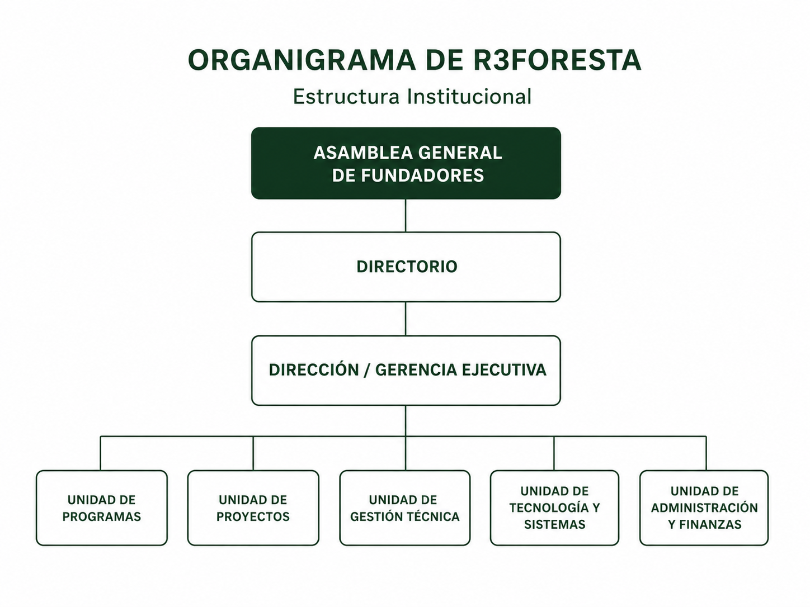
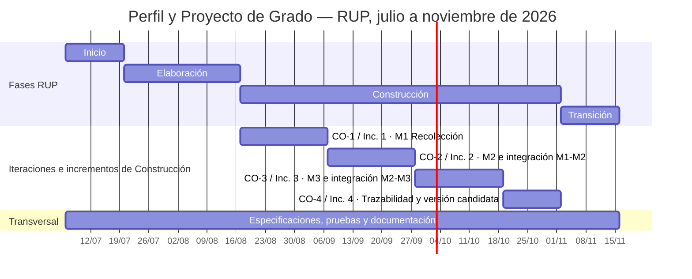
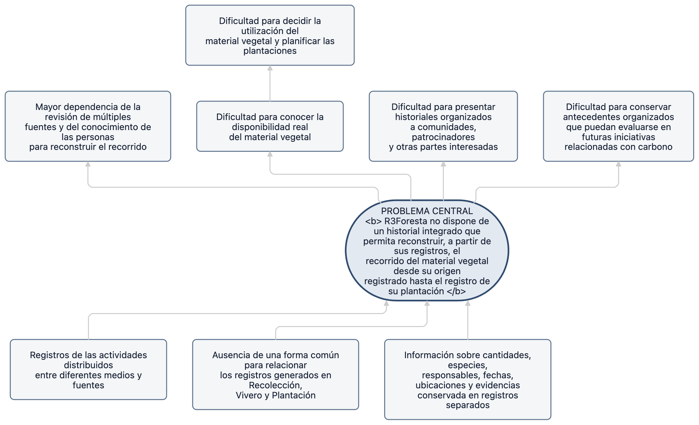

# Sistema de trazabilidad del material vegetal para reforestación con proyección hacia bonos de carbono: caso R3Foresta

## Índice general

<!-- toc -->

- [1. Introducción](#1-introducción)
- [2. Antecedentes](#2-antecedentes)
- [3. Planteamiento del problema](#3-planteamiento-del-problema)
- [4. Objetivos](#4-objetivos)
- [5. Justificación](#5-justificación)
- [6. Alcances y límites](#6-alcances-y-límites)
- [7. Marco teórico preliminar](#7-marco-teórico-preliminar)
- [8. Metodología de desarrollo](#8-metodología-de-desarrollo)
- [9. Índice propuesto del Proyecto de Grado](#9-índice-propuesto-del-proyecto-de-grado)
- [10. Cronograma de actividades](#10-cronograma-de-actividades)
- [11. Referencias bibliográficas](#11-referencias-bibliográficas)
- [12. Anexos](#12-anexos)

<!-- tocstop -->

<!-- Índice regenerable a partir de los encabezados Markdown; no editar sus entradas de forma aislada. -->

## 1. Introducción

La reforestación es un proceso que involucra distintas etapas, actores y decisiones, desde la obtención del material vegetal hasta su establecimiento en campo. Esta complejidad aumenta cuando una organización proyecta que sus actividades puedan formar parte, en el futuro, de iniciativas relacionadas con bonos de carbono, donde intervienen procesos adicionales de monitoreo, medición, validación y verificación.

Para R3Foresta, la generación futura de bonos de carbono constituye un objetivo estratégico de largo plazo (R3Foresta, 2026). Alcanzarlo requerirá trabajos posteriores que exceden el alcance de este Proyecto de Grado. Sin embargo, antes de pensar en esos procesos, existe una necesidad más inmediata: organizar y relacionar la información que se genera durante las actividades de reforestación.

Actualmente, parte de esta información se encuentra distribuida entre fotografías, redes sociales, servicios de mensajería, cuadernos, notas y el conocimiento de las personas involucradas. Esto dificulta responder preguntas básicas sobre el material vegetal: de dónde provino, quién estuvo a cargo, qué ocurrió durante su paso por el vivero, cuántas unidades fueron movilizadas y dónde terminó siendo plantado.

Este Proyecto de Grado aborda precisamente ese primer nivel del problema. Se propone desarrollar un sistema de trazabilidad como componente de **R3foresta App**, orientado a preservar el historial del material vegetal desde su origen registrado, ya sea mediante la recolección de semillas o la incorporación de material adquirido externamente al proceso de trazabilidad, pasando por su desarrollo en vivero cuando corresponda, hasta el registro de su plantación. El sistema integrará información sobre procedencia, cantidades, responsables, ubicaciones y evidencias mediante los módulos de **Recolección, Vivero y Plantación**, contemplando tanto el material obtenido por R3foresta como el adquirido de fuentes externas.

De esta manera, R3Foresta podrá comenzar a construir un historial organizado de sus actividades de reforestación que responda a sus necesidades actuales y que, en el futuro, pueda evaluarse como parte de una base documental para iniciativas de carbono. El alcance del proyecto concluye con el registro de la plantación y no incluye el monitoreo posterior de los árboles, la cuantificación de carbono ni los procesos de certificación o emisión de créditos.

## 2. Antecedentes

### 2.1. Antecedentes institucionales

R3Foresta fue creada en 2019 como una iniciativa socioambiental orientada a la bioregeneración de ecosistemas y al fortalecimiento de las comunidades vinculadas. Actualmente integra reforestación, agua, biodiversidad, residuos, alimentación y tecnología mediante los componentes R3Carbon, R3Water, R3Bio y R3F10 — Reciclaje y Economía Circular (R3Foresta, 2026).

**Figura 1**

*Estructura organizacional de R3Foresta*



*Nota.* Organigrama institucional proporcionado por la Fundación R3Foresta.

**R3foresta App** se vincula con la proyección institucional de R3Carbon mediante la trazabilidad del material vegetal (R3Foresta, 2026). La aplicación relacionará su recorrido desde su origen registrado, ya sea mediante la recolección de semillas o la incorporación de material adquirido externamente al proceso de trazabilidad, hasta el registro de su plantación, incluido su desarrollo en vivero cuando corresponda. El seguimiento posterior, la medición de carbono y la certificación quedan fuera del proyecto.

### 2.2. Antecedentes internacionales

En Perú, Salamanca Contreras (2024) implementó un sistema web para administrar existencias y despachos de un vivero comercial y reportó mejoras en la exactitud del inventario. El trabajo muestra el aporte de centralizar los movimientos del vivero, pero no reconstruye la procedencia del material ni su transferencia hacia actividades de reforestación.

En Ecuador, Mayorga Vásquez et al. (2022) propusieron un sistema web que integró información administrativa y productiva de viveros. A diferencia de R3foresta App, no relaciona de extremo a extremo la recolección, el manejo en vivero y la evidencia geográfica de la plantación.

En el ámbito de la trazabilidad, Thakur et al. (2011) utilizaron eventos para representar estados, movimientos y transformaciones y recuperar relaciones históricas dentro de una cadena. Su dominio es agroalimentario y no contempla los cambios biológicos, las unidades de medida ni las reglas del material vegetal utilizado por R3Foresta.

### 2.3. Antecedentes en Bolivia

Quispe Tola y Condori Zapana (2020) desarrollaron para la Autoridad de Fiscalización y Control Social de Bosques y Tierra un sistema que centraliza iniciativas forestales e incorpora consultas, mapas y reportes. Su unidad principal es la iniciativa o proyecto forestal, no la cadena operativa del material vegetal entre recolección, vivero y plantación.

### 2.4. Antecedentes cercanos a la ciudad de La Paz

En las fuentes revisadas no se identificó un trabajo equivalente desarrollado en la ciudad de La Paz. Los antecedentes más cercanos corresponden al departamento de La Paz y a la ciudad de El Alto.

Limachi Mamani (2020) desarrolló para la Autoridad de Fiscalización y Control Social de Bosques y Tierra un sistema que registra y geolocaliza viveros, especies y volúmenes de producción. Su unidad principal es el vivero, por lo que no reconstruye el recorrido del material vegetal desde su procedencia hasta la plantación.

Valdez Alvarado (2023) desarrolló para la Unidad de Forestación del Gobierno Autónomo Municipal de El Alto un sistema que centraliza información sobre plantines, responsables, solicitudes y plantaciones. Es el antecedente local más cercano al recorrido Vivero–Plantación. R3foresta App incorpora además la Recolección y las relaciones necesarias para reconstruir la procedencia, los movimientos, las cantidades y las evidencias.

Los trabajos revisados resuelven partes del problema, como el inventario de viveros, la geolocalización, la producción o la representación de eventos. Dentro del alcance de la búsqueda, no se identificó una solución que integre la procedencia propia o externa, los movimientos entre Recolección, Vivero y Plantación, la consistencia de cantidades y saldos y la evidencia del destino. Esta conclusión se limita a las fuentes consultadas.

## 3. Planteamiento del problema

### 3.1. Situación problemática

Para construir un historial integrado del material vegetal, R3Foresta necesita relacionar la información que se genera durante cada etapa de las actividades de Recolección, Vivero y Plantación. Sin embargo, actualmente estos registros se encuentran distribuidos entre fotografías, redes sociales, servicios de mensajería, cuadernos, notas y el conocimiento de las personas involucradas, sin una forma común de relacionarlos entre sí.

Esta dispersión dificulta relacionar información que pertenece a un mismo recorrido. Una fotografía, por ejemplo, puede mostrar el resultado de una plantación, pero, de forma aislada, no permite determinar con claridad cuántas plantas fueron utilizadas, qué especies participaron, cuándo ocurrió la actividad, dónde se realizó o quiénes estuvieron involucrados.

En el vivero, es necesario conocer qué material de propagación se encuentra disponible, qué cantidad está en proceso de germinación, qué plantas continúan en desarrollo y cuáles pueden destinarse a una futura plantación. Sin esta información relacionada, resulta difícil conocer la disponibilidad real del material vegetal y tomar decisiones sobre su utilización.

La plantación presenta una necesidad similar. Al planificar una plantación, se debe definir cuántas plantas se utilizarán y qué especies la compondrán, incluso estableciendo su distribución porcentual cuando corresponda. Para ello es necesario conocer previamente qué material está disponible y si será necesario complementarlo con plantas adquiridas externamente.

A medida que se realizan nuevas recolecciones, procesos de vivero y plantaciones, aumenta también la cantidad de información que debe administrarse y relacionarse. Cuando estos registros permanecen separados, reconstruir posteriormente el recorrido del material requiere revisar distintas fuentes y recurrir al conocimiento de las personas que participaron en los procesos.

Esta situación dificulta tanto la administración interna de las actividades de reforestación como la presentación de historiales organizados a comunidades, patrocinadores y otras partes interesadas. También limita la posibilidad de conservar desde ahora antecedentes que, complementados posteriormente con procesos de monitoreo, medición y verificación, puedan evaluarse como parte de futuras iniciativas relacionadas con carbono.

El árbol de problemas que sintetiza esta situación se presenta en el **Anexo A**.

### 3.2. Problema central

Actualmente, R3Foresta no dispone de un historial integrado que le permita reconstruir, a partir de sus registros, el recorrido del material vegetal desde su origen registrado hasta el registro de su plantación.

### 3.3. Formulación del problema

#### 3.3.1. Pregunta general

¿Cómo puede R3Foresta organizar y relacionar la información generada durante sus actividades de reforestación para reconstruir, a partir de sus registros, el recorrido del material vegetal desde su origen registrado hasta el registro de su plantación?

#### 3.3.2. Preguntas específicas

- ¿Qué información se genera y cómo se gestiona actualmente en las actividades de Recolección, Vivero y Plantación de R3Foresta?
- ¿Qué información y relaciones deben registrarse para reconstruir el recorrido registrado del material vegetal desde su origen registrado hasta el registro de su plantación?
- ¿Qué debe permitir el sistema en Recolección, Vivero y Plantación para mantener vinculada la información del material vegetal durante su recorrido?
- ¿Cómo verificar que lo implementado cumple los requerimientos definidos y que los registros conservan coherencia entre las cantidades y los movimientos del material vegetal?
- ¿En qué medida el sistema permite reconstruir, a partir de sus registros y evidencias, el recorrido del material vegetal en escenarios operativos representativos de R3Foresta?

## 4. Objetivos

### 4.1. Objetivo general

Desarrollar un sistema web que permita a R3Foresta registrar, organizar y relacionar la información generada en las actividades de Recolección, Vivero y Plantación, para reconstruir, a partir de sus registros, el recorrido del material vegetal desde su origen registrado hasta el registro de su plantación.

### 4.2. Objetivos específicos

- **Analizar** la información que se genera y cómo se gestiona actualmente en las actividades de Recolección, Vivero y Plantación de R3Foresta.
- **Diseñar** la organización de la información y las relaciones necesarias para reconstruir el recorrido registrado del material vegetal desde su origen registrado hasta el registro de su plantación.
- **Implementar** en el sistema las funciones de Recolección, Vivero y Plantación necesarias para mantener vinculada la información del material vegetal durante su recorrido.
- **Verificar** que las funciones implementadas cumplan los requerimientos definidos y que los registros mantengan coherencia entre las cantidades y los movimientos del material vegetal.
- **Evaluar**, mediante escenarios operativos representativos, en qué medida el sistema permite reconstruir, a partir de sus registros y evidencias, el recorrido del material vegetal.

## 5. Justificación

R3Foresta necesita una cadena informacional común para reconstruir el recorrido del material vegetal y conocer su procedencia, disponibilidad, pérdidas, transferencias y destino (Olsen & Borit, 2013; International Organization for Standardization, 2020). El sistema relacionará los registros de Recolección, Vivero y Plantación con el propósito de reducir la dependencia de búsquedas manuales y de la memoria de las personas.

La generación futura de bonos de carbono forma parte de la orientación institucional de R3Foresta (R3Foresta, 2026). R3foresta App conservará, desde su origen registrado, un historial de cantidades, saldos, responsables, ubicaciones y evidencias. Esta base podrá respaldar la información presentada a comunidades, patrocinadores y aliados y evaluarse para una posible reutilización en futuras iniciativas de carbono. Registrar esos antecedentes desde ahora reduce la necesidad de reconstruirlos después a partir de fuentes dispersas.

El historial no demostrará por sí mismo la supervivencia o el crecimiento de las plantas, la biomasa, las remociones de dióxido de carbono equivalente, la línea base, la adicionalidad, la permanencia o las fugas. Tampoco sustituirá el seguimiento de campo, el monitoreo, la cuantificación, la validación, la verificación ni la emisión de créditos (International Organization for Standardization, 2019; Verra, s. f.). Estas actividades corresponden a proyectos posteriores y no amplían el alcance académico.

El aporte tecnológico y académico consistirá en integrar el análisis del dominio, un modelo de trazabilidad, reglas de integridad, tres módulos y evidencia de verificación y validación. La infraestructura, el repositorio y los equipos ya disponibles respaldan su factibilidad técnica. Los beneficios se informarán según los escenarios ejecutados, sin asumir mejoras ni impactos ambientales antes de evaluarlos.

## 6. Alcances y límites

### 6.1. Alcance funcional

El alcance funcional comprende tres módulos. El recorrido académico se inicia con el origen registrado: una recolección de semillas o la incorporación, en Vivero o Plantación, de material vegetal adquirido externamente. En esta última variante se conservará la información disponible sobre su procedencia, proveedor o entidad de origen, cantidad, unidad, fecha de ingreso, responsable y evidencia asociada.

- **Recolección.** Registrará la especie, la cantidad y unidad de medida, la fecha, el responsable, la ubicación y la evidencia del material recolectado. Permitirá identificar el lote de origen y su transferencia al vivero hasta su cierre o vinculación con el material resultante.

- **Vivero.** Registrará la recepción y el manejo del material procedente de Recolección o adquirido externamente. Para el material externo, conservará su ingreso y la procedencia disponible. También conservará los hechos que expliquen cambios de cantidad, mermas, descartes, saldo vivo y salidas hacia Plantación, hasta el despacho, cierre o agotamiento del material.

- **Plantación.** Registrará el material procedente de Vivero y, cuando corresponda, el adquirido externamente para su incorporación directa a esta etapa. Relacionará el material con la campaña o subcampaña y conservará la procedencia, las cantidades recibidas, plantadas, devueltas o descartadas, los responsables, la fecha, la ubicación y la evidencia.

Los módulos compartirán identificadores para reconstruir el recorrido del material vegetal y explicar los saldos. El historial distinguirá los movimientos entre responsables o etapas de los cambios biológicos u operativos que modifican cantidades o unidades.

Como controles transversales, el producto aplicará autenticación y autorización, registro de operaciones críticas, respaldo y recuperación, protección de credenciales y tratamiento restringido de fotografías, coordenadas y datos personales. Esta información no se proporcionará a agentes de inteligencia artificial sin autorización.

Los registros de trazabilidad podrán evaluarse para su posible reutilización y complemento en futuras iniciativas de carbono. No constituyen monitoreo ni certificación; su pertinencia dependerá de la metodología, las mediciones y los controles que se adopten posteriormente.

### 6.2. Límites

- El alcance concluye con el registro de la plantación; no comprende mantenimiento, reposición, crecimiento ni seguimiento de supervivencia.
- El sistema no calcula biomasa o dióxido de carbono equivalente, no aborda línea base, adicionalidad o permanencia y no implementa monitoreo, reporte y verificación de carbono ni evalúa elegibilidad bajo un estándar.
- El proyecto no certifica plantaciones, no genera, emite ni comercializa bonos o créditos y no se integra con mercados de carbono o certificadoras.
- Las fotografías, coordenadas, fechas y documentos respaldan el registro con el que se relacionan, pero no constituyen autenticación forense ni certificación independiente del hecho físico.
- Blockchain, NFT, contratos inteligentes, IPFS, anclajes criptográficos y componentes equivalentes quedan fuera del aporte académico, de la verificación y de los resultados.
- El producto se desarrollará para el caso y los procesos de R3Foresta; no incluye una operación nacional, un despliegue masivo ni la generalización automática a otras organizaciones.

## 7. Marco teórico preliminar

### 7.1. Sistema de información

Un sistema reúne elementos interrelacionados que actúan de forma conjunta (International Organization for Standardization, 2026). En este proyecto, el sistema de información integra usuarios, módulos, datos, reglas y controles para registrar y consultar el recorrido del material vegetal entre Recolección, Vivero y Plantación.

### 7.2. Trazabilidad

La trazabilidad es la capacidad de acceder a información relacionada con un objeto a lo largo de su ciclo de vida o de las etapas definidas para su seguimiento (Olsen & Borit, 2013). Moe (1998) diferencia la trazabilidad interna de aquella que enlaza diferentes etapas de una cadena, mientras que Dabbene et al. (2014) destacan la importancia de la identificación, la granularidad y la recuperación de las relaciones históricas. En R3Foresta, la trazabilidad abarcará desde el origen registrado hasta el registro de la plantación.

### 7.3. Material vegetal

La Organización de las Naciones Unidas para la Alimentación y la Agricultura incluye dentro del material reproductivo forestal las semillas, las partes de plantas y las plantas producidas a partir de ellas. Para iniciativas forestales recomienda documentar la fuente, la cantidad, los tratamientos, la distribución y los lugares donde el material se utiliza, además de conservar información del proveedor cuando es adquirido (Food and Agriculture Organization of the United Nations, s. f.). En este proyecto, *material vegetal* comprende esas unidades durante el periodo definido por el alcance.

### 7.4. Reforestación

La reforestación corresponde al restablecimiento de bosque mediante plantación o siembra deliberada en terrenos clasificados como bosque (Food and Agriculture Organization of the United Nations, 2023). Para este proyecto, el término delimita el propósito de las actividades en las que se utiliza el material vegetal, pero no implica que el sistema mida recuperación ecológica, supervivencia o captura de carbono. El producto registra la plantación como último hecho de la cadena operativa considerada.

### 7.5. Bonos de carbono

En el título, *bonos de carbono* se utiliza como denominación general de futuros créditos de carbono. En programas como el Verified Carbon Standard, las unidades se emiten después de cuantificar y verificar las reducciones o remociones según las reglas aplicables (Verra, s. f.). Su generación futura forma parte de la orientación estratégica de R3Foresta (R3Foresta, 2026). El historial producido por el sistema podrá evaluarse para su posible reutilización como base documental parcial en iniciativas posteriores.

Un proyecto de gases de efecto invernadero requiere una metodología aplicable, línea base, identificación de fuentes y sumideros, cuantificación, monitoreo, reporte y gestión de la calidad de los datos (International Organization for Standardization, 2019). En el Verified Carbon Standard también intervienen la validación del proyecto, la verificación independiente y la solicitud de emisión de unidades (Verra, s. f.). Por ello, la cadena de custodia registrada por R3foresta App no demuestra resultados climáticos, elegibilidad bajo un estándar ni derecho a recibir créditos.

### 7.6. Cadena de custodia

La cadena de custodia conserva la relación entre el material, los actores responsables y los movimientos o cambios registrados durante un recorrido. ISO 22095:2020 proporciona terminología y modelos generales para representar cadenas de custodia y advierte que un sistema de este tipo no demuestra por sí solo la veracidad de las declaraciones incorporadas (International Organization for Standardization, 2020). En R3Foresta, la cadena de custodia se utilizará para relacionar la procedencia, las cantidades, los responsables, las evidencias y el destino del material vegetal, sin atribuir al sistema funciones de certificación.

### 7.7. Rational Unified Process

El Rational Unified Process es un proceso dirigido por casos de uso, centrado en la arquitectura e iterativo e incremental. Organiza el ciclo de vida en Inicio, Elaboración, Construcción y Transición; los riesgos orientan las iteraciones y cada fase concluye con un hito de revisión (Kruchten, 2004; IBM, s. f.). En este proyecto, las iteraciones de Construcción producirán o ampliarán un incremento ejecutable; las de Inicio y Elaboración generarán productos de decisión y, cuando corresponda, una arquitectura base ejecutable. Los módulos se integrarán progresivamente durante Construcción.

### 7.8. Spec-Driven Development

Spec-Driven Development, o desarrollo guiado por especificaciones, define el comportamiento antes de implementarlo. Se aplicará como práctica dentro de RUP mediante un protocolo basado en el flujo de GitHub Spec Kit: especificar, planificar, descomponer en tareas e implementar (GitHub, 2026). Cada especificación incluirá escenarios, reglas, casos límite y criterios de aceptación; cualquier cambio aprobado actualizará también los planes, las tareas y las pruebas afectadas.

### 7.9. Desarrollo de software asistido por inteligencia artificial

La inteligencia artificial podrá apoyar el análisis, el diseño, el código, las pruebas y la documentación. No aprobará requisitos, reglas del dominio ni resultados y no sustituirá la revisión del código ni la responsabilidad autoral. Toda contribución material se someterá a control humano y dejará registro de la herramienta, la tarea, la salida utilizada, la revisión, la prueba y el cambio asociado (GitHub, 2026; Tabassi, 2023).

## 8. Metodología de desarrollo

### 8.1. RUP adaptado

El desarrollo utilizará el **Rational Unified Process (RUP) adaptado**, complementado con **Spec-Driven Development asistido por inteligencia artificial**. RUP será el proceso rector; SDD organizará el paso de las especificaciones a planes, tareas, código y pruebas; y la IA actuará como herramienta de apoyo bajo revisión humana.

RUP se adopta porque permite tratar riesgos de forma temprana, mantener una arquitectura compartida, relacionar requisitos con pruebas e integrar progresivamente los tres módulos. La adaptación conservará fases, hitos, iteraciones y productos verificables, pero simplificará los roles y documentos que no aporten a una ejecución individual (IBM, s. f.; Kruchten, 2004).

### 8.2. Aplicación al proyecto

**Tabla 1**

*Aplicación de RUP adaptado*

| Fase | Iteración | Actividades principales | Productos e hito de cierre |
|---|---|---|---|
| Inicio | IN-1 | Delimitar el problema, los actores, los tres módulos, los requisitos iniciales, los riesgos y la referencia académica | Visión, alcance, glosario, casos de uso iniciales, plan y revisión del hito LCO |
| Elaboración | EL-1 | Detallar reglas críticas; diseñar el modelo de trazabilidad, la arquitectura, los datos y los contratos entre módulos; comprobar mediante un prototipo arquitectónico mínimo M1→M2→M3 la identidad, procedencia, integridad e historial, junto con los riesgos técnicos principales | Arquitectura base ejecutable, modelo de dominio y datos, especificaciones priorizadas y revisión del hito LCA |
| Construcción | CO-1 a CO-4 | Desarrollar M1 Recolección; agregar M2 Vivero e integrar M1→M2; agregar M3 Plantación e integrar M2→M3; completar la trazabilidad transversal y las pruebas | Cuatro incrementos ejecutables, migraciones, pruebas, evidencia de integración, versión candidata e hito IOC |
| Transición | TR-1 | Ejecutar pruebas del sistema, escenarios de validación, correcciones, despliegue, manuales, aceptación y cierre | Versión final, informe de resultados, registro de aceptación e hito PR |

*Nota.* Elaboración propia con base en las fases, iteraciones e hitos de RUP descritos por Kruchten (2004) e IBM (s. f.), adaptados al alcance y a los tres módulos del proyecto.

En cada fase se aplicarán, según corresponda, las disciplinas de requisitos, análisis y diseño, implementación, pruebas, despliegue, gestión del proyecto y gestión de configuración y cambios.

Los hitos de cierre serán **LCO** (*Lifecycle Objectives*, objetivos del ciclo de vida), **LCA** (*Lifecycle Architecture*, arquitectura del ciclo de vida), **IOC** (*Initial Operational Capability*, capacidad operativa inicial) y **PR** (*Product Release*, liberación del producto).

### 8.3. Flujo SDD asistido por IA

En cada iteración se priorizarán requisitos y riesgos; se elaborará una especificación con escenarios, reglas, invariantes y criterios de aceptación; se prepararán el plan y las tareas; y se implementará, integrará, probará y demostrará el resultado. Los hallazgos actualizarán de forma controlada las especificaciones y los productos afectados, con pruebas de regresión e historial de la decisión.

### 8.4. Verificación, validación y aceptación

La **verificación técnica** contrastará requisitos, reglas e invariantes mediante pruebas unitarias, funcionales, de integración y regresión. Como mínimo se comprobarán el saldo no negativo, el rechazo de consumos o asignaciones superiores al disponible, la prevención de duplicados, la consistencia de las transferencias M1→M2 y M2→M3 y la reconstrucción de un historial completo con evidencia asociada.

La **validación operativa** utilizará escenarios representativos seleccionados a partir de variantes reales de R3Foresta, incluida la ruta principal y los ingresos externos que permanezcan en el alcance. Cada escenario indicará si emplea una operación real autorizada o datos controlados y registrará precondiciones, datos, pasos, resultado esperado, resultado observado, evidencia, defectos y decisión. La **aceptación** confrontará los resultados con criterios definidos previamente para cada incremento y para el producto integrado; los resultados conformes y no conformes se documentarán sin anticipar mejoras no comprobadas.

### 8.5. Seguimiento y evidencia

El trabajo se organizará mediante una lista priorizada vinculada con los objetivos, las iteraciones y los incrementos. Cada elemento relacionará la necesidad, el requisito, la especificación, la decisión de diseño, la tarea, el cambio, la prueba, el resultado y la aceptación. Al cerrar una iteración se revisarán sus productos y se registrarán decisiones, riesgos y ajustes.

La responsabilidad técnica y autoral permanecerá bajo control humano. Los agentes de inteligencia artificial no constituirán roles RUP y sus contribuciones materiales se registrarán y revisarán según lo definido en la sección 7.9.

## 9. Índice propuesto del Proyecto de Grado

```text
Resumen
Palabras clave

Introducción

Capítulo I — Marco introductorio
  1.1 Antecedentes institucionales y trabajos similares
  1.2 Planteamiento del problema
  1.3 Objetivos
  1.4 Justificación
  1.5 Alcances y límites
  1.6 Metodología de desarrollo
  1.7 Organización del documento

Capítulo II — Marco teórico y conceptual
  2.1 Material vegetal y procesos de reforestación
  2.2 Trazabilidad y cadena de custodia
  2.3 Eventos, transformaciones y procedencia
  2.4 Integridad de cantidades y saldos
  2.5 Evidencia e información geográfica
  2.6 Reconstrucción y comprobación de la trazabilidad
  2.7 Bonos de carbono y alcance de la proyección
  2.8 Rational Unified Process
  2.9 Spec-Driven Development y asistencia de inteligencia artificial
  2.10 Síntesis conceptual adoptada

Capítulo III — Marco aplicativo
  3.1 Análisis de la información y su gestión actual
  3.2 Organización de la información y sus relaciones
  3.3 Implementación e integración de los tres módulos
    3.3.1 Iteración CO-1: M1 Recolección
    3.3.2 Iteración CO-2: M2 Vivero e integración M1→M2
    3.3.3 Iteración CO-3: M3 Plantación e integración M2→M3
    3.3.4 Iteración CO-4: trazabilidad transversal e integración total
  3.4 Verificación de funciones y coherencia de registros
  3.5 Validación operativa y aceptación
  3.6 Presentación y discusión de resultados

Conclusiones
Recomendaciones
Referencias bibliográficas
Anexos
```

**Tabla 2**

*Correspondencia entre objetivos y secciones del documento final*

| Objetivo específico | Resultado principal | Ubicación prevista |
|---|---|---|
| Analizar | Procesos, actores, requisitos y reglas definidos | Capítulo III, sección 3.1 |
| Diseñar | Modelo de trazabilidad, relaciones e invariantes | Capítulo III, sección 3.2 |
| Implementar | Recolección, Vivero y Plantación integrados | Capítulo III, sección 3.3 |
| Verificar | Matriz de pruebas y resultados técnicos | Capítulo III, sección 3.4 |
| Evaluar | Reconstrucción y evidencia comprobadas mediante escenarios operativos de validación y criterios de aceptación | Capítulo III, secciones 3.5 y 3.6 |

*Nota.* Elaboración propia a partir de los objetivos específicos de la sección 4.2 y del índice propuesto del Proyecto de Grado presentado en esta sección.

## 10. Cronograma de actividades

El cronograma se desarrolla del **6 de julio al 15 de noviembre de 2026**, periodo definido para la ejecución académica. Conserva la presentación por objetivos específicos y muestra su correspondencia con las fases, las iteraciones y los incrementos de RUP.

**Tabla 3**

*Cronograma por objetivos, fases e iteraciones RUP*

| Periodo | Fase, iteración y énfasis | Actividades principales | Producto verificable |
|---|---|---|---|
| 6–19 jul | Inicio, IN-1 — Analizar | Alcance, actores, procesos, casos de uso, requisitos iniciales, riesgos y referencia académica | Visión, plan, requisitos iniciales e hito LCO |
| 20 jul–16 ago | Elaboración, EL-1 — Analizar y diseñar | Reglas, modelo de trazabilidad, arquitectura, línea vertical arquitectónica mínima M1→M2→M3, contratos y riesgos técnicos | Arquitectura base, especificaciones priorizadas e hito LCA |
| 17 ago–6 sep | Construcción, CO-1 — Implementar | Especificar, diseñar, implementar y probar M1 Recolección | Incremento 1: M1 funcional y probado |
| 7–27 sep | Construcción, CO-2 — Implementar | Construir M2 Vivero e integrar M1→M2 | Incremento 2: M1 y M2 integrados y probados |
| 28 sep–18 oct | Construcción, CO-3 — Implementar | Construir M3 Plantación e integrar M2→M3 | Incremento 3: tres módulos integrados |
| 19 oct–1 nov | Construcción, CO-4 — Implementar y verificar | Completar trazabilidad transversal, integración, regresión y versión candidata | Incremento 4: versión candidata e hito IOC |
| 2–8 nov | Transición, TR-1 — Verificar y evaluar | Pruebas del sistema, escenarios operativos y corrección de defectos | Informe de verificación y validación |
| 9–15 nov | Transición, TR-1 — Evaluar | Despliegue, manuales, aceptación y consolidación del documento | Producto liberado, hito PR y documento final para revisión |

*Nota.* Elaboración propia a partir del periodo de ejecución definido en el registro de decisiones del proyecto del 25 de agosto de 2026 y de la aplicación de RUP presentada en la Tabla 1, sustentada en Kruchten (2004) e IBM (s. f.).

**Figura 2**

*Diagrama de Gantt del proceso de desarrollo, julio–noviembre de 2026*



*Nota.* Elaboración propia; cada barra utiliza días calendario y cubre los periodos indicados en la Tabla 3.

## 11. Referencias bibliográficas

Dabbene, F., Gay, P., & Tortia, C. (2014). Traceability issues in food supply chain management: A review. *Biosystems Engineering, 120*, 65–80. https://doi.org/10.1016/j.biosystemseng.2013.09.006

Food and Agriculture Organization of the United Nations. (2023). *Terms and definitions: FRA 2025* (Forest Resources Assessment Working Paper No. 194). https://www.fao.org/3/cc4691en/cc4691en.pdf

Food and Agriculture Organization of the United Nations. (s. f.). *Forest reproductive material*. Sustainable Forest Management Toolbox. Recuperado el 19 de agosto de 2026, de https://www.fao.org/sustainable-forest-management-toolbox/modules/forest-reproductive-material/en

GitHub. (2026, 21 de agosto). *GitHub Spec Kit*. https://github.github.com/spec-kit/

IBM. (s. f.). *Project planning in the Rational Unified Process*. https://www.ibm.com/docs/en/rational-clearquest/10.0.9?topic=settings-project-planning

International Organization for Standardization. (2019). *Greenhouse gases—Part 2: Specification with guidance at the project level for quantification, monitoring and reporting of greenhouse gas emission reductions or removal enhancements* (ISO Standard No. 14064-2:2019). https://www.iso.org/standard/66454.html

International Organization for Standardization. (2020). *Chain of custody—General terminology and models* (ISO Standard No. 22095:2020). https://www.iso.org/standard/72532.html

International Organization for Standardization. (2026). *Quality management—Fundamentals and vocabulary* (ISO Standard No. 9000:2026). https://www.iso.org/standard/9000

Kruchten, P. (2004). *The Rational Unified Process: An introduction* (3.ª ed.). Addison-Wesley Professional.

Limachi Mamani, F. Z. (2020). *Sistema de registro geolocalización de viveros en el departamento de La Paz. Caso ABT*. https://repositorio.upea.bo/jspui/handle/123456789/172

Mayorga Vásquez, L. C., Riccardi Martillo, G. A., Bermeo Almeida, O. X., & Guevara Arias, V. I. (2022). Sistema web para los procesos administrativos y de producción en viveros del cantón Milagro. *Revista Ingeniería, 6*(16), 200–213. https://doi.org/10.33996/revistaingenieria.v6i16.100

Moe, T. (1998). Perspectives on traceability in food manufacture. *Trends in Food Science & Technology, 9*(5), 211–214. https://doi.org/10.1016/S0924-2244(98)00037-5

Olsen, P., & Borit, M. (2013). How to define traceability. *Trends in Food Science & Technology, 29*(2), 142–150. https://doi.org/10.1016/j.tifs.2012.10.003

Quispe Tola, M. R., & Condori Zapana, J. C. (2020). *Sistema inventario registro de iniciativas de manejo integral sustentables de los bosques y la Madre Tierra*. https://repositorio.upea.bo/jspui/bitstream/123456789/64/1/PDG-MARLIEN%20RUTH%20QUISPE%20TOLA-JUAN%20CARLOS%20CONDORI%20ZAPANA.pdf

R3Foresta. (2026, 23 de agosto). *Resumen ejecutivo institucional: Modelo integral de bioregeneración, innovación ambiental y desarrollo comunitario*.

Salamanca Contreras, F. R. (2024). *Influencia del sistema web con notificaciones en el proceso de control interno y seguimiento del inventario en el vivero Tu Semilla E.I.R.L. sede Tacna, 2022*. https://repositorio.upt.edu.pe/handle/20.500.12969/3690

Tabassi, E. (2023). *Artificial Intelligence Risk Management Framework (AI RMF 1.0)* (NIST AI 100-1). National Institute of Standards and Technology. https://doi.org/10.6028/NIST.AI.100-1

Thakur, M., Sørensen, C. F., Bjørnson, F. O., Forås, E., & Hurburgh, C. R. (2011). Managing food traceability information using EPCIS framework. *Journal of Food Engineering, 103*(4), 417–433. https://doi.org/10.1016/j.jfoodeng.2010.11.012

Valdez Alvarado, G. R. (2023). *Desarrollo de un sistema de información web para la gestión y control de viveros en la ciudad de El Alto. Caso: Unidad de Forestación del Gobierno Autónomo Municipal de El Alto*. https://repositorio.upea.bo/jspui/bitstream/123456789/1019/1/PROYECTO%20DE%20GRADO%20-%20%20GADIEL%20RANDALL.pdf

Verra. (s. f.). *Develop a Verified Carbon Standard (VCS) project.* Recuperado el 27 de agosto de 2026, de https://verra.org/programs/verified-carbon-standard/develop-a-vcs-project/

## 12. Anexos

### Anexo A — Árbol de problemas

**Figura A1**

*Árbol de problemas de la situación problemática*



*Nota.* Elaboración propia a partir de la problemática.
