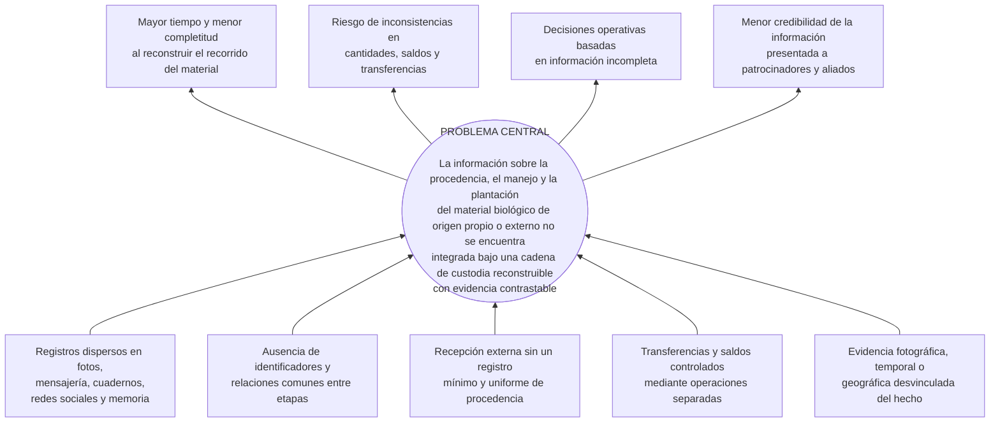
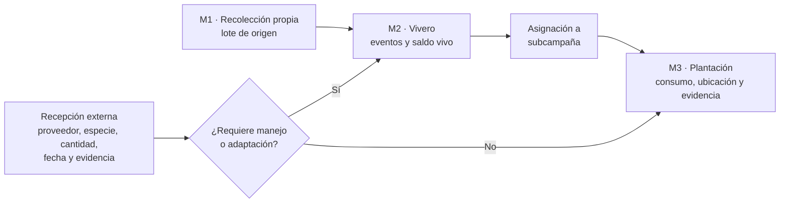
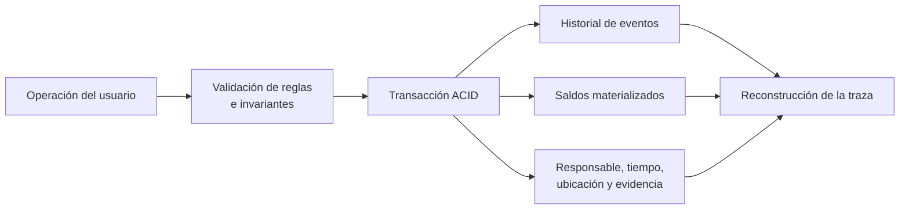
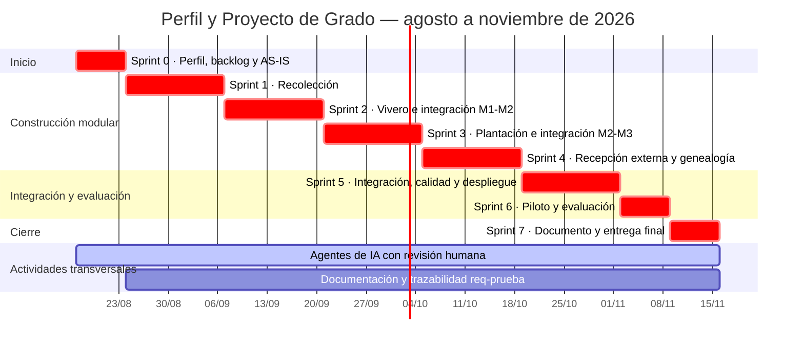

## Resumen

R3Foresta desarrolla actividades de reforestación con material biológico obtenido mediante recolección propia y, cuando la operación lo requiere, mediante la adquisición de plantines a proveedores externos. En la práctica actual, fotografías, mensajes, publicaciones en redes sociales, cuadernos y otros registros permiten documentar parcialmente estas actividades, pero la información no se conserva bajo una estructura común que relacione procedencia, manejo en vivero, cantidades, responsables, evidencias y plantación. Esta fragmentación dificulta reconstruir la cadena de custodia y presentar información consistente a la organización, comunidades, voluntarios, empresas patrocinadoras y otros actores interesados.

El proyecto tiene como objetivo desarrollar y evaluar un sistema de trazabilidad para la cadena de custodia del material biológico utilizado por R3Foresta, desde su recolección o recepción externa hasta su manejo en vivero y plantación. La solución mantendrá tres módulos operativos —Recolección, Vivero y Plantación— e incorporará la recepción externa como un flujo de ingreso que podrá dirigirse al vivero para adaptación o directamente a plantación, según las reglas que se definan durante el análisis.

La investigación será aplicada, con enfoque de ciencia del diseño y estudio de caso. La ejecución formal se desarrollará de agosto a noviembre de 2026 mediante ocho sprints para completar módulos, integraciones, recepción externa, pruebas, piloto y cierre. La verificación técnica comprobará requerimientos, invariantes de saldos y transferencias mediante pruebas unitarias, de integración, concurrencia, fallo inducido y extremo a extremo. La evaluación operativa comparará una línea base construida con 8 a 12 casos históricos con un piloto de hasta cinco usuarios. Se medirán recuperabilidad, evidencia, tiempo de reconstrucción y carga de registro. El proyecto no certifica plantaciones, supervivencia, captura de carbono ni créditos de carbono; su aporte se limita a producir una trazabilidad reconstruible con evidencia contrastable.

**Palabras clave:** trazabilidad, cadena de custodia, material biológico, reforestación, eventos, integridad de datos, R3Foresta.

---

## Índice general

1. Introducción
2. Antecedentes
3. Planteamiento del problema
4. Objetivos
5. Justificación
6. Alcances y límites
7. Marco teórico preliminar
8. Marco metodológico
9. Propuesta de solución y aporte de ingeniería
10. Temario tentativo del documento final
11. Cronograma de actividades
12. Recursos y presupuesto
13. Referencias bibliográficas

## Índice de tablas

- Tabla 1. Síntesis comparativa de antecedentes.
- Tabla 2. Cobertura prevista de la evaluación operativa.
- Tabla 3. Métricas e instrumentos de evaluación.
- Tabla 4. Correspondencia entre objetivos y resultados.
- Tabla 5. Cronograma resumido.
- Tabla 6. Presupuesto monetario previsto.

## Índice de figuras

- Figura 1. Árbol de causas y efectos.
- Figura 2. Cadena de custodia propuesta y flujos de origen.
- Figura 3. Modelo transaccional basado en eventos y saldos.
- Figura 4. Diagrama de Gantt, agosto–noviembre de 2026.

---

## 1. Introducción

La reforestación moviliza material biológico entre lugares, responsables y etapas con propósitos distintos. Una semilla o unidad de propagación puede ser recolectada, trasladada, recibida en vivero, sometida a procesos biológicos, agrupada como lote de plantas vivas, asignada a una actividad y finalmente plantada. R3Foresta también puede adquirir plantines a terceros, mantenerlos temporalmente en vivero para su adaptación o utilizarlos en una plantación directa. En ambos orígenes, la organización necesita conservar la relación entre procedencia, cantidades, responsables, tiempos, ubicaciones y evidencias.

La trazabilidad supera el almacenamiento aislado de inventarios o fotografías. Implica la capacidad de acceder a información relacionada con un objeto a lo largo de su vida y de las etapas de una cadena (Olsen & Borit, 2013). En una cadena de custodia, además, deben registrarse los movimientos y transformaciones bajo reglas explícitas; la existencia del sistema no verifica por sí sola la veracidad de las declaraciones realizadas por sus usuarios (International Organization for Standardization [ISO], 2020). Por esta razón, el presente trabajo utiliza expresiones prudentes: propone una trazabilidad reconstruible con evidencia contrastable, no una certificación independiente.

La práctica actual de R3Foresta conserva parte de la historia de sus actividades mediante fotografías, redes sociales, mensajería, cuadernos y memoria de los responsables. Estas fuentes tienen valor, pero se encuentran dispersas y no comparten necesariamente identificadores, unidades ni reglas de conciliación. El problema adquiere relevancia organizacional porque las empresas patrocinadoras financian árboles y requieren confianza respecto de cuántos fueron destinados a una actividad, dónde se plantaron y qué evidencia respalda esa ejecución.

Ante esta situación, el proyecto propone desarrollar y evaluar un sistema que integre tres módulos: Recolección, Vivero y Plantación. La adquisición externa no se convierte en un cuarto módulo, sino en un flujo alternativo de ingreso de material cuya procedencia debe conservarse. El aporte de ingeniería se concentra en la genealogía de lotes, el historial de eventos, la consistencia de cantidades y saldos, las transferencias atómicas entre etapas y la asociación de evidencia fotográfica, temporal y geográfica.

La investigación adopta un enfoque aplicado de ciencia del diseño, complementado con un estudio de caso en R3Foresta. Se combinará verificación técnica con una evaluación operativa de alcance acotado. La primera comprobará reglas e invariantes en condiciones controladas; la segunda contrastará la reconstrucción de casos históricos con trazas generadas durante un piloto real. Esta separación evita confundir la corrección del software con su utilidad práctica.

El perfil se organiza en antecedentes, problema, objetivos, justificación, alcance, fundamentos teóricos, metodología, propuesta, temario, cronograma, recursos y referencias. Su alcance temporal concluye a mediados de noviembre de 2026. Los instrumentos completos, resultados de pruebas, diagramas detallados y resultados del piloto corresponderán al documento final del Proyecto de Grado.

## 2. Antecedentes

Los antecedentes revisados muestran que la digitalización de viveros, la gestión de inventarios y la trazabilidad de cadenas físicas han sido abordadas de manera parcial, pero no resuelven de forma conjunta el recorrido que interesa a R3Foresta.

En Bolivia, Limachi Mamani (2020) desarrolló un sistema de registro y geolocalización de viveros para la Autoridad de Fiscalización y Control Social de Bosques y Tierra. El trabajo administra viveros, especies y volúmenes de producción, y demuestra la pertinencia de sistemas georreferenciados en el ámbito forestal boliviano. Su unidad de seguimiento principal es el vivero y no una genealogía de material desde el origen hasta la plantación. Por otra parte, Yujra Huanca (2022) estudió la producción y supervivencia de plantines de *Parastrephia lepidophylla* en vivero y campo. Este antecedente aporta conocimiento sobre la transición biológica vivero–plantación, aunque no desarrolla una solución informática de cadena de custodia.

En el contexto latinoamericano, Salamanca Contreras (2024) implementó un sistema web para control interno e inventario de un vivero comercial y reportó mejoras en exactitud de inventario y cumplimiento de despachos. Mayorga Vásquez et al. (2022) propusieron un sistema web para procesos administrativos y productivos de viveros. Ambos trabajos respaldan la utilidad de digitalizar existencias, producción y despachos, pero no integran la procedencia del material, las transferencias hacia campañas de reforestación ni la reconstrucción de evidencias geográficas de plantación.

En la literatura internacional, Moe (1998) distinguió entre la trazabilidad interna y la trazabilidad a través de una cadena, y resaltó la necesidad de definir unidades rastreables. Olsen y Borit (2013) precisaron que la trazabilidad consiste en la posibilidad de acceder a información sobre objetos considerados a lo largo de su ciclo de vida. Dabbene et al. (2014) revisaron problemas de identificación, granularidad, transformación y recuperación de genealogía en cadenas físicas. Aunque estas contribuciones provienen principalmente del ámbito agroalimentario, sus principios son transferibles al seguimiento de material biológico.

Thakur et al. (2011) mostraron que los eventos de negocio pueden representar estados, movimientos y transformaciones, separando datos maestros de hechos ocurridos. Este enfoque es cercano a la necesidad de R3Foresta de conservar un historial que explique los cambios de saldo. Sin embargo, la aplicación forestal incorpora particularidades: el cambio legítimo de unidades después de una transformación biológica observada, la mortalidad o merma, la asignación física a subcampañas y la relación entre el lote y una ubicación de plantación.

La revisión no identificó, entre las fuentes consultadas, una solución que combine en un mismo caso la recolección propia, la recepción de plantines externos, el manejo en vivero, la plantación, un historial de eventos, saldos protegidos por reglas transaccionales y evidencia geoespacial. Esta afirmación delimita el resultado de la búsqueda realizada y no pretende demostrar la inexistencia absoluta de otras soluciones.

**Tabla 1. Síntesis comparativa de antecedentes.**

| Antecedente | Aporte principal | Diferencia respecto de R3Foresta |
|---|---|---|
| Limachi Mamani (2020) | Registro y geolocalización de viveros en La Paz | No reconstruye la genealogía del material hasta la plantación |
| Yujra Huanca (2022) | Seguimiento biológico vivero–campo | No desarrolla un sistema de información de cadena de custodia |
| Salamanca Contreras (2024) | Inventario y despachos de vivero | Se orienta a inventario comercial y no a procedencia forestal y plantación |
| Mayorga Vásquez et al. (2022) | Gestión administrativa y productiva de viveros | No integra origen, eventos, transferencias atómicas ni evidencia de campo |
| Thakur et al. (2011) | Representación de una cadena mediante eventos | No contempla las reglas biológicas y geográficas del caso de reforestación |

## 3. Planteamiento del problema

### 3.1. Situación problemática

R3Foresta realiza actividades de reforestación con comunidades, voluntarios y organizaciones patrocinadoras. La evidencia disponible de esas actividades se conserva actualmente en fotografías, publicaciones en redes sociales, conversaciones de mensajería, cuadernos, notas y la memoria de las personas involucradas. Estas fuentes permiten comunicar que una actividad ocurrió, pero no constituyen por sí mismas una estructura común para reconstruir de extremo a extremo la procedencia y el recorrido del material plantado.

El material puede tener dos orígenes. En el primero, R3Foresta recolecta semillas u otro material de propagación, lo traslada a vivero, registra procesos biológicos y obtiene plantas vivas. En el segundo, adquiere plantines de proveedores externos. Estos plantines pueden pasar por el vivero para adaptación o dirigirse a una plantación. En la recepción externa se requiere, como mínimo, conservar proveedor u origen declarado, especie, cantidad, fecha y evidencia fotográfica; un recibo o factura puede adjuntarse cuando exista, pero no puede considerarse obligatorio porque no siempre está disponible.

Durante el recorrido cambian la ubicación, el responsable, el estado, la agrupación y, en ciertos procesos, la unidad de medida. El material recolectado puede expresarse en gramos o unidades de propagación, mientras el saldo vivo del vivero y la plantación se expresan en unidades de plantas. Este cambio no es una conversión aritmética automática, sino el resultado observado de un proceso biológico. También pueden ocurrir mermas, descartes, devoluciones, cierres y asignaciones parciales.

Cuando las salidas y entradas se registran de manera separada, o cuando un saldo puede alterarse sin conservar el hecho que lo explica, aparecen riesgos de registros incompletos, doble asignación, doble consumo y cantidades difíciles de conciliar. De manera similar, una fotografía o coordenada guardada fuera del hecho operativo puede perder su relación con la especie, cantidad, fecha y responsable que debía respaldar.

La consecuencia principal es una capacidad limitada para reconstruir la cadena de custodia con evidencia contrastable. Esto afecta decisiones internas sobre disponibilidad y pérdidas, y también la credibilidad de la información presentada a empresas patrocinadoras y aliados. El problema es informacional: el sistema puede fortalecer la consistencia y recuperabilidad de lo registrado, pero no puede garantizar por sí solo que una declaración del operador sea físicamente verdadera.

### 3.2. Árbol de causas y efectos

Las causas se formulan como hipótesis de diagnóstico y serán confirmadas, modificadas o descartadas mediante entrevistas, inventario documental y reconstrucción de casos históricos.

**Figura 1. Árbol de causas y efectos.**



### 3.3. Problema central

> En la práctica actual de R3Foresta, la información sobre la procedencia, recepción, manejo, transferencia y plantación del material biológico de origen propio o externo se conserva en registros dispersos que no comparten una estructura y relaciones comunes; esta fragmentación limita la reconstrucción de la cadena de custodia, la comprobación de la consistencia de cantidades y saldos y la presentación de evidencia contrastable a los actores interesados.

### 3.4. Formulación del problema

#### Pregunta general

> ¿Cómo desarrollar y evaluar, en el caso R3Foresta, un sistema de trazabilidad que permita reconstruir con evidencia contrastable la cadena de custodia del material biológico de origen propio o externo, desde su obtención hasta su manejo en vivero y plantación, y qué diferencias presenta frente a la práctica de registro actual en capacidad de reconstrucción y carga operativa?

#### Preguntas específicas

1. ¿Qué procesos, actores, datos, estados, eventos, unidades de medida y reglas de negocio intervienen en la recolección, recepción externa, vivero y plantación del material biológico?
2. ¿Qué modelo de información y reglas de integridad permite relacionar los orígenes, movimientos, transformaciones, saldos, responsables y evidencias de la cadena de custodia?
3. ¿Cómo implementar los módulos de Recolección, Vivero y Plantación e incorporar la recepción externa como un flujo de ingreso sin perder la historia de procedencia?
4. ¿En qué medida la solución cumple los requerimientos y preserva las invariantes definidas bajo pruebas funcionales, de integración, concurrencia, fallo inducido y extremo a extremo?
5. ¿Qué capacidad presenta la solución para reconstruir trazas con evidencia contrastable y qué carga operativa genera respecto de la práctica actual de R3Foresta?

## 4. Objetivos

### 4.1. Objetivo general

Desarrollar y evaluar un sistema de trazabilidad para la cadena de custodia del material biológico utilizado por R3Foresta, desde su recolección o recepción externa hasta su manejo en vivero y plantación, que permita reconstruir con evidencia contrastable su procedencia, movimientos, cantidades, responsables y destino.

### 4.2. Objetivos específicos

1. **Analizar** los procesos, actores, datos, estados, eventos, unidades de medida, requerimientos y reglas de negocio que intervienen en la recolección, recepción externa, vivero y plantación del material biológico.
2. **Diseñar** un modelo de trazabilidad e integridad que relacione orígenes, entidades, eventos, transformaciones, cantidades, saldos, responsables y evidencias, y que formalice las reglas aplicables a las transferencias entre etapas.
3. **Implementar** los módulos de Recolección, Vivero y Plantación, incorporando la recepción de material externo como flujo de ingreso hacia vivero o plantación y conservando su procedencia.
4. **Verificar** el cumplimiento de los requerimientos y de las invariantes de consistencia mediante pruebas unitarias, de integración, concurrencia, fallo inducido y extremo a extremo.
5. **Evaluar**, sobre una muestra delimitada, la capacidad de reconstrucción con evidencia contrastable y la carga operativa de la solución, comparándolas con una línea base obtenida de la práctica actual de R3Foresta.

## 5. Justificación

### 5.1. Justificación técnica

La cadena de custodia no se resuelve únicamente con formularios e inventarios. Las operaciones deben impedir saldos negativos, doble consumo y transferencias incompletas, incluso cuando dos usuarios actúan de forma concurrente o una operación falla. Además, el dominio exige diferenciar la transformación biológica observada de una conversión matemática de unidades. Estas condiciones justifican el uso de modelado de dominio, eventos, transacciones, control de concurrencia, información geoespacial y pruebas de invariantes.

El aporte técnico reside en integrar esos mecanismos en una solución aplicable al flujo de R3Foresta y en relacionar cada regla crítica con evidencia de prueba. La solución conservará la historia necesaria para explicar el saldo operativo sin presentarse como una arquitectura de *event sourcing* estricta.

### 5.2. Justificación operativa y organizacional

La organización necesita conocer qué material recibió o produjo, cuánto permanece disponible, qué se perdió, qué fue asignado y dónde se plantó. Una cadena reconstruible reduce la dependencia de la memoria y facilita la conciliación entre fuentes. La utilidad no se supondrá de antemano: será evaluada mediante tiempos, completitud, evidencia recuperable y percepción de uso.

### 5.3. Justificación comercial

Las empresas patrocinadoras aportan recursos para financiar árboles y actividades de reforestación. Para R3Foresta, la confianza de esos actores depende de poder relacionar la cantidad comprometida con la procedencia del material, la actividad ejecutada, el lugar de plantación y la evidencia disponible. El sistema no certifica una afirmación comercial, pero mejora la capacidad de la organización para presentar información consistente y contrastable.

### 5.4. Justificación académica y metodológica

El proyecto articula análisis del dominio, diseño de un modelo de trazabilidad, formalización de invariantes, implementación de mecanismos transaccionales y evaluación técnica y operativa. Esta articulación corresponde a un Proyecto de Grado orientado a resolver un problema real mediante método científico, de acuerdo con la modalidad definida por la UMSA (Universidad Mayor de San Andrés, s. f.).

La comparación AS-IS/TO-BE empleará el mismo instrumento antes y después. Las pruebas técnicas complementarán esa comparación al comprobar propiedades que no pueden inferirse de una interfaz o de la opinión de los usuarios.

### 5.5. Justificación económica

El beneficio económico potencial se relaciona con menor tiempo de reconstrucción, conciliación y preparación de información, y con la reducción de errores de asignación. No se afirmará ahorro antes de medirlo. La infraestructura prevista utiliza planes gratuitos y equipos propios, por lo que el desembolso principal corresponde a herramientas de asistencia, conectividad y trabajo de campo.

### 5.6. Justificación social y ambiental

Una mejor relación entre procedencia, responsables, cantidades y ubicación favorece la rendición de cuentas entre R3Foresta, comunidades, voluntarios, patrocinadores y aliados. No obstante, la trazabilidad de actividad no demuestra por sí sola supervivencia, recuperación ecológica o captura de carbono. Esas conclusiones requieren monitoreo biológico y metodologías externas al presente proyecto.

## 6. Alcances y límites

### 6.1. Alcance funcional

El proyecto mantendrá tres módulos operativos:

1. **Recolección:** registro del lote de origen propio, especie, cantidad y unidad, fecha, responsable, ubicación y evidencia.
2. **Vivero:** recepción del material que requiere manejo o adaptación, registro de eventos biológicos y operativos, mermas, descartes, saldo vivo, despacho y cierre.
3. **Plantación:** asignación de material a una subcampaña, registro de consumo, responsables, fecha, ubicación y evidencia de la plantación inicial.

La **recepción de plantines externos** será un flujo de ingreso y no un cuarto módulo. Considerará dos recorridos que deberán precisarse en el análisis:

- proveedor → recepción externa → vivero para adaptación → asignación → plantación;
- proveedor → recepción externa → plantación directa.

El registro mínimo de recepción incluirá proveedor u origen declarado, especie, cantidad, fecha y evidencia fotográfica. El recibo o factura será opcional. En ambos recorridos se conservará el vínculo con el origen externo.

También se encuentran dentro del alcance:

- identificación y genealogía de lotes y asignaciones;
- historial de eventos que explique los cambios de estado y saldo;
- reglas para impedir cantidades negativas, doble asignación y doble consumo;
- transferencias atómicas entre etapas cuando una operación afecte más de un registro;
- evidencia fotográfica, temporal y geográfica vinculada con el hecho que respalda;
- mejoras de interfaz necesarias para el piloto;
- pruebas unitarias, de integración, concurrencia, fallo inducido y extremo a extremo;
- evaluación comparativa de capacidad de reconstrucción y carga operativa.

### 6.2. Alcance de la evaluación

**Tabla 2. Cobertura prevista de la evaluación operativa.**

| Elemento | Cobertura prevista hasta noviembre de 2026 | Evidencia |
|---|---|---|
| Línea base AS-IS | 8 a 12 casos históricos completos o parcialmente reconstruibles | Documentos disponibles, entrevista y cronometraje |
| Piloto TO-BE | Actividad real coordinada con R3Foresta, con hasta cinco usuarios | Registros del sistema, observación y cuestionario |
| Origen propio | Incluido cuando exista una actividad compatible en la ventana | Traza real o caso controlado si no ocurre |
| Recepción externa | Incluida después de completar su análisis e implementación | Traza real si se concreta una adquisición; en caso contrario, caso controlado |
| Plantación | Se procurará validar durante una reforestación real | Registro de campo y contraste independiente cuando sea posible |
| Reglas críticas | Cobertura técnica completa del alcance implementado | Suite de pruebas y matriz requerimiento–regla–prueba |

El vivero, comunidad o lugar concreto del piloto se seleccionará con R3Foresta según disponibilidad de una actividad real, accesibilidad logística, consentimiento de participantes y posibilidad de observar el proceso. Esta decisión operativa no cambia el objeto del estudio de caso.

### 6.3. Fuera del alcance

Quedan fuera del proyecto:

- certificación, emisión o comercialización de bonos o créditos de carbono;
- cálculo de biomasa, CO₂ equivalente, adicionalidad, permanencia o línea base de carbono;
- certificación independiente de plantaciones o autenticidad forense de fotografías;
- inventario forestal y seguimiento ecológico de largo plazo;
- garantía de supervivencia del material plantado;
- blockchain, NFT, contratos inteligentes, IPFS y anclajes criptográficos;
- integración con mercados de carbono o sistemas externos de certificación;
- operación nacional o despliegue masivo;
- un cuarto módulo independiente para compras o proveedores.

La aspiración de R3Foresta de participar en mecanismos de carbono se reconoce únicamente como contexto organizacional de largo plazo. No es un resultado ni una promesa del presente Proyecto de Grado.

### 6.4. Limitaciones

- La población accesible es pequeña; el piloto tendrá hasta cinco usuarios y no permitirá inferencia estadística.
- La muestra de 8 a 12 casos históricos dependerá de la disponibilidad y calidad de registros anteriores.
- La realización de una adquisición externa y de una plantación durante la ventana del proyecto depende del calendario operativo de R3Foresta.
- Los recorridos que no ocurran de forma real se evaluarán con casos controlados, y esa diferencia se informará en los resultados.
- Una fotografía, coordenada o fecha respalda un registro, pero no demuestra por sí sola la exactitud física de la cantidad declarada.
- El sitio y las personas participantes del piloto todavía no están confirmados; se seleccionarán mediante los criterios señalados en la sección 6.2.

## 7. Marco teórico preliminar

### 7.1. Trazabilidad y cadena de custodia

Moe (1998) diferencia la trazabilidad interna, limitada a una organización o proceso, de la trazabilidad que enlaza diferentes etapas y actores. Olsen y Borit (2013) la definen en función de la posibilidad de acceder a información sobre objetos considerados a lo largo de su ciclo de vida. Para este proyecto, el objeto trazable puede ser un lote recolectado, un ingreso externo, un lote de vivero o una asignación, siempre que sus relaciones permitan reconstruir procedencia y destino.

ISO 22095:2020 proporciona terminología y modelos generales de cadena de custodia. También establece una delimitación importante: un sistema de cadena de custodia no verifica por sí mismo las afirmaciones sobre el material (ISO, 2020). En consecuencia, R3Foresta registra evidencia y conserva relaciones; una eventual certificación requeriría procedimientos y terceros que están fuera de alcance.

### 7.2. Eventos, genealogía y saldos

Un evento representa un hecho ocurrido: recepción, embolsado, merma, despacho, devolución o plantación. Thakur et al. (2011) muestran que una cadena puede describirse mediante eventos que relacionan qué objeto intervino, cuándo, dónde y por qué. El historial permite explicar la evolución del material y reconstruir su genealogía.

La propuesta combina eventos no destructivos con saldos materializados para la operación cotidiana. Los eventos explican el cambio y el saldo permite decidir la disponibilidad sin recalcular todo el historial. Por ello se habla de un modelo transaccional basado en eventos, no de *event sourcing* estricto.

### 7.3. Invariantes, contratos y trazabilidad de requerimientos

Una invariante es una condición que debe mantenerse antes y después de una operación, por ejemplo: saldo no negativo, cantidad positiva, una asignación no consumida dos veces y correspondencia entre origen y destino. El diseño por contrato formaliza precondiciones, poscondiciones e invariantes (Meyer, 1992). En el proyecto, estas condiciones se vincularán con requerimientos, reglas de negocio, mecanismos de implementación y pruebas. La trazabilidad de requerimientos permite conservar esas relaciones durante la evolución del sistema (Gotel & Finkelstein, 1994).

### 7.4. Transacciones, atomicidad y concurrencia

Una transferencia entre etapas puede implicar varios efectos: descontar el origen, crear o actualizar el destino y registrar el hecho. La atomicidad exige que todos se confirmen o ninguno permanezca. El aislamiento controla interferencias entre transacciones concurrentes. PostgreSQL ofrece niveles de aislamiento y mecanismos de bloqueo que permiten implementar estas propiedades (PostgreSQL Global Development Group, 2026). Las pruebas de concurrencia y fallo inducido comprobarán que dos operaciones no consuman el mismo saldo y que un error no deje estados parciales.

### 7.5. Información geográfica y evidencia

La evidencia geográfica relaciona un hecho con una ubicación y permite contrastar puntos de recolección o plantación con áreas definidas. PostGIS amplía PostgreSQL con tipos y operaciones espaciales. Su uso no garantiza la autenticidad de una captura, pero permite almacenar geometrías de forma consistente y aplicar reglas espaciales, como determinar si un punto se encuentra dentro del polígono esperado.

### 7.6. Calidad del producto software

ISO/IEC 25010:2023 organiza la calidad de producto en nueve características. Para este proyecto resultan especialmente pertinentes la adecuación funcional, fiabilidad, capacidad de interacción, seguridad y mantenibilidad (ISO, 2023). Estas características orientarán la selección de criterios de prueba y observación, sin sustituir la evaluación específica de trazabilidad.

## 8. Marco metodológico

### 8.1. Tipo y enfoque de investigación

La investigación es **aplicada y tecnológica**, porque desarrolla un artefacto de software para resolver un problema operativo concreto. Se adopta el enfoque de **ciencia del diseño**, en el que el conocimiento se produce mediante la construcción y evaluación de un artefacto pertinente para un problema organizacional (Hevner et al., 2004).

El trabajo utiliza un **estudio de caso único** en R3Foresta. El estudio de caso permite analizar un fenómeno contemporáneo dentro de su contexto y combinar distintas fuentes de evidencia; en Ingeniería de Software requiere declarar contexto, preguntas, recolección y análisis de datos (Runeson & Höst, 2009). Los resultados describirán el caso y no se generalizarán estadísticamente a otras organizaciones.

El enfoque será mixto de predominio descriptivo:

- datos cuantitativos: completitud de ítems, proporción con evidencia, tiempo de reconstrucción, acciones, reintentos y resultados de pruebas;
- datos cualitativos: entrevistas semiestructuradas, observación y dificultades percibidas por los participantes.

### 8.2. Unidades de análisis, participantes y muestra

La unidad principal de análisis es una **traza de cadena de custodia**, entendida como el conjunto de registros relacionados que permiten seguir material desde su origen hasta el punto alcanzado en vivero o plantación. En la línea base, los “8 a 12 casos” son actividades o recorridos históricos identificables; no son eventos generados por el software.

La selección será intencional por disponibilidad de registros y relevancia para el flujo. Participarán hasta cinco usuarios vinculados con coordinación, vivero o campo. Cuando resulte viable, una persona que no haya capturado la traza realizará la reconstrucción; podría participar un evaluador independiente vinculado a una institución académica, sin comprometer en este perfil una afiliación todavía no formalizada.

### 8.3. Metodología de desarrollo

El desarrollo seguirá un proceso **iterativo e incremental organizado en sprints**. Este enfoque construye una base funcional y la amplía mediante incrementos sucesivos (Basili & Turner, 1975; Larman & Basili, 2003). ISO/IEC/IEEE 12207:2026 permite aplicar los procesos del ciclo de vida de forma iterativa e incremental sin prescribir una metodología particular (International Organization for Standardization et al., 2026), y SWEBOK v4.0a sistematiza las prácticas aceptadas de la disciplina (IEEE Computer Society, 2025).

La ejecución académica formal comprenderá el periodo del **17 de agosto al 15 de noviembre de 2026**. En esa ventana se desarrollarán y cerrarán los tres módulos —Recolección, Vivero y Plantación—, los contratos Recolección→Vivero y Vivero→Plantación, la recepción externa con sus dos recorridos, la trazabilidad transversal, las pruebas, el piloto y la documentación final. El trabajo se distribuirá en un sprint inicial de planificación, cinco sprints de construcción e integración y dos sprints de evaluación y cierre.

Existen artefactos, código y prototipos exploratorios producidos antes del inicio formal. Se utilizarán como insumos técnicos y evidencia de factibilidad, pero no se presentarán como objetivos académicos ya cumplidos. Cada módulo e integración solo se considerará terminado dentro del proyecto cuando, durante el sprint correspondiente, haya sido revisado contra los requerimientos, integrado con los demás componentes, documentado, probado y aceptado según sus criterios de cierre.

Cada sprint incluirá planificación, ejecución, revisión del incremento con R3Foresta o seguimiento académico cuando corresponda y una retrospectiva breve. El backlog se ordenará por dependencia del flujo físico del material y por riesgo de integración. Los requerimientos, reglas de negocio, decisiones de arquitectura, esquema de datos y contratos se conservarán como especificaciones versionadas y se actualizarán deliberadamente cuando cambie una decisión.

El postulante es el autor académico y responsable principal del análisis, arquitectura, base de datos, lógica de negocio, integración, requisitos, diseño de experiencia, coordinación y documentación. Jhamil Cali brindó apoyo puntual en una prueba de concepto de contratos inteligentes —fuera del alcance vigente— y Miguel Calderón participó en pruebas o correcciones aisladas. Los **agentes de inteligencia artificial**, principalmente Claude Code y Codex, se emplearán como apoyo aprobado para descomponer tareas, proponer implementaciones, revisar código, generar casos de prueba y asistir la redacción. Sus resultados serán revisados, corregidos y validados por el postulante; los agentes no aprobarán requerimientos, no decidirán reglas del dominio ni sustituirán la responsabilidad autoral humana.

### 8.4. Plan de sprints y fases de ejecución

1. **Sprint 0 — Inicio y planificación (17–23 de agosto).** Cierre del perfil, consolidación del backlog, arquitectura de referencia, criterios de terminado, preparación del piloto y diseño y levantamiento de la línea base AS-IS.
2. **Sprint 1 — Recolección (24 de agosto–6 de septiembre).** Análisis, desarrollo, integración interna, pruebas y documentación del módulo de Recolección.
3. **Sprint 2 — Vivero e integración M1→M2 (7–20 de septiembre).** Desarrollo del ciclo de Vivero, eventos, saldos y contrato de transferencia desde Recolección.
4. **Sprint 3 — Plantación e integración M2→M3 (21 de septiembre–4 de octubre).** Desarrollo de campañas, subcampañas, asignaciones, plantación y contrato de transferencia desde Vivero.
5. **Sprint 4 — Recepción externa y genealogía completa (5–18 de octubre).** Desarrollo de los recorridos proveedor→Vivero→Plantación y proveedor→Plantación, conservando el origen externo.
6. **Sprint 5 — Integración y calidad (19 de octubre–1 de noviembre).** Integración transversal, ajustes de interfaz, pruebas unitarias, de integración, concurrencia, fallo inducido y extremo a extremo, despliegue y documentación técnica.
7. **Sprint 6 — Piloto y evaluación (2–8 de noviembre).** Ejecución del piloto con hasta cinco usuarios, verificación independiente cuando sea posible, aplicación TO-BE y contraste con la línea base.
8. **Sprint 7 — Cierre académico (9–15 de noviembre).** Análisis de resultados, conclusiones, revisión integral, armado de anexos y entrega del Proyecto de Grado.

### 8.5. Instrumentos y métricas

**Tabla 3. Métricas e instrumentos de evaluación.**

| Dimensión | Métrica o criterio | Instrumento |
|---|---|---|
| Cumplimiento funcional | Requerimientos satisfechos | Matriz requerimiento–prueba |
| Integridad | Saldos negativos, doble consumo y estados parciales aceptados | Pruebas unitarias, integración, concurrencia y fallo inducido |
| Genealogía | Trazas con origen, relaciones y destino recuperables | Guía de reconstrucción |
| Evidencia | Ítems respaldados / ítems requeridos | Lista de cotejo documental |
| Eficiencia de reconstrucción | Tiempo para responder el mismo conjunto de preguntas | Cronometraje AS-IS/TO-BE |
| Carga operativa | Tiempo de registro, acciones, reintentos y dificultades | Observación, telemetría disponible y cuestionario |
| Percepción | Claridad y facilidad reportadas | Cuestionario breve y entrevista |

La comparación será descriptiva. Se reportarán conteos, porcentajes, medianas, rangos y hallazgos cualitativos, sin pruebas de significación ni afirmaciones de causalidad generalizable.

### 8.6. Procedimiento AS-IS/TO-BE

En la fase **AS-IS**, una persona intentará responder preguntas de procedencia, especie, cantidad, fecha, responsable, destino, ubicación y evidencia utilizando solo los documentos disponibles. En una segunda pasada, el responsable podrá completar vacíos de memoria. Se registrarán fuente y tiempo, separando información documentada de información recordada.

En la fase **TO-BE**, el mismo instrumento se aplicará a trazas del piloto. Cuando sea posible, la reconstrucción será realizada por una persona distinta de quien registró los datos. Se compararán completitud, evidencia, tiempo y rupturas de genealogía. Las rutas que no ocurran durante el piloto se informarán como casos controlados y no como validación de campo.

### 8.7. Consideraciones éticas

Antes de entrevistas y observaciones se explicará el propósito académico y se obtendrá consentimiento informado. El uso de datos operativos será coordinado con R3Foresta antes del piloto. Los nombres o ubicaciones podrán incorporarse únicamente cuando sean pertinentes y exista consentimiento; los datos personales no necesarios se omitirán. Los registros de prueba se mantendrán diferenciados de los datos operativos.

## 9. Propuesta de solución y aporte de ingeniería

### 9.1. Descripción general

La propuesta integra los orígenes propio y externo con los tres módulos de R3Foresta. La procedencia se mantiene mediante identificadores y relaciones entre el registro de origen, el lote de vivero cuando exista, la asignación y la plantación. Los catálogos describen especies, actores y lugares; los eventos conservan hechos; y los saldos materializados permiten operar.

El flujo externo se diseñará en detalle durante el objetivo específico 1. El modelo preliminar reconoce dos recorridos porque ambos existen como necesidad organizacional. La decisión de enviar plantines a adaptación o directamente a plantación deberá quedar registrada para preservar la continuidad de la cadena.

**Figura 2. Cadena de custodia propuesta y flujos de origen.**



### 9.2. Modelo transaccional basado en eventos y saldos

Cada operación crítica validará reglas, registrará el evento, actualizará el saldo y asociará responsable, fecha y evidencia dentro de una transacción cuando corresponda. Una corrección no deberá borrar la historia explicativa; se registrará mediante una operación permitida por el dominio.

**Figura 3. Modelo transaccional basado en eventos y saldos.**



### 9.3. Contratos de integración

Los puntos críticos son aquellos en los que una etapa entrega material a otra. El contrato entre Recolección y Vivero debe vincular el consumo del origen con la creación del lote receptor. El contrato entre Vivero y Plantación debe relacionar despacho o asignación con el stock disponible para la subcampaña. La recepción externa deberá definir contratos equivalentes según el recorrido aprobado.

La atomicidad evita una salida sin destino o un destino sin descuento del origen. El control de concurrencia evita que dos operaciones consuman el mismo saldo. Estas propiedades serán formuladas como invariantes y vinculadas con pruebas reproducibles.

### 9.4. Resultados esperados

- modelo consolidado de procesos, actores, entidades, eventos y reglas;
- flujo de recepción externa integrado con Vivero y Plantación;
- módulos operativos estabilizados;
- genealogía reconstruible para material propio y externo;
- matriz de trazabilidad entre requerimientos, reglas, invariantes y pruebas;
- resultados de verificación técnica;
- línea base AS-IS, piloto TO-BE y contraste descriptivo;
- documentación de limitaciones y recomendaciones.

## 10. Temario tentativo del documento final

```text
Introducción
  Contexto, problema, objetivos, justificación, alcance y estructura

Capítulo I — Marco teórico y conceptual
  1.1 Trazabilidad y cadena de custodia
  1.2 Unidades trazables, genealogía y procedencia
  1.3 Eventos y saldos materializados
  1.4 Invariantes, transacciones y concurrencia
  1.5 Evidencia e información geoespacial
  1.6 Calidad de producto software

Capítulo II — Marco referencial y contextual
  2.1 Reforestación y material biológico
  2.2 R3Foresta como caso de aplicación
  2.3 Actores y práctica de registro actual
  2.4 Antecedentes y brecha identificada

Capítulo III — Marco metodológico
  3.1 Ciencia del diseño y estudio de caso
  3.2 Metodología iterativa e incremental
  3.3 Unidades de análisis, participantes e instrumentos
  3.4 Línea base AS-IS y piloto TO-BE
  3.5 Verificación técnica y análisis de datos
  3.6 Consideraciones éticas

Capítulo IV — Desarrollo y resultados
  4.1 Procesos, requerimientos y reglas de negocio
      4.1.1 Recolección propia
      4.1.2 Recepción externa y sus dos recorridos
      4.1.3 Vivero, asignación y plantación
  4.2 Modelo de trazabilidad e integridad
  4.3 Implementación de los tres módulos y el flujo externo
  4.4 Verificación de requerimientos e invariantes
  4.5 Resultados AS-IS/TO-BE y carga operativa
  4.6 Discusión y limitaciones

Capítulo V — Conclusiones y recomendaciones
  5.1 Cumplimiento de objetivos
  5.2 Aportes
  5.3 Limitaciones
  5.4 Trabajo futuro

Referencias bibliográficas
Anexos
```

**Tabla 4. Correspondencia entre objetivos y resultados.**

| Objetivo | Resultado principal | Sección prevista |
|---|---|---|
| 1. Analizar | Procesos, requerimientos, reglas y flujo externo definidos | 4.1 |
| 2. Diseñar | Modelo de trazabilidad, invariantes y contratos | 4.2 |
| 3. Implementar | Tres módulos y recepción externa integrados | 4.3 |
| 4. Verificar | Matriz de pruebas y resultados técnicos | 4.4 |
| 5. Evaluar | Línea base, piloto, contraste y carga operativa | 4.5 |

## 11. Cronograma de actividades

La ejecución formal comienza el 17 de agosto y concluye el 15 de noviembre de 2026. El cronograma incluye el ciclo completo de análisis, desarrollo, integración, pruebas, evaluación y documentación. Las fechas representan compromisos académicos prospectivos; los prototipos anteriores se utilizarán únicamente como insumos.

**Tabla 5. Cronograma resumido.**

| Sprint y periodo | Objetivo y actividades principales | Incremento verificable |
|---|---|---|
| Sprint 0 · 17–23 ago | Inicio, perfil, backlog, arquitectura, criterios de terminado y línea base AS-IS | Perfil, plan de ejecución y línea base disponibles |
| Sprint 1 · 24 ago–6 sep | Analizar, desarrollar, probar y documentar Recolección | M1 integrado y revisado |
| Sprint 2 · 7–20 sep | Desarrollar Vivero, eventos, saldos y contrato M1→M2 | M2 y primera integración cerrados |
| Sprint 3 · 21 sep–4 oct | Desarrollar Plantación, asignaciones y contrato M2→M3 | M3 y segunda integración cerrados |
| Sprint 4 · 5–18 oct | Desarrollar recepción externa, sus dos recorridos y genealogía completa | Material propio y externo trazables |
| Sprint 5 · 19 oct–1 nov | Integración transversal, UI/UX, seguridad, pruebas y despliegue | Versión candidata para piloto |
| Sprint 6 · 2–8 nov | Ejecutar piloto, aplicar TO-BE y contrastar con AS-IS | Evidencia operativa y técnica analizada |
| Sprint 7 · 9–15 nov | Redactar resultados, conclusiones, anexos y entrega | Proyecto de Grado concluido |
| Transversal · 17 ago–15 nov | Agentes de IA con revisión humana, control de versiones y actualización documental | Cambios, decisiones y pruebas trazables |

**Figura 4. Diagrama de Gantt, agosto–noviembre de 2026.**



## 12. Recursos y presupuesto

### 12.1. Recursos humanos

- postulante, como responsable principal del análisis, desarrollo, evaluación y documentación;
- tutora académica, para orientación y revisión;
- personal y participantes de R3Foresta, para información del proceso y piloto;
- hasta cinco usuarios del piloto;
- evaluador independiente, si se formaliza su disponibilidad;
- apoyo puntual de colaboradores, limitado a las contribuciones que se declararán en el documento final.

Las horas del postulante y colaboradores se consideran aporte en especie. Se registrarán durante los sprints para documentar el esfuerzo, pero no se monetizan en este presupuesto porque no existe una tarifa institucional definida.

### 12.2. Recursos tecnológicos y materiales

- computadora portátil y teléfonos móviles propios, como aporte en especie;
- repositorios Git y GitHub;
- PostgreSQL/PostGIS, Supabase, Vercel y Render en planes gratuitos;
- herramientas de programación, prueba, documentación y diagramación;
- agentes de inteligencia artificial mediante una suscripción mensual alternada entre Claude Code y Codex, sin mantener ambas simultáneamente;
- conexión a Internet y datos móviles;
- transporte y alimentación para aproximadamente 20 visitas de campo.

No se contempla dominio personalizado: se utilizará el subdominio de Vercel. Tampoco se presupuestan servicios blockchain, IPFS o redes RPC porque se encuentran fuera del alcance.

### 12.3. Presupuesto

**Tabla 6. Presupuesto monetario previsto.**

| Concepto | Cálculo | Moneda | Subtotal |
|---|---:|---:|---:|
| Agentes de IA: suscripción alternada entre Claude Code y Codex | 4 meses × USD 20, agosto–noviembre de 2026 | USD | 80 |
| Supabase, Vercel, Render y GitHub | Planes gratuitos | USD | 0 |
| Dominio personalizado | No requerido | USD | 0 |
| Transporte de campo | 20 visitas × Bs 20–35 | Bs | 400–700 |
| Alimentación de campo | 20 visitas × Bs 20 | Bs | 400 |
| Datos móviles | 20 visitas × Bs 3 | Bs | 60 |
| Internet, agosto–noviembre | 4 meses × Bs 50 | Bs | 200 |
| Equipos y horas de trabajo | Aporte en especie, no monetizado | — | — |
| **Total en dólares** |  | **USD** | **80** |
| **Total en bolivianos** |  | **Bs** | **1.060–1.360** |

El postulante financiará el 100 % de los desembolsos monetarios. R3Foresta aportará acceso al contexto operativo y participación, sin aporte económico comprometido. El presupuesto corresponde exclusivamente a la ejecución formal agosto–noviembre; los gastos exploratorios anteriores se consideran costos hundidos y no se imputan al Proyecto de Grado. Los costos se presentan en sus monedas originales para evitar una conversión sujeta a variaciones. La impresión no se incluye porque la entrega actual es digital y la cantidad de copias físicas todavía no está definida.

## 13. Referencias bibliográficas

Basili, V. R., & Turner, A. J. (1975). Iterative enhancement: A practical technique for software development. *IEEE Transactions on Software Engineering, SE-1*(4), 390–396. https://doi.org/10.1109/TSE.1975.6312870

Dabbene, F., Gay, P., & Tortia, C. (2014). Traceability issues in food supply chain management: A review. *Biosystems Engineering, 120*, 65–80. https://doi.org/10.1016/j.biosystemseng.2013.09.006

Gotel, O. C. Z., & Finkelstein, A. C. W. (1994). An analysis of the requirements traceability problem. *Proceedings of the 1st International Conference on Requirements Engineering*, 94–101. https://doi.org/10.1109/ICRE.1994.292398

Hevner, A. R., March, S. T., Park, J., & Ram, S. (2004). Design science in information systems research. *MIS Quarterly, 28*(1), 75–105. https://doi.org/10.2307/25148625

IEEE Computer Society. (2025). *Guide to the Software Engineering Body of Knowledge (SWEBOK Guide), version 4.0a*. https://www.computer.org/education/bodies-of-knowledge/software-engineering/v4

International Organization for Standardization. (2020). *Chain of custody—General terminology and models* (ISO Standard No. 22095:2020). https://www.iso.org/standard/72532.html

International Organization for Standardization. (2023). *Systems and software engineering—Systems and software Quality Requirements and Evaluation (SQuaRE)—Product quality model* (ISO/IEC Standard No. 25010:2023). https://www.iso.org/standard/78176.html

International Organization for Standardization, International Electrotechnical Commission, & Institute of Electrical and Electronics Engineers. (2026). *Systems and software engineering—Software life cycle processes* (ISO/IEC/IEEE Standard No. 12207:2026). https://www.iso.org/standard/90219.html

Larman, C., & Basili, V. R. (2003). Iterative and incremental development: A brief history. *Computer, 36*(6), 47–56. https://doi.org/10.1109/MC.2003.1204375

Limachi Mamani, F. Z. (2020). *Sistema de registro geolocalización de viveros en el departamento de La Paz. Caso ABT* [Proyecto de grado, Universidad Pública de El Alto]. https://repositorio.upea.bo/jspui/bitstream/123456789/1260/5/1.%20FINAL.pdf

Mayorga Vásquez, L. C., Riccardi Martillo, G. A., Bermeo Almeida, O. X., & Guevara Arias, V. I. (2022). Sistema web para los procesos administrativos y de producción en viveros del cantón Milagro. *Revista Ingeniería, 6*(16), 200–213. https://doi.org/10.33996/revistaingenieria.v6i16.100

Meyer, B. (1992). Applying design by contract. *Computer, 25*(10), 40–51. https://doi.org/10.1109/2.161279

Moe, T. (1998). Perspectives on traceability in food manufacture. *Trends in Food Science & Technology, 9*(5), 211–214. https://doi.org/10.1016/S0924-2244(98)00037-5

Olsen, P., & Borit, M. (2013). How to define traceability. *Trends in Food Science & Technology, 29*(2), 142–150. https://doi.org/10.1016/j.tifs.2012.10.003

PostgreSQL Global Development Group. (2026). *Transaction isolation*. PostgreSQL documentation. https://www.postgresql.org/docs/current/transaction-iso.html

Runeson, P., & Höst, M. (2009). Guidelines for conducting and reporting case study research in software engineering. *Empirical Software Engineering, 14*, 131–164. https://doi.org/10.1007/s10664-008-9102-8

Salamanca Contreras, F. R. (2024). *Influencia del sistema web con notificaciones en el proceso de control interno y seguimiento del inventario en el vivero Tu Semilla E.I.R.L. sede Tacna, 2022* [Tesis, Universidad Privada de Tacna]. https://repositorio.upt.edu.pe/bitstream/handle/20.500.12969/3690/Salamanca-Contreras-Fiorella.pdf?isAllowed=y&sequence=6

Thakur, M., Sørensen, C. F., Bjørnson, F. O., Forås, E., & Hurburgh, C. R. (2011). Managing food traceability information using EPCIS framework. *Journal of Food Engineering, 103*(4), 417–433. https://doi.org/10.1016/j.jfoodeng.2010.11.012

Universidad Mayor de San Andrés. (s. f.). *Reglamento general de tipos y modalidades de graduación*. https://www.umsa.bo/documents/1811251/1811998/5%2BREGLAMENTO%2BDE%2BTIPOS%2BY%2BMODALIDADES%2BDE%2BGRADUACI%C3%93N.pdf/e959340f-87f2-ef65-e2df-f52ef89a2a53

Yujra Huanca, G. G. (2022). *Evaluación del crecimiento de la Sup’u T’ula (Parastrephia lepidophylla) con tres niveles de vermicompost en K’iphak’iphani–Viacha, y sobrevivencia de plantines en Umala–La Paz* [Tesis de grado, Universidad Mayor de San Andrés]. https://dipgis.umsa.bo/wp-content/uploads/2023/10/Tesis-Gisela-Yucra.pdf

## Anexos previstos para el documento final

Los anexos no se desarrollan en esta versión del perfil. Para el Proyecto de Grado se prevén:

- guía de entrevista y cuestionario AS-IS/TO-BE;
- consentimiento informado;
- matriz requerimiento–regla–invariante–prueba;
- diagramas técnicos consolidados;
- evidencias y resultados del piloto;
- resultados detallados de pruebas.

---

*Versión de contenido del perfil actualizada el 18 de agosto de 2026. El formato Word aplicará tamaño carta, margen izquierdo de 4 cm, demás márgenes de 3 cm y estilo APA 7. El logo institucional y el armado gráfico se incorporarán en la etapa de maquetación, fuera de la presente actualización Markdown.*
