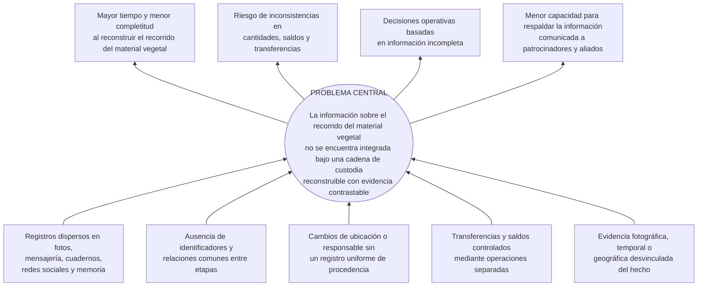
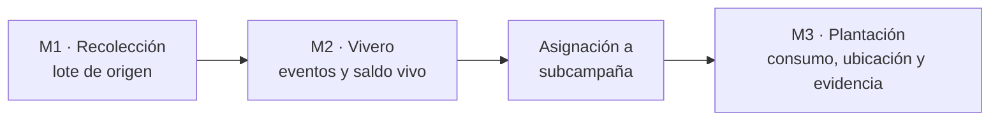
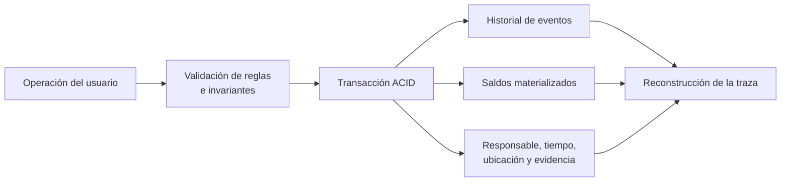
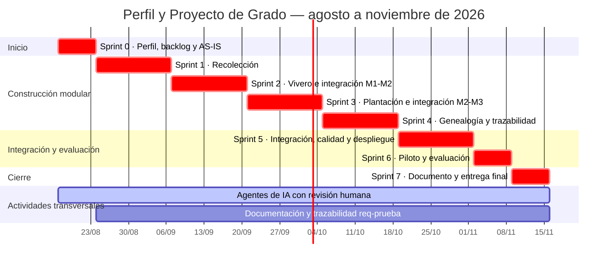

## Resumen

R3Foresta desarrolla actividades de reforestación con la participación de comunidades, voluntarios y empresas patrocinadoras. En estas actividades, las semillas recolectadas atraviesan procesos de vivero hasta convertirse en plantas destinadas a la plantación. En la práctica actual, fotografías, mensajes, publicaciones en redes sociales, cuadernos y otros registros documentan parcialmente estos procesos, pero la información no se conserva bajo una estructura común que permita relacionar procedencia, cantidades, responsables, ubicaciones y evidencias entre las diferentes etapas. Esta fragmentación dificulta reconstruir el recorrido de las semillas y plantas y presentar información consistente a los actores interesados.

El proyecto tiene como objetivo desarrollar y evaluar un sistema de trazabilidad que registre los eventos ocurridos desde el origen o ingreso del material vegetal al proceso hasta el registro de su plantación. La solución articulará los módulos de Recolección, Vivero y Plantación, conservará las relaciones entre sus registros y permitirá reconstruir el recorrido con información y evidencia contrastable.

La investigación será aplicada y tecnológica: construirá el sistema y evaluará su funcionamiento en el caso de R3Foresta. El desarrollo seguirá un proceso iterativo e incremental de agosto a noviembre de 2026. La evaluación combinará la verificación técnica de los requerimientos y reglas de consistencia con la comparación entre casos históricos y las trazas generadas durante un piloto de hasta cinco usuarios. Se analizarán la completitud de la información, la evidencia recuperable, el tiempo de reconstrucción y la carga de registro. El alcance concluye con el registro de la plantación; el sistema no realiza monitoreo posterior ni certifica plantaciones, supervivencia, captura de carbono o créditos de carbono.

**Palabras clave:** trazabilidad, cadena de custodia, material vegetal, reforestación, eventos, integridad de datos, R3Foresta.

---

## Índice general

1. Introducción
2. Antecedentes
3. Planteamiento del problema
4. Objetivos
5. Justificación
6. Alcances y límites
7. Marco teórico preliminar
8. Marco metodológico
9. Propuesta de solución y aporte de ingeniería
10. Temario tentativo del documento final
11. Cronograma de actividades
12. Recursos y presupuesto
13. Referencias bibliográficas

## Índice de tablas

- Tabla 1. Cobertura prevista de la evaluación operativa.
- Tabla 2. Métricas e instrumentos de evaluación.
- Tabla 3. Correspondencia entre objetivos y resultados.
- Tabla 4. Cronograma resumido.
- Tabla 5. Presupuesto monetario previsto.

## Índice de figuras

- Figura 1. Árbol de causas y efectos.
- Figura 2. Recorrido principal del material vegetal.
- Figura 3. Modelo transaccional basado en eventos y saldos.
- Figura 4. Diagrama de Gantt, agosto–noviembre de 2026.

---

## 1. Introducción

La reforestación comprende un conjunto de etapas sucesivas en las que las semillas, hasta convertirse en plantas, pasan por distintos procesos, ubicaciones y responsables antes de llegar a su plantación. En este recorrido, el material es recolectado, germinado, trasladado por diferentes actores y posteriormente destinado a ser plantado. Cada etapa genera información relacionada con su procedencia, cantidades, responsables, tiempos, ubicaciones y evidencias, cuya continuidad permite conocer cómo el material vegetal avanza a través del proceso. En adelante, se utilizará _material vegetal_ como denominación general para las semillas, plantas y demás unidades de propagación comprendidas en estas etapas.

La necesidad de mantener esta continuidad de información da lugar al concepto de trazabilidad. Esta no consiste únicamente en almacenar inventarios, registros o fotografías de forma aislada, sino en conservar la información y las relaciones necesarias para reconstruir el recorrido de un elemento a través de las distintas etapas de una cadena. Olsen y Borit (2013) la relacionan con la capacidad de acceder a información sobre un objeto a lo largo de su ciclo de vida.

Asimismo, en una cadena de custodia deben registrarse los movimientos y cambios bajo reglas explícitas; sin embargo, la existencia de un sistema no verifica por sí sola la veracidad de las declaraciones realizadas por sus usuarios (International Organization for Standardization [ISO], 2020). Por esta razón, el presente trabajo plantea una trazabilidad reconstruible mediante evidencia contrastable, sin pretender constituirse en una certificación independiente.

La práctica actual de R3Foresta conserva información y evidencias de sus actividades mediante fotografías, redes sociales, servicios de mensajería, cuadernos y el conocimiento de los responsables. Sin embargo, estos registros se encuentran dispersos y no necesariamente comparten identificadores, unidades o reglas que permitan relacionarlos y conciliar las cantidades registradas entre las diferentes etapas. Esta situación afecta tanto la gestión interna como la información proporcionada a las empresas patrocinadoras, que requieren conocer cuántos árboles fueron destinados a una plantación, dónde fueron plantados y qué evidencias respaldan su ejecución. En este contexto, disponer de una trazabilidad reconstruible y respaldada por evidencia adquiere relevancia tanto para la gestión de dichos procesos como para sustentar la información comunicada a terceros.

Ante esta situación, el proyecto propone desarrollar y evaluar un sistema de trazabilidad que integre los procesos de _recolección, vivero y plantación_. El sistema permitirá registrar los eventos y cambios que atraviesa el material vegetal desde su origen o ingreso al proceso hasta su plantación, vinculando información sobre cantidades, responsables, tiempos, ubicaciones y evidencias. A partir de estos registros, será posible reconstruir su recorrido a través de las distintas etapas y contrastar la información asociada a cada una de ellas. El alcance concluye con el registro de la plantación y no incluye el monitoreo posterior de los árboles. De esta manera, el sistema busca proporcionar una base estructurada para la gestión interna de R3Foresta y para respaldar la información comunicada a terceros.

## 2. Antecedentes

La revisión de antecedentes avanza desde las experiencias más cercanas al ámbito forestal boliviano hacia los fundamentos y mecanismos de trazabilidad aplicables al problema de R3Foresta.

En Bolivia, Limachi Mamani (2020) desarrolló un sistema de registro y geolocalización de viveros para la Autoridad de Fiscalización y Control Social de Bosques y Tierra. El trabajo administra viveros, especies y volúmenes de producción, y demuestra la pertinencia de emplear sistemas georreferenciados en la gestión forestal del país. Su unidad principal de registro, sin embargo, es el vivero; por ello, el aporte se concentra en identificar y localizar unidades productivas y no en reconstruir el recorrido del material vegetal desde su procedencia hasta la plantación.

La digitalización de viveros ha avanzado también en el contexto latinoamericano. Salamanca Contreras (2024) implementó un sistema web para el control interno y el inventario de un vivero comercial y reportó mejoras en la exactitud del inventario y el cumplimiento de despachos. Mayorga Vásquez et al. (2022), por su parte, propusieron un sistema web para procesos administrativos y productivos de viveros. Estos trabajos muestran que existencias, producción y despachos pueden gestionarse digitalmente, pero permanecen centrados en la administración interna del vivero: no relacionan de extremo a extremo la procedencia del material vegetal, sus transferencias hacia actividades de reforestación y la evidencia geográfica de la plantación.

Para superar una visión limitada al inventario, la literatura internacional aporta fundamentos sobre qué debe conservar un sistema de trazabilidad. Moe (1998) distinguió la trazabilidad interna de aquella que enlaza distintas etapas de una cadena y resaltó la necesidad de definir unidades rastreables. Olsen y Borit (2013) situaron la trazabilidad en la posibilidad de acceder a información sobre objetos considerados a lo largo de su ciclo de vida, mientras que Dabbene et al. (2014) examinaron los problemas de identificación, granularidad, transformación y recuperación de genealogía en cadenas físicas. Aunque estas contribuciones proceden principalmente del ámbito agroalimentario, permiten establecer que reconstruir una cadena requiere conservar tanto las unidades y sus atributos como las relaciones producidas cuando cambian, se agrupan o se transfieren.

Sobre esa base conceptual, Thakur et al. (2011) mostraron que los eventos de negocio pueden representar estados, movimientos y transformaciones, separando los datos maestros de los hechos ocurridos. Solanki y Brewster (2014) profundizaron esta representación al modelar transformaciones que vinculan unidades de entrada y salida, de modo que los eventos relacionados permitan recuperar su procedencia. El principio es transferible a R3Foresta porque un historial enlazado puede explicar los cambios de saldo y las relaciones entre unidades de material vegetal. Su aplicación requiere, no obstante, reglas propias para registrar la transformación biológica observada, la mortalidad o merma, las asignaciones parciales y la vinculación del lote con una ubicación de plantación. Esta transferencia conceptual no implica implementar literalmente EPCIS ni adoptar los procesos del dominio agroalimentario de las fuentes.

La representación histórica tampoco basta si los movimientos y las cantidades pueden quedar inconexos o si la capacidad de reconstrucción solo se presupone. ISO 22095:2020 proporciona terminología y modelos generales para la cadena de custodia, pero aclara que un sistema no demuestra por sí mismo la veracidad de las declaraciones registradas (ISO, 2020). Desde una perspectiva empírica, Donnelly et al. (2012) evaluaron sistemas de trazabilidad mediante un ejercicio de retiro simulado que exigía recuperar el origen y la información asociada a los lotes. Este enfoque respalda la necesidad de comprobar la reconstrucción mediante preguntas, fuentes recuperadas, vacíos y tiempo empleado, sin trasladar a R3Foresta el contexto de inocuidad alimentaria. En conjunto, estos antecedentes muestran que la trazabilidad requiere relacionar los eventos con reglas de consistencia y evidencia, y que su recuperabilidad debe evaluarse en la práctica.

Entre las fuentes revisadas no se identificó una solución que integrara, dentro de un mismo flujo, la procedencia del material vegetal, sus transformaciones, los movimientos entre etapas, la consistencia de cantidades y saldos y la evidencia asociada a la plantación, de forma que permitiera reconstruir posteriormente su cadena de custodia. Esta síntesis se limita al conjunto y alcance de la búsqueda bibliográfica realizada y no afirma la inexistencia absoluta de soluciones similares.

## 3. Planteamiento del problema

### 3.1. Situación problemática

R3Foresta realiza actividades de reforestación con comunidades, voluntarios y organizaciones patrocinadoras. La evidencia disponible de esas actividades se conserva actualmente en fotografías, publicaciones en redes sociales, conversaciones de mensajería, cuadernos, notas y la memoria de las personas involucradas. Estas fuentes permiten comunicar que una actividad ocurrió, pero no constituyen por sí mismas una estructura común para reconstruir de extremo a extremo la procedencia y el recorrido del material vegetal destinado a ellas.

El proceso comienza con la recolección de semillas, continúa con su manejo en vivero y concluye con la plantación de las plantas obtenidas. A lo largo de este recorrido es necesario conservar la procedencia y relacionar los eventos registrados hasta la plantación.

Durante el recorrido cambian la ubicación, el responsable, el estado, la agrupación y, en ciertos procesos, la unidad de medida del material vegetal. Las semillas recolectadas pueden expresarse en gramos o unidades de propagación, mientras que el saldo vivo del vivero y la plantación se expresan en unidades de plantas. Este cambio no es una conversión aritmética automática, sino el resultado observado de un proceso biológico. También pueden ocurrir mermas, descartes, devoluciones, cierres y asignaciones parciales.

Cuando las salidas y entradas se registran de manera separada, o cuando un saldo puede alterarse sin conservar el hecho que lo explica, aparecen riesgos de registros incompletos, doble asignación, doble consumo y cantidades difíciles de conciliar. De manera similar, una fotografía o coordenada guardada fuera del hecho operativo puede perder su relación con la especie, cantidad, fecha y responsable que debía respaldar.

La consecuencia principal es una capacidad limitada para reconstruir la cadena de custodia con evidencia contrastable. Esto afecta las decisiones internas sobre disponibilidad y pérdidas, así como la capacidad de respaldar la información comunicada a empresas patrocinadoras y aliados. El problema es informacional: el sistema puede fortalecer la consistencia y recuperabilidad de lo registrado, pero no puede garantizar por sí solo que una declaración del operador sea físicamente verdadera.

### 3.2. Árbol de causas y efectos

Las causas se formulan como hipótesis de diagnóstico y serán confirmadas, modificadas o descartadas mediante entrevistas, inventario documental y reconstrucción de casos históricos.

**Figura 1. Árbol de causas y efectos.**



### 3.3. Problema central

> En la práctica actual de R3Foresta, la información sobre el recorrido del material vegetal, desde su origen o ingreso al proceso hasta su plantación, se conserva en registros dispersos que no comparten una estructura ni relaciones comunes; esta fragmentación limita la reconstrucción de la cadena de custodia, la comprobación de la consistencia de cantidades y saldos y la presentación de evidencia contrastable a los actores interesados.

### 3.4. Formulación del problema

#### Pregunta general

> ¿Cómo desarrollar, en el caso R3Foresta, un sistema de trazabilidad que permita reconstruir con evidencia contrastable el recorrido del material vegetal desde su origen o ingreso al proceso hasta el registro de su plantación, y qué diferencias presenta frente a la práctica de registro actual en capacidad de reconstrucción y carga operativa?

#### Preguntas específicas

1. ¿Qué procesos, actores, datos, estados, eventos, unidades de medida y reglas de negocio intervienen en la recolección, el vivero y la plantación del material vegetal?
2. ¿Qué modelo de información y reglas de integridad permite relacionar los orígenes, movimientos, transformaciones, saldos, responsables y evidencias de la cadena de custodia?
3. ¿Cómo implementar e integrar los módulos de Recolección, Vivero y Plantación sin perder la historia de procedencia del material vegetal?
4. ¿En qué medida la solución cumple los requerimientos y preserva las invariantes definidas bajo pruebas funcionales, de integración, concurrencia, fallo inducido y extremo a extremo?
5. ¿Qué capacidad presenta la solución para reconstruir trazas con evidencia contrastable y qué carga operativa genera respecto de la práctica actual de R3Foresta?

## 4. Objetivos

### 4.1. Objetivo general

Desarrollar y evaluar un sistema de trazabilidad para la cadena de custodia del material vegetal utilizado por R3Foresta, desde su recolección o recepción externa hasta su manejo en vivero y plantación, que permita reconstruir con evidencia contrastable su procedencia, movimientos, cantidades, responsables y destino.

### 4.2. Objetivos específicos

1. **Analizar** los procesos, actores, datos, estados, eventos, unidades de medida, requerimientos y reglas de negocio que intervienen en la recolección, recepción externa, vivero y plantación del material vegetal.
2. **Diseñar** un modelo de trazabilidad e integridad que relacione orígenes, entidades, eventos, transformaciones, cantidades, saldos, responsables y evidencias, y que formalice las reglas aplicables a las transferencias entre etapas.
3. **Implementar** los módulos de Recolección, Vivero y Plantación, incorporando la recepción de material externo como flujo de ingreso hacia vivero o plantación y conservando su procedencia.
4. **Verificar** el cumplimiento de los requerimientos y de las invariantes de consistencia mediante pruebas unitarias, de integración, concurrencia, fallo inducido y extremo a extremo.
5. **Evaluar**, sobre una muestra delimitada, la capacidad de reconstrucción con evidencia contrastable y la carga operativa de la solución, comparándolas con una línea base obtenida de la práctica actual de R3Foresta.

## 5. Justificación

R3Foresta necesita reconstruir el recorrido del material vegetal que recibe o produce para conocer su procedencia, las cantidades disponibles, las pérdidas ocurridas, las asignaciones y transferencias realizadas y su destino final. Cuando estos datos se conservan en formularios, inventarios o evidencias independientes, resulta difícil establecer posteriormente qué ocurrió con una cantidad o lote determinado a medida que atravesó las etapas de recolección, vivero y plantación. Por ello, la organización requiere una cadena de información que mantenga la continuidad entre el origen, los movimientos y el destino del material vegetal.

Atender esta necesidad requiere una solución informática orientada específicamente a la trazabilidad, pues un sistema convencional de registro puede almacenar datos sin conservar las relaciones necesarias para explicar el recorrido del material. La información sobre origen, cantidades, movimientos, pérdidas, transferencias, responsables, fechas, ubicaciones y destino debe permanecer vinculada y ser coherente entre las diferentes etapas de la cadena. De este modo, los registros podrán ser consultados como partes de un mismo recorrido y no como constancias aisladas cuya correspondencia dependa de una reconstrucción manual.

Disponer de información reconstruible y respaldada permitirá a R3Foresta relacionar las cantidades administradas con su procedencia y destino, identificar responsables y ubicaciones, y recuperar la evidencia asociada a las actividades registradas. Esta capacidad fortalecerá la presentación de información consistente y contrastable ante comunidades, voluntarios, empresas patrocinadoras y aliados, y facilitará la rendición de cuentas entre los actores involucrados. La trazabilidad propuesta respaldará lo registrado, sin constituir por sí misma una certificación de supervivencia de las plantas, recuperación ecológica, captura de carbono o cumplimiento ambiental.

## 6. Alcances y límites

### 6.1. Alcance funcional

El proyecto mantendrá tres módulos operativos:

1. **Recolección:** registro de las semillas o unidades de propagación recolectadas, su especie, cantidad y unidad de medida, fecha, responsable, ubicación y evidencia.
2. **Vivero:** recepción y manejo del material vegetal, registro de eventos biológicos y operativos, mermas, descartes, saldo vivo, despacho y cierre.
3. **Plantación:** asignación de plantas a una subcampaña y registro de la cantidad plantada, responsables, fecha, ubicación y evidencia.

El sistema podrá registrar material vegetal que ingrese al proceso en una etapa posterior a Recolección, conservando su procedencia y vinculándolo con el módulo que corresponda. Esta posibilidad se tratará como una variante de ingreso dentro de los tres módulos existentes, no como un módulo ni como una línea de trabajo independiente.

También se encuentran dentro del alcance:

- identificación y genealogía de lotes y asignaciones;
- historial de eventos que explique los cambios de estado y saldo;
- reglas para impedir cantidades negativas, doble asignación y doble consumo;
- transferencias atómicas entre etapas cuando una operación afecte más de un registro;
- evidencia fotográfica, temporal y geográfica vinculada con el hecho que respalda;
- mejoras de interfaz necesarias para el piloto;
- pruebas unitarias, de integración, concurrencia, fallo inducido y extremo a extremo;
- evaluación comparativa de capacidad de reconstrucción y carga operativa.

### 6.2. Alcance de la evaluación

**Tabla 1. Cobertura prevista de la evaluación operativa.**

| Elemento | Cobertura prevista hasta noviembre de 2026 | Evidencia |
|---|---|---|
| Línea base AS-IS | 8 a 12 casos históricos completos o parcialmente reconstruibles | Documentos disponibles, entrevista y cronometraje |
| Piloto TO-BE | Actividad real coordinada con R3Foresta, con hasta cinco usuarios | Registros del sistema, observación y cuestionario |
| Recorrido principal | Recolección, Vivero y Plantación incluidos según las actividades disponibles en la ventana | Traza real o caso controlado cuando una etapa no ocurra |
| Plantación | Se procurará validar durante una reforestación real | Registro de campo y contraste independiente cuando sea posible |
| Reglas críticas | Cobertura técnica completa del alcance implementado | Suite de pruebas y matriz requerimiento–regla–prueba |

El vivero, comunidad o lugar concreto del piloto se seleccionará con R3Foresta según disponibilidad de una actividad real, accesibilidad logística, consentimiento de participantes y posibilidad de observar el proceso. Esta decisión operativa no cambia el objeto del estudio de caso.

### 6.3. Fuera del alcance

Quedan fuera del proyecto:

- certificación, emisión o comercialización de bonos o créditos de carbono;
- cálculo de biomasa, CO₂ equivalente, adicionalidad, permanencia o línea base de carbono;
- certificación independiente de plantaciones o autenticidad forense de fotografías;
- monitoreo, crecimiento, mantenimiento o seguimiento ecológico posteriores al registro de la plantación;
- garantía de supervivencia de las plantas después de su plantación;
- blockchain, NFT, contratos inteligentes, IPFS y anclajes criptográficos;
- integración con mercados de carbono o sistemas externos de certificación;
- operación nacional o despliegue masivo;

La aspiración de R3Foresta de participar en mecanismos de carbono se reconoce únicamente como contexto organizacional de largo plazo. No es un resultado ni una promesa del presente Proyecto de Grado.

### 6.4. Limitaciones

- La población accesible es pequeña; el piloto tendrá hasta cinco usuarios y no permitirá inferencia estadística.
- La muestra de 8 a 12 casos históricos dependerá de la disponibilidad y calidad de registros anteriores.
- La realización de una recolección y una plantación durante la ventana del proyecto depende del calendario operativo de R3Foresta.
- Los recorridos que no ocurran de forma real se evaluarán con casos controlados, y esa diferencia se informará en los resultados.
- Una fotografía, coordenada o fecha respalda un registro, pero no demuestra por sí sola la exactitud física de la cantidad declarada.
- El sitio y las personas participantes del piloto todavía no están confirmados; se seleccionarán mediante los criterios señalados en la sección 6.2.

## 7. Marco teórico preliminar

### 7.1. Trazabilidad y cadena de custodia

Moe (1998) diferencia la trazabilidad interna, limitada a una organización o proceso, de la trazabilidad que enlaza diferentes etapas y actores. Olsen y Borit (2013) la definen en función de la posibilidad de acceder a información sobre objetos considerados a lo largo de su ciclo de vida. En este proyecto, el periodo trazado se delimita desde el origen o ingreso del material vegetal hasta el registro de su plantación. En el mundo real, el material vegetal atraviesa procesos y agrupaciones; en el sistema, se representa mediante registros de origen, lotes de vivero, asignaciones y plantaciones cuyas relaciones permiten reconstruir procedencia y destino.

ISO 22095:2020 proporciona terminología y modelos generales de cadena de custodia. También establece una delimitación importante: un sistema de cadena de custodia no verifica por sí mismo las afirmaciones sobre el material vegetal (ISO, 2020). En consecuencia, R3Foresta registra evidencia y conserva relaciones; una eventual certificación requeriría procedimientos y terceros que están fuera de alcance.

### 7.2. Eventos, genealogía y saldos

Un evento representa un hecho ocurrido: recepción, embolsado, merma, despacho, devolución o plantación. Thakur et al. (2011) muestran que una cadena puede describirse mediante eventos que relacionan qué objeto intervino, cuándo, dónde y por qué. El historial permite explicar los cambios del material vegetal representado y reconstruir su genealogía.

La propuesta combina eventos no destructivos con saldos materializados para la operación cotidiana. Los eventos explican el cambio y el saldo permite decidir la disponibilidad sin recalcular todo el historial. Por ello se habla de un modelo transaccional basado en eventos, no de *event sourcing* estricto.

### 7.3. Invariantes, contratos y trazabilidad de requerimientos

Una invariante es una condición que debe mantenerse antes y después de una operación, por ejemplo: saldo no negativo, cantidad positiva, una asignación no consumida dos veces y correspondencia entre origen y destino. El diseño por contrato formaliza precondiciones, poscondiciones e invariantes (Meyer, 1992). En el proyecto, estas condiciones se vincularán con requerimientos, reglas de negocio, mecanismos de implementación y pruebas. La trazabilidad de requerimientos permite conservar esas relaciones durante la evolución del sistema (Gotel & Finkelstein, 1994).

### 7.4. Transacciones, atomicidad y concurrencia

Una transferencia entre etapas puede implicar varios efectos: descontar el origen, crear o actualizar el destino y registrar el hecho. La atomicidad exige que todos se confirmen o ninguno permanezca. El aislamiento controla interferencias entre transacciones concurrentes. PostgreSQL ofrece niveles de aislamiento y mecanismos de bloqueo que permiten implementar estas propiedades (PostgreSQL Global Development Group, 2026). Las pruebas de concurrencia y fallo inducido comprobarán que dos operaciones no consuman el mismo saldo y que un error no deje estados parciales.

### 7.5. Información geográfica y evidencia

La evidencia geográfica relaciona un hecho con una ubicación y permite contrastar puntos de recolección o plantación con áreas definidas. PostGIS amplía PostgreSQL con tipos y operaciones espaciales. Su uso no garantiza la autenticidad de una captura, pero permite almacenar geometrías de forma consistente y aplicar reglas espaciales, como determinar si un punto se encuentra dentro del polígono esperado.

### 7.6. Calidad del producto software

ISO/IEC 25010:2023 organiza la calidad de producto en nueve características. Para este proyecto resultan especialmente pertinentes la adecuación funcional, fiabilidad, capacidad de interacción, seguridad y mantenibilidad (ISO, 2023). Estas características orientarán la selección de criterios de prueba y observación, sin sustituir la evaluación específica de trazabilidad.

## 8. Marco metodológico

### 8.1. Tipo y enfoque de investigación

La investigación es **aplicada y tecnológica**, porque desarrolla un artefacto de software para resolver un problema operativo concreto. Se adopta el enfoque de **ciencia del diseño**, en el que el conocimiento se produce mediante la construcción y evaluación de un artefacto pertinente para un problema organizacional (Hevner et al., 2004).

El trabajo utiliza un **estudio de caso único** en R3Foresta. El estudio de caso permite analizar un fenómeno contemporáneo dentro de su contexto y combinar distintas fuentes de evidencia; en Ingeniería de Software requiere declarar contexto, preguntas, recolección y análisis de datos (Runeson & Höst, 2009). Los resultados describirán el caso y no se generalizarán estadísticamente a otras organizaciones.

El enfoque será mixto de predominio descriptivo:

- datos cuantitativos: completitud de ítems, proporción con evidencia, tiempo de reconstrucción, acciones, reintentos y resultados de pruebas;
- datos cualitativos: entrevistas semiestructuradas, observación y dificultades percibidas por los participantes.

### 8.2. Unidades de análisis, participantes y muestra

La unidad principal de análisis es una **traza de cadena de custodia**, entendida como el conjunto de registros relacionados que permite reconstruir el recorrido del material vegetal desde su origen o ingreso hasta el registro de la plantación. Cuando un caso histórico esté incompleto, la reconstrucción llegará hasta el último punto documentado y se registrarán los vacíos encontrados. En la línea base, los “8 a 12 casos” son actividades o recorridos históricos identificables; no son eventos generados por el software.

La selección será intencional por disponibilidad de registros y relevancia para el flujo. Participarán hasta cinco usuarios vinculados con coordinación, vivero o campo. Cuando resulte viable, una persona que no haya capturado la traza realizará la reconstrucción; podría participar un evaluador independiente vinculado a una institución académica, sin comprometer en este perfil una afiliación todavía no formalizada.

### 8.3. Metodología de desarrollo

El desarrollo seguirá un proceso **iterativo e incremental organizado en sprints**. Este enfoque construye una base funcional y la amplía mediante incrementos sucesivos (Basili & Turner, 1975; Larman & Basili, 2003). ISO/IEC/IEEE 12207:2026 permite aplicar los procesos del ciclo de vida de forma iterativa e incremental sin prescribir una metodología particular (International Organization for Standardization et al., 2026), y SWEBOK v4.0a sistematiza las prácticas aceptadas de la disciplina (IEEE Computer Society, 2025).

La ejecución académica formal comprenderá el periodo del **17 de agosto al 15 de noviembre de 2026**. En esa ventana se desarrollarán y cerrarán los tres módulos —Recolección, Vivero y Plantación—, los contratos Recolección→Vivero y Vivero→Plantación, la trazabilidad transversal, las pruebas, el piloto y la documentación final. El trabajo se distribuirá en un sprint inicial de planificación, cinco sprints de construcción e integración y dos sprints de evaluación y cierre.

Existen artefactos, código y prototipos exploratorios producidos antes del inicio formal. Se utilizarán como insumos técnicos y evidencia de factibilidad, pero no se presentarán como objetivos académicos ya cumplidos. Cada módulo e integración solo se considerará terminado dentro del proyecto cuando, durante el sprint correspondiente, haya sido revisado contra los requerimientos, integrado con los demás componentes, documentado, probado y aceptado según sus criterios de cierre.

Cada sprint incluirá planificación, ejecución, revisión del incremento con R3Foresta o seguimiento académico cuando corresponda y una retrospectiva breve. El backlog se ordenará por dependencia del recorrido físico del material vegetal y por riesgo de integración. Los requerimientos, reglas de negocio, decisiones de arquitectura, esquema de datos y contratos se conservarán como especificaciones versionadas y se actualizarán deliberadamente cuando cambie una decisión.

El postulante es el autor académico y responsable principal del análisis, arquitectura, base de datos, lógica de negocio, integración, requisitos, diseño de experiencia, coordinación y documentación. Jhamil Cali brindó apoyo puntual en una prueba de concepto de contratos inteligentes —fuera del alcance vigente— y Miguel Calderón participó en pruebas o correcciones aisladas. Los **agentes de inteligencia artificial**, principalmente Claude Code y Codex, se emplearán como apoyo aprobado para descomponer tareas, proponer implementaciones, revisar código, generar casos de prueba y asistir la redacción. Sus resultados serán revisados, corregidos y validados por el postulante; los agentes no aprobarán requerimientos, no decidirán reglas del dominio ni sustituirán la responsabilidad autoral humana.

### 8.4. Plan de sprints y fases de ejecución

1. **Sprint 0 — Inicio y planificación (17–23 de agosto).** Cierre del perfil, consolidación del backlog, arquitectura de referencia, criterios de terminado, preparación del piloto y diseño y levantamiento de la línea base AS-IS.
2. **Sprint 1 — Recolección (24 de agosto–6 de septiembre).** Análisis, desarrollo, integración interna, pruebas y documentación del módulo de Recolección.
3. **Sprint 2 — Vivero e integración M1→M2 (7–20 de septiembre).** Desarrollo del ciclo de Vivero, eventos, saldos y contrato de transferencia desde Recolección.
4. **Sprint 3 — Plantación e integración M2→M3 (21 de septiembre–4 de octubre).** Desarrollo de campañas, subcampañas, asignaciones, plantación y contrato de transferencia desde Vivero.
5. **Sprint 4 — Genealogía y trazabilidad transversal (5–18 de octubre).** Consolidación del recorrido completo y de las relaciones entre Recolección, Vivero y Plantación.
6. **Sprint 5 — Integración y calidad (19 de octubre–1 de noviembre).** Integración transversal, ajustes de interfaz, pruebas unitarias, de integración, concurrencia, fallo inducido y extremo a extremo, despliegue y documentación técnica.
7. **Sprint 6 — Piloto y evaluación (2–8 de noviembre).** Ejecución del piloto con hasta cinco usuarios, verificación independiente cuando sea posible, aplicación TO-BE y contraste con la línea base.
8. **Sprint 7 — Cierre académico (9–15 de noviembre).** Análisis de resultados, conclusiones, revisión integral, armado de anexos y entrega del Proyecto de Grado.

### 8.5. Instrumentos y métricas

**Tabla 2. Métricas e instrumentos de evaluación.**

| Dimensión | Métrica o criterio | Instrumento |
|---|---|---|
| Cumplimiento funcional | Requerimientos satisfechos | Matriz requerimiento–prueba |
| Integridad | Saldos negativos, doble consumo y estados parciales aceptados | Pruebas unitarias, integración, concurrencia y fallo inducido |
| Genealogía | Trazas con origen, relaciones y destino recuperables | Guía de reconstrucción |
| Evidencia | Ítems respaldados / ítems requeridos | Lista de cotejo documental |
| Eficiencia de reconstrucción | Tiempo para responder el mismo conjunto de preguntas | Cronometraje AS-IS/TO-BE |
| Carga operativa | Tiempo de registro, acciones, reintentos y dificultades | Observación, telemetría disponible y cuestionario |
| Percepción | Claridad y facilidad reportadas | Cuestionario breve y entrevista |

La comparación será descriptiva. Se reportarán conteos, porcentajes, medianas, rangos y hallazgos cualitativos, sin pruebas de significación ni afirmaciones de causalidad generalizable.

### 8.6. Procedimiento AS-IS/TO-BE

En la fase **AS-IS**, una persona intentará responder preguntas de procedencia, especie, cantidad, fecha, responsable, destino, ubicación y evidencia utilizando solo los documentos disponibles. En una segunda pasada, el responsable podrá completar vacíos de memoria. Se registrarán fuente y tiempo, separando información documentada de información recordada.

En la fase **TO-BE**, el mismo instrumento se aplicará a trazas del piloto. Cuando sea posible, la reconstrucción será realizada por una persona distinta de quien registró los datos. Se compararán completitud, evidencia, tiempo y rupturas de genealogía. Las rutas que no ocurran durante el piloto se informarán como casos controlados y no como validación de campo.

El procedimiento adapta al caso R3Foresta el principio de los ejercicios de retiro simulado, en los que la efectividad de la trazabilidad se examina intentando recuperar el origen y la información de un lote (Donnelly et al., 2012). No se traslada el contexto de inocuidad alimentaria: se adopta únicamente la comprobación empírica de la reconstrucción mediante preguntas, fuentes recuperadas, vacíos y tiempo empleado.

### 8.7. Consideraciones éticas

Antes de entrevistas y observaciones se explicará el propósito académico y se obtendrá consentimiento informado. El uso de datos operativos será coordinado con R3Foresta antes del piloto. Los nombres o ubicaciones podrán incorporarse únicamente cuando sean pertinentes y exista consentimiento; los datos personales no necesarios se omitirán. Los registros de prueba se mantendrán diferenciados de los datos operativos.

## 9. Propuesta de solución y aporte de ingeniería

### 9.1. Descripción general

La propuesta integra los procesos de Recolección, Vivero y Plantación para registrar los eventos que atraviesa el material vegetal hasta su plantación. En el sistema, este se representa mediante registros enlazados por identificadores y relaciones entre el origen, el lote de vivero, la asignación y la plantación. Los catálogos describen especies, actores y lugares; los eventos conservan los hechos ocurridos; y los saldos materializados permiten operar sin perder la historia que los explica.

**Figura 2. Recorrido principal del material vegetal.**



### 9.2. Modelo transaccional basado en eventos y saldos

Cada operación crítica validará reglas, registrará el evento, actualizará el saldo y asociará responsable, fecha y evidencia dentro de una transacción cuando corresponda. Una corrección no deberá borrar la historia explicativa; se registrará mediante una operación permitida por el dominio.

**Figura 3. Modelo transaccional basado en eventos y saldos.**



### 9.3. Contratos de integración

Los puntos críticos son aquellos en los que el material vegetal pasa de una etapa a otra. El contrato entre Recolección y Vivero debe vincular el consumo del origen con la creación del lote receptor. El contrato entre Vivero y Plantación debe relacionar el despacho o la asignación con el saldo disponible para la subcampaña.

La atomicidad evita una salida sin destino o un destino sin descuento del origen. El control de concurrencia evita que dos operaciones consuman el mismo saldo. Estas propiedades serán formuladas como invariantes y vinculadas con pruebas reproducibles.

### 9.4. Resultados esperados

- modelo consolidado de procesos, actores, entidades, eventos y reglas;
- módulos operativos estabilizados;
- genealogía reconstruible del material vegetal;
- matriz de trazabilidad entre requerimientos, reglas, invariantes y pruebas;
- resultados de verificación técnica;
- línea base AS-IS, piloto TO-BE y contraste descriptivo;
- documentación de limitaciones y recomendaciones.

## 10. Temario tentativo del documento final

```text
Introducción
  Contexto, problema, objetivos, justificación, alcance y estructura

Capítulo I — Marco teórico y conceptual
  1.1 Trazabilidad y cadena de custodia
  1.2 Unidades trazables, genealogía y procedencia
  1.3 Eventos y saldos materializados
  1.4 Invariantes, transacciones y concurrencia
  1.5 Evidencia e información geoespacial
  1.6 Calidad de producto software

Capítulo II — Marco referencial y contextual
  2.1 Reforestación y material vegetal
  2.2 R3Foresta como caso de aplicación
  2.3 Actores y práctica de registro actual
  2.4 Antecedentes y brecha identificada

Capítulo III — Marco metodológico
  3.1 Ciencia del diseño y estudio de caso
  3.2 Metodología iterativa e incremental
  3.3 Unidades de análisis, participantes e instrumentos
  3.4 Línea base AS-IS y piloto TO-BE
  3.5 Verificación técnica y análisis de datos
  3.6 Consideraciones éticas

Capítulo IV — Desarrollo y resultados
  4.1 Procesos, requerimientos y reglas de negocio
      4.1.1 Recolección
      4.1.2 Vivero y transformación biológica observada
      4.1.3 Plantación e integración entre etapas
  4.2 Modelo de trazabilidad e integridad
  4.3 Implementación e integración de los tres módulos
  4.4 Verificación de requerimientos e invariantes
  4.5 Resultados AS-IS/TO-BE y carga operativa
  4.6 Discusión y limitaciones

Capítulo V — Conclusiones y recomendaciones
  5.1 Cumplimiento de objetivos
  5.2 Aportes
  5.3 Limitaciones
  5.4 Trabajo futuro

Referencias bibliográficas
Anexos
```

**Tabla 3. Correspondencia entre objetivos y resultados.**

| Objetivo | Resultado principal | Sección prevista |
|---|---|---|
| 1. Analizar | Procesos, requerimientos y reglas definidos | 4.1 |
| 2. Diseñar | Modelo de trazabilidad, invariantes y contratos | 4.2 |
| 3. Implementar | Tres módulos integrados | 4.3 |
| 4. Verificar | Matriz de pruebas y resultados técnicos | 4.4 |
| 5. Evaluar | Línea base, piloto, contraste y carga operativa | 4.5 |

## 11. Cronograma de actividades

La ejecución formal comienza el 17 de agosto y concluye el 15 de noviembre de 2026. El cronograma incluye el ciclo completo de análisis, desarrollo, integración, pruebas, evaluación y documentación. Las fechas representan compromisos académicos prospectivos; los prototipos anteriores se utilizarán únicamente como insumos.

**Tabla 4. Cronograma resumido.**

| Sprint y periodo | Objetivo y actividades principales | Incremento verificable |
|---|---|---|
| Sprint 0 · 17–23 ago | Inicio, perfil, backlog, arquitectura, criterios de terminado y línea base AS-IS | Perfil, plan de ejecución y línea base disponibles |
| Sprint 1 · 24 ago–6 sep | Analizar, desarrollar, probar y documentar Recolección | M1 integrado y revisado |
| Sprint 2 · 7–20 sep | Desarrollar Vivero, eventos, saldos y contrato M1→M2 | M2 y primera integración cerrados |
| Sprint 3 · 21 sep–4 oct | Desarrollar Plantación, asignaciones y contrato M2→M3 | M3 y segunda integración cerrados |
| Sprint 4 · 5–18 oct | Consolidar genealogía y trazabilidad transversal | Recorrido completo reconstruible entre los tres módulos |
| Sprint 5 · 19 oct–1 nov | Integración transversal, UI/UX, seguridad, pruebas y despliegue | Versión candidata para piloto |
| Sprint 6 · 2–8 nov | Ejecutar piloto, aplicar TO-BE y contrastar con AS-IS | Evidencia operativa y técnica analizada |
| Sprint 7 · 9–15 nov | Redactar resultados, conclusiones, anexos y entrega | Proyecto de Grado concluido |
| Transversal · 17 ago–15 nov | Agentes de IA con revisión humana, control de versiones y actualización documental | Cambios, decisiones y pruebas trazables |

**Figura 4. Diagrama de Gantt, agosto–noviembre de 2026.**



## 12. Recursos y presupuesto

### 12.1. Recursos humanos

- postulante, como responsable principal del análisis, desarrollo, evaluación y documentación;
- tutora académica, para orientación y revisión;
- personal y participantes de R3Foresta, para información del proceso y piloto;
- hasta cinco usuarios del piloto;
- evaluador independiente, si se formaliza su disponibilidad;
- apoyo puntual de colaboradores, limitado a las contribuciones que se declararán en el documento final.

Las horas del postulante y colaboradores se consideran aporte en especie. Se registrarán durante los sprints para documentar el esfuerzo, pero no se monetizan en este presupuesto porque no existe una tarifa institucional definida.

### 12.2. Recursos tecnológicos y materiales

- computadora portátil y teléfonos móviles propios, como aporte en especie;
- repositorios Git y GitHub;
- PostgreSQL/PostGIS, Supabase, Vercel y Render en planes gratuitos;
- herramientas de programación, prueba, documentación y diagramación;
- agentes de inteligencia artificial mediante una suscripción mensual alternada entre Claude Code y Codex, sin mantener ambas simultáneamente;
- conexión a Internet y datos móviles;
- transporte y alimentación para aproximadamente 20 visitas de campo.

No se contempla dominio personalizado: se utilizará el subdominio de Vercel. Tampoco se presupuestan servicios blockchain, IPFS o redes RPC porque se encuentran fuera del alcance.

### 12.3. Presupuesto

**Tabla 5. Presupuesto monetario previsto.**

| Concepto | Cálculo | Moneda | Subtotal |
|---|---:|---:|---:|
| Agentes de IA: suscripción alternada entre Claude Code y Codex | 4 meses × USD 20, agosto–noviembre de 2026 | USD | 80 |
| Supabase, Vercel, Render y GitHub | Planes gratuitos | USD | 0 |
| Dominio personalizado | No requerido | USD | 0 |
| Transporte de campo | 20 visitas × Bs 20–35 | Bs | 400–700 |
| Alimentación de campo | 20 visitas × Bs 20 | Bs | 400 |
| Datos móviles | 20 visitas × Bs 3 | Bs | 60 |
| Internet, agosto–noviembre | 4 meses × Bs 50 | Bs | 200 |
| Equipos y horas de trabajo | Aporte en especie, no monetizado | — | — |
| **Total en dólares** |  | **USD** | **80** |
| **Total en bolivianos** |  | **Bs** | **1.060–1.360** |

El postulante financiará el 100 % de los desembolsos monetarios. R3Foresta aportará acceso al contexto operativo y participación, sin aporte económico comprometido. El presupuesto corresponde exclusivamente a la ejecución formal agosto–noviembre; los gastos exploratorios anteriores se consideran costos hundidos y no se imputan al Proyecto de Grado. Los costos se presentan en sus monedas originales para evitar una conversión sujeta a variaciones. La impresión no se incluye porque la entrega actual es digital y la cantidad de copias físicas todavía no está definida.

## 13. Referencias bibliográficas

Basili, V. R., & Turner, A. J. (1975). Iterative enhancement: A practical technique for software development. *IEEE Transactions on Software Engineering, SE-1*(4), 390–396. https://doi.org/10.1109/TSE.1975.6312870

Dabbene, F., Gay, P., & Tortia, C. (2014). Traceability issues in food supply chain management: A review. *Biosystems Engineering, 120*, 65–80. https://doi.org/10.1016/j.biosystemseng.2013.09.006

Donnelly, K. A.-M., Karlsen, K. M., & Dreyer, B. (2012). A simulated recall study in five major food sectors. *British Food Journal, 114*(7), 1016–1031. https://doi.org/10.1108/00070701211241590

Gotel, O. C. Z., & Finkelstein, A. C. W. (1994). An analysis of the requirements traceability problem. *Proceedings of the 1st International Conference on Requirements Engineering*, 94–101. https://doi.org/10.1109/ICRE.1994.292398

Hevner, A. R., March, S. T., Park, J., & Ram, S. (2004). Design science in information systems research. *MIS Quarterly, 28*(1), 75–105. https://doi.org/10.2307/25148625

IEEE Computer Society. (2025). *Guide to the Software Engineering Body of Knowledge (SWEBOK Guide), version 4.0a*. https://www.computer.org/education/bodies-of-knowledge/software-engineering/v4

International Organization for Standardization. (2020). *Chain of custody—General terminology and models* (ISO Standard No. 22095:2020). https://www.iso.org/standard/72532.html

International Organization for Standardization. (2023). *Systems and software engineering—Systems and software Quality Requirements and Evaluation (SQuaRE)—Product quality model* (ISO/IEC Standard No. 25010:2023). https://www.iso.org/standard/78176.html

International Organization for Standardization, International Electrotechnical Commission, & Institute of Electrical and Electronics Engineers. (2026). *Systems and software engineering—Software life cycle processes* (ISO/IEC/IEEE Standard No. 12207:2026). https://www.iso.org/standard/90219.html

Larman, C., & Basili, V. R. (2003). Iterative and incremental development: A brief history. *Computer, 36*(6), 47–56. https://doi.org/10.1109/MC.2003.1204375

Limachi Mamani, F. Z. (2020). *Sistema de registro geolocalización de viveros en el departamento de La Paz. Caso ABT* [Proyecto de grado, Universidad Pública de El Alto]. https://repositorio.upea.bo/jspui/bitstream/123456789/1260/5/1.%20FINAL.pdf

Mayorga Vásquez, L. C., Riccardi Martillo, G. A., Bermeo Almeida, O. X., & Guevara Arias, V. I. (2022). Sistema web para los procesos administrativos y de producción en viveros del cantón Milagro. *Revista Ingeniería, 6*(16), 200–213. https://doi.org/10.33996/revistaingenieria.v6i16.100

Meyer, B. (1992). Applying design by contract. *Computer, 25*(10), 40–51. https://doi.org/10.1109/2.161279

Moe, T. (1998). Perspectives on traceability in food manufacture. *Trends in Food Science & Technology, 9*(5), 211–214. https://doi.org/10.1016/S0924-2244(98)00037-5

Olsen, P., & Borit, M. (2013). How to define traceability. *Trends in Food Science & Technology, 29*(2), 142–150. https://doi.org/10.1016/j.tifs.2012.10.003

PostgreSQL Global Development Group. (2026). *Transaction isolation*. PostgreSQL documentation. https://www.postgresql.org/docs/current/transaction-iso.html

Runeson, P., & Höst, M. (2009). Guidelines for conducting and reporting case study research in software engineering. *Empirical Software Engineering, 14*, 131–164. https://doi.org/10.1007/s10664-008-9102-8

Salamanca Contreras, F. R. (2024). *Influencia del sistema web con notificaciones en el proceso de control interno y seguimiento del inventario en el vivero Tu Semilla E.I.R.L. sede Tacna, 2022* [Tesis, Universidad Privada de Tacna]. https://repositorio.upt.edu.pe/bitstream/handle/20.500.12969/3690/Salamanca-Contreras-Fiorella.pdf?isAllowed=y&sequence=6

Solanki, M., & Brewster, C. (2014). Modelling and linking transformations in EPCIS governing supply chain business processes. In M. Hepp & Y. Hoffner (Eds.), *E-Commerce and Web Technologies* (Lecture Notes in Business Information Processing, Vol. 188, pp. 46–57). Springer. https://doi.org/10.1007/978-3-319-10491-1_5

Thakur, M., Sørensen, C. F., Bjørnson, F. O., Forås, E., & Hurburgh, C. R. (2011). Managing food traceability information using EPCIS framework. *Journal of Food Engineering, 103*(4), 417–433. https://doi.org/10.1016/j.jfoodeng.2010.11.012

Universidad Mayor de San Andrés. (s. f.). *Reglamento general de tipos y modalidades de graduación*. https://www.umsa.bo/documents/1811251/1811998/5%2BREGLAMENTO%2BDE%2BTIPOS%2BY%2BMODALIDADES%2BDE%2BGRADUACI%C3%93N.pdf/e959340f-87f2-ef65-e2df-f52ef89a2a53

## Anexos previstos para el documento final

Los anexos no se desarrollan en esta versión del perfil. Para el Proyecto de Grado se prevén:

- guía de entrevista y cuestionario AS-IS/TO-BE;
- consentimiento informado;
- matriz requerimiento–regla–invariante–prueba;
- diagramas técnicos consolidados;
- evidencias y resultados del piloto;
- resultados detallados de pruebas.

---

*Versión de contenido del perfil actualizada el 18 de agosto de 2026. El formato Word aplicará tamaño carta, margen izquierdo de 4 cm, demás márgenes de 3 cm y estilo APA 7. El logo institucional y el armado gráfico se incorporarán en la etapa de maquetación, fuera de la presente actualización Markdown.*
