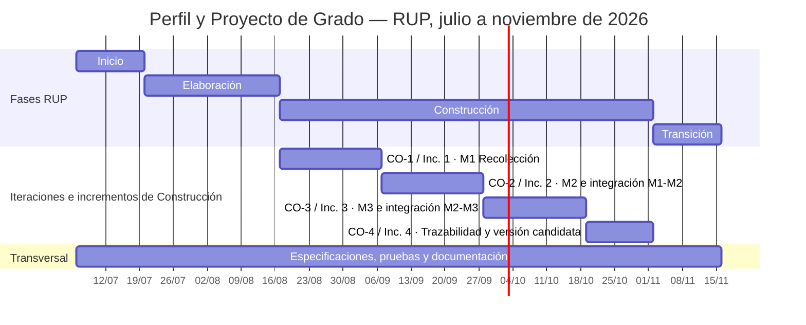
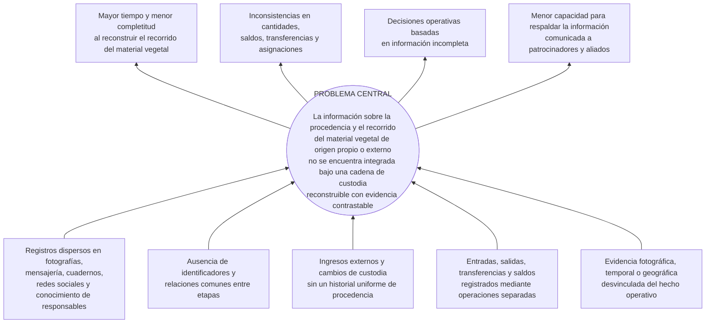

# Sistema de trazabilidad del material vegetal para reforestación con proyección hacia bonos de carbono: caso R3Foresta

## Índice general

<!-- toc -->

- [1. Introducción](#1-introducción)
- [2. Antecedentes](#2-antecedentes)
- [3. Planteamiento del problema](#3-planteamiento-del-problema)
- [4. Objetivos](#4-objetivos)
- [5. Justificación](#5-justificación)
- [6. Alcances y límites](#6-alcances-y-límites)
- [7. Marco teórico preliminar](#7-marco-teórico-preliminar)
- [8. Metodología de desarrollo](#8-metodología-de-desarrollo)
- [9. Índice propuesto del Proyecto de Grado](#9-índice-propuesto-del-proyecto-de-grado)
- [10. Cronograma de actividades](#10-cronograma-de-actividades)
- [11. Referencias bibliográficas](#11-referencias-bibliográficas)
- [12. Anexos](#12-anexos)

<!-- tocstop -->

<!-- Índice regenerable a partir de los encabezados Markdown; no editar sus entradas de forma aislada. -->

## 1. Introducción

La reforestación moviliza material vegetal entre lugares, responsables y etapas con propósitos distintos. Una semilla o unidad de propagación puede ser recolectada, trasladada al vivero, atravesar procesos biológicos, integrarse en lotes de plantas y finalmente ser asignada a una actividad de plantación. R3Foresta también utiliza material vegetal adquirido o recibido de terceros, que puede ingresar al vivero o dirigirse directamente a una plantación. En cualquiera de estos recorridos es necesario conservar la relación entre la procedencia, las cantidades, los responsables, las fechas, las ubicaciones y las evidencias. En adelante, se utilizará *material vegetal* como denominación general para las semillas, plantas y demás unidades de propagación comprendidas en estas etapas.

La trazabilidad no consiste únicamente en almacenar inventarios, formularios o fotografías de forma aislada. Requiere conservar la información y las relaciones necesarias para reconstruir el recorrido de un objeto a través de las etapas de una cadena (Olsen & Borit, 2013). En una cadena de custodia, además, los movimientos y cambios deben registrarse bajo reglas explícitas; sin embargo, la existencia de un sistema no demuestra por sí sola la veracidad de las declaraciones registradas (International Organization for Standardization, 2020). Por ello, el proyecto plantea registros reconstruibles con evidencia contrastable y no una certificación independiente de los hechos físicos.

La expresión *caso R3Foresta* del título delimita la organización y el contexto donde se aplicará el producto; no declara un diseño investigativo de estudio de caso. La **Fundación R3Foresta para la Bioregeneración de Ecosistemas y la Economía Circular** desarrolla actividades de reforestación con comunidades, voluntarios y organizaciones patrocinadoras. Actualmente, la información y las evidencias de estas actividades se conservan en fotografías, publicaciones en redes sociales, conversaciones de mensajería, cuadernos, notas y el conocimiento de las personas involucradas. Aunque estas fuentes documentan las actividades realizadas, se encuentran dispersas y no comparten una estructura, identificadores ni relaciones comunes para reconstruir de extremo a extremo el recorrido del material vegetal, conciliar cantidades y saldos, identificar responsables y recuperar la evidencia asociada.

Ante esta situación, el proyecto desarrollará un sistema de trazabilidad como componente operativo de **R3foresta App**, desde la recolección o recepción externa del material vegetal hasta el registro de su plantación. La solución comprenderá los módulos de **Recolección, Vivero y Plantación**. El material adquirido o recibido de terceros se tratará como una variante de ingreso en Vivero o Plantación y conservará sus datos de procedencia, sin constituir un módulo adicional.

R3foresta App se plantea como un componente operativo para organizar la cadena que comienza con el origen del material vegetal y concluye con el registro de su plantación. La relación entre procedencia, movimientos, cantidades, responsables, ubicaciones y evidencias busca facilitar la reconstrucción de la cadena de custodia, apoyar la gestión interna y presentar información consistente ante patrocinadores, aliados y otros actores. La proyección hacia bonos de carbono señalada en el título se limita al posible uso posterior de estos registros dentro de procesos institucionales que requerirían metodología, cuantificación, monitoreo y verificación independientes; dichos procesos no forman parte del producto académico.

El alcance concluye con el registro de la plantación. El sistema no realiza monitoreo posterior de supervivencia, no mide captura de dióxido de carbono, no implementa una metodología de monitoreo, reporte y verificación de carbono, no certifica plantaciones y no genera, emite ni comercializa bonos o créditos de carbono.

## 2. Antecedentes

### 2.1. Antecedentes institucionales

R3Foresta fue creada en 2019 como una iniciativa y plataforma de acción socioambiental orientada a la bioregeneración de ecosistemas estratégicos y al fortalecimiento de las comunidades vinculadas con ellos. Su modelo evolucionó desde la acción ambiental directa hacia la integración de reforestación, agua, biodiversidad, residuos, alimentación, tecnología y comunidades. Actualmente articula las dimensiones ecológica, comunitaria, científico-tecnológica y económica mediante los componentes R3Carbon, R3Water, R3Bio y R3F10 — Reciclaje y Economía Circular (R3Foresta, 2026).

**Figura 1**

*Estructura organizacional de R3Foresta*


*Nota.* Organigrama institucional proporcionado por la Fundación R3Foresta.

En la dimensión científico-tecnológica, R3Foresta integra medición, monitoreo, trazabilidad, digitalización e innovación. Dentro de R3Carbon desarrolla **R3foresta App**, destinada a registrar y relacionar el recorrido del material vegetal desde la recolección de semillas o su recepción externa, pasando por el manejo en vivero, hasta el registro de su plantación. Esta función plantea la aplicación como base operativa de la cadena de custodia del material vegetal y como medio para organizar la información y las evidencias utilizadas por la Fundación en su gestión y rendición de cuentas.

### 2.2. Antecedentes internacionales

En Perú, Salamanca Contreras (2024) implementó un sistema web para el control interno y el seguimiento del inventario de un vivero comercial. El trabajo abordó la administración de existencias y despachos y reportó mejoras en la exactitud del inventario. Su resultado aporta evidencia sobre la centralización de los movimientos de un vivero, pero su alcance permanece en la gestión comercial interna y no reconstruye la procedencia del material ni su transferencia hacia actividades de reforestación.

En Ecuador, Mayorga Vásquez et al. (2022) propusieron un sistema web para los procesos administrativos y productivos de viveros. La solución integró información de producción y administración, mostrando que estos procesos pueden gestionarse mediante una plataforma común. Su diferencia respecto de R3foresta App radica en que no relaciona de extremo a extremo la recolección o recepción externa, el manejo en vivero y la evidencia geográfica de la plantación.

En el ámbito internacional de la trazabilidad, Thakur et al. (2011) utilizaron eventos para representar estados, movimientos y transformaciones dentro de una cadena y separar los datos maestros de los hechos ocurridos. Este antecedente aporta un mecanismo para conservar relaciones históricas y recuperar el recorrido de unidades identificadas. Su dominio es agroalimentario y no contempla los cambios biológicos, las unidades de medida ni las reglas operativas propias del material vegetal utilizado por R3Foresta.

### 2.3. Antecedentes en Bolivia

Quispe Tola y Condori Zapana (2020) desarrollaron para la Autoridad de Fiscalización y Control Social de Bosques y Tierra un sistema de inventario y registro de iniciativas de manejo integral sustentable de los bosques y la Madre Tierra. La solución centralizó el registro de iniciativas e incorporó consultas, mapas y reportes por niveles. Su unidad principal es la iniciativa o proyecto forestal, por lo que no registra la cadena operativa de semillas y plantas ni las relaciones entre recolección, vivero y plantación.

### 2.4. Antecedentes cercanos a la ciudad de La Paz

Dentro de las fuentes revisadas no se identificó un trabajo equivalente desarrollado específicamente en la ciudad de La Paz. Los antecedentes geográficamente más cercanos corresponden al departamento de La Paz y a la ciudad de El Alto.

Limachi Mamani (2020) desarrolló un sistema de registro y geolocalización de viveros para la Autoridad de Fiscalización y Control Social de Bosques y Tierra en el departamento de La Paz. El sistema administra viveros, especies y volúmenes de producción y ofrece una vista espacial para apoyar decisiones. Su unidad principal es el vivero, de modo que no reconstruye el recorrido de cada conjunto de material vegetal desde su procedencia hasta la plantación.

Valdez Alvarado (2023) desarrolló un sistema web para la gestión y control de viveros de la Unidad de Forestación del Gobierno Autónomo Municipal de El Alto. La solución centralizó información sobre plantines, responsables, solicitudes y plantaciones y permitió conocer el estado de los plantines durante su crecimiento. Este trabajo es el antecedente local más cercano al recorrido Vivero–Plantación; R3foresta App se diferencia al incorporar también la Recolección, la recepción externa, la cadena de custodia y las relaciones necesarias para reconstruir el origen, los movimientos, las cantidades y las evidencias.

En conjunto, los trabajos revisados resuelven partes del problema: inventarios de vivero, geolocalización, producción, solicitudes, iniciativas forestales o representación de eventos. No se identificó, dentro del alcance de la búsqueda, una solución que integre la procedencia propia o externa del material vegetal, sus movimientos y cambios entre Recolección, Vivero y Plantación, la consistencia de cantidades y saldos y la evidencia vinculada con el destino. Esta conclusión se limita a las fuentes revisadas y no afirma la inexistencia absoluta de soluciones similares.

## 3. Planteamiento del problema

### 3.1. Situación problemática

R3Foresta realiza actividades de reforestación con comunidades, voluntarios y organizaciones patrocinadoras. La información y las evidencias de estas actividades se conservan actualmente en fotografías, publicaciones en redes sociales, conversaciones de mensajería, cuadernos, notas y el conocimiento de las personas involucradas. Estos registros se encuentran dispersos y no comparten una estructura, identificadores ni relaciones comunes que permitan reconstruir de extremo a extremo la procedencia y el recorrido del material vegetal, las cantidades administradas, los responsables de cada etapa, las ubicaciones y las evidencias asociadas.

El material vegetal utilizado por R3Foresta puede ser de origen propio o externo. En el primer caso, la organización recolecta semillas u otro material de propagación, lo traslada al vivero, registra los procesos biológicos y obtiene plantas destinadas a la plantación. En el segundo, adquiere o recibe plantas y otros materiales vegetales de proveedores o terceros, que pueden ingresar al vivero o dirigirse directamente a una plantación. En ambos casos, la cadena requiere relacionar la procedencia, la especie, las cantidades, las fechas, los responsables y las evidencias con los hechos posteriores hasta el destino del material.

Durante este recorrido cambian la ubicación, el responsable, el estado, la agrupación y, en determinados procesos, la unidad de medida del material vegetal. Las semillas recolectadas pueden registrarse en gramos o unidades de propagación, mientras que el saldo vivo del vivero y la plantación se expresa en unidades de plantas. El paso de semillas a plantas no constituye una conversión aritmética automática, sino un resultado biológico observado. El proceso también comprende mermas, descartes, devoluciones, cierres, transferencias y asignaciones parciales.

Actualmente, las entradas, salidas, transformaciones, transferencias y modificaciones de saldo se documentan en fuentes separadas y no conforman un historial común que explique cada cambio. Esta fragmentación dificulta conciliar las cantidades entre etapas, determinar la disponibilidad real del material y reconocer registros incompletos, asignaciones repetidas o consumos duplicados. De igual manera, las fotografías, fechas o coordenadas almacenadas fuera del hecho operativo quedan desvinculadas de la especie, la cantidad, el responsable y la actividad que deben respaldar.

Como consecuencia, la reconstrucción de una cadena de custodia exige buscar y contrastar manualmente diferentes fuentes y recurrir a la memoria de las personas involucradas. Esto puede aumentar el tiempo necesario para responder consultas, favorece omisiones y contradicciones y dificulta determinar qué material se encontraba disponible, qué cantidades se perdieron o trasladaron, quién fue responsable de cada movimiento y cuál fue el destino registrado. La dispersión también limita la elaboración de reportes consistentes y la capacidad de explicar los saldos entre las etapas de Recolección, Vivero y Plantación.

La misma situación afecta la rendición de cuentas. R3Foresta dispone de evidencias sobre sus actividades, pero no de una cadena informacional común que las vincule sistemáticamente con el origen, los responsables, las cantidades y el destino del material vegetal. En consecuencia, la Fundación tiene menor capacidad para presentar a patrocinadores, aliados y comunidades un recorrido transparente y contrastable, y carece de una base operativa consolidada para procesos institucionales posteriores que requieran demostrar la cadena de suministro. El proyecto no realizará esos procesos posteriores, pero atiende la información fundamental que los precede.

El árbol de causas y efectos que sintetiza esta situación se presenta en el **Anexo A**.

### 3.2. Problema central

> En la práctica actual de R3Foresta, la información sobre la procedencia, los movimientos, las transformaciones, las cantidades, los responsables, las evidencias y el destino del material vegetal de origen propio o externo se conserva en registros dispersos que no comparten una estructura, identificadores ni relaciones comunes; esta fragmentación limita la reconstrucción de la cadena de custodia, la consistencia de cantidades y saldos y la presentación de evidencia contrastable a los actores interesados.

### 3.3. Formulación del problema

#### Pregunta general

> ¿Cómo asegurar, en el caso de R3Foresta, la trazabilidad de la cadena de custodia del material vegetal desde su recolección o recepción externa, pasando por el vivero, hasta el registro de su plantación, de manera que puedan reconstruirse su procedencia, movimientos, cantidades, responsables, evidencias y destino?

#### Preguntas específicas

1. ¿Qué procesos, actores, datos, estados, eventos, unidades de medida, requerimientos y reglas de negocio caracterizan Recolección, Vivero y Plantación, incluidas las variantes de ingreso de material vegetal adquirido o recibido de terceros?
2. ¿Qué modelo de trazabilidad e integridad permite relacionar orígenes, entidades, eventos, transformaciones, cantidades, saldos, responsables y evidencias, y formalizar las reglas aplicables a las transferencias y transformaciones entre etapas?
3. ¿Cómo implementar e integrar los módulos de Recolección, Vivero y Plantación, incorporando el ingreso de material vegetal adquirido o recibido de terceros directamente en Vivero o Plantación, con sus datos de procedencia y su registro en el historial?
4. ¿En qué medida la solución cumple los requerimientos y preserva las invariantes definidas mediante pruebas funcionales y técnicas?
5. ¿Cómo comprobar, mediante escenarios operativos y criterios de aceptación, la capacidad de la solución para reconstruir trazas con evidencia contrastable y la carga de los flujos implementados?

## 4. Objetivos

### 4.1. Objetivo general

Desarrollar un sistema de trazabilidad para la cadena de custodia del material vegetal utilizado por R3Foresta, desde su recolección o recepción externa hasta el registro de la plantación, con información relacionada sobre procedencia, movimientos, cantidades, responsables, evidencias y destino.

### 4.2. Objetivos específicos

1. **Analizar** los procesos, actores, datos, estados, eventos, unidades de medida, requerimientos y reglas de negocio de Recolección, Vivero y Plantación, incluidas las variantes de ingreso de material vegetal adquirido o recibido de terceros.
2. **Diseñar** un modelo de trazabilidad e integridad que relacione orígenes, entidades, eventos, transformaciones, cantidades, saldos, responsables y evidencias, y que formalice las reglas aplicables a las transferencias y transformaciones entre etapas.
3. **Implementar** los módulos de Recolección, Vivero y Plantación, incorporando el ingreso de material vegetal adquirido o recibido de terceros directamente en Vivero o Plantación, con sus datos de procedencia y su registro en el historial.
4. **Verificar** el cumplimiento de los requerimientos y de las invariantes de consistencia mediante pruebas funcionales y técnicas.
5. **Evaluar**, mediante escenarios operativos y criterios de aceptación, la capacidad de la solución para reconstruir trazas con evidencia contrastable y la carga de los flujos implementados.

## 5. Justificación

R3Foresta necesita reconstruir el recorrido del material vegetal que recibe o produce para conocer su procedencia, las cantidades disponibles, las pérdidas ocurridas, las asignaciones y transferencias realizadas y su destino final. Cuando esta información se conserva en registros y evidencias independientes, resulta difícil establecer posteriormente qué ocurrió con una cantidad o lote a medida que atravesó las etapas de Recolección, Vivero y Plantación. Por ello, la organización requiere una cadena informacional común que relacione el origen, los movimientos y el destino del material vegetal.

La solución es necesaria desde el punto de vista operativo porque permitirá que los registros de cada módulo formen parte de un mismo recorrido. La procedencia, las cantidades, los responsables, las fechas, las ubicaciones y las evidencias podrán consultarse de forma relacionada, con el propósito de reducir la dependencia de búsquedas manuales y de la memoria de las personas y apoyar decisiones sobre disponibilidad, movimientos, pérdidas y destino del material.

Desde la perspectiva institucional, R3foresta App permitirá organizar información para respaldar las actividades comunicadas a comunidades, voluntarios, patrocinadores y aliados. Una cadena de custodia estructurada podría constituir un insumo inicial para eventuales procesos posteriores de verificación o certificación, siempre que estos incorporen sus propias metodologías, mediciones y controles; el sistema académico no ejecutará esos procesos ni afirmará que la información registrada equivale a una certificación.

Desde la perspectiva tecnológica y académica, el proyecto relacionará el análisis del dominio con un modelo de trazabilidad, reglas de integridad, tres módulos integrados y evidencia de verificación y validación. Su desarrollo permitirá aplicar principios de Ingeniería de Software a un contexto real en el que las unidades cambian de estado, cantidad, agrupación y responsabilidad. Los beneficios de tiempo, carga o calidad de información no se asumirán de antemano; cualquier resultado se limitará a los escenarios ejecutados y a la evidencia obtenida.

La factibilidad técnica se apoya en la infraestructura de software, el repositorio y los equipos ya disponibles para R3foresta App, por lo que el alcance no exige adquirir hardware especializado. Desde una perspectiva social y ambiental indirecta, una mejor organización de la procedencia, las cantidades y las evidencias puede apoyar la rendición de cuentas de las actividades de reforestación; esta utilidad esperada no equivale a medir impacto ecológico ni a certificar resultados ambientales.

## 6. Alcances y límites

### 6.1. Alcance funcional

El alcance funcional comprende exclusivamente los siguientes tres módulos:

1. **Recolección.** Registrará el origen del material vegetal recolectado por R3Foresta. Incluirá la especie, la cantidad y unidad de medida, la fecha, el responsable, la ubicación y la evidencia disponible. Permitirá identificar el lote de origen y documentar su entrega o transferencia al vivero. El módulo comenzará con el registro de la actividad de recolección y concluirá con el cierre del lote o su vinculación con el material recibido en Vivero.

2. **Vivero.** Registrará la recepción y el manejo del material vegetal procedente de Recolección o adquirido o recibido de terceros. Para los ingresos externos conservará el tipo de ingreso, el proveedor u organización de procedencia, la especie, la cantidad y unidad, la fecha, el responsable y la evidencia documental disponible. Durante el manejo registrará los hechos biológicos y operativos observados, las mermas, los descartes, los cambios de cantidad, el saldo vivo y la salida o asignación hacia Plantación. El módulo concluirá con el despacho, cierre o agotamiento explicado del material.

3. **Plantación.** Registrará el material procedente de Vivero y el material externo que se dirija directamente a una actividad de plantación. Relacionará la asignación con la campaña o subcampaña correspondiente y conservará la cantidad recibida, plantada, devuelta o descartada, los responsables, la fecha, la ubicación y la evidencia disponible. El módulo concluirá con el registro de la plantación y permitirá consultar la procedencia y el recorrido relacionado del material utilizado.

Los tres módulos compartirán identificadores y relaciones suficientes para reconstruir el recorrido del material vegetal. El historial distinguirá los movimientos entre responsables o etapas de los cambios biológicos u operativos que modifican cantidades o unidades, y permitirá explicar los saldos a partir de los registros relacionados. La recepción externa permanecerá como variante de Vivero o Plantación y no constituirá un cuarto módulo.

Como controles transversales, el producto aplicará autenticación y autorización según responsabilidades, registro de operaciones críticas, protección de credenciales, respaldo y recuperación de la información y tratamiento restringido de fotografías, coordenadas y datos personales. Las credenciales, los secretos, las coordenadas sensibles y los datos personales o institucionales no autorizados no se proporcionarán a agentes de inteligencia artificial.

### 6.2. Límites

- El alcance temporal del material vegetal concluye con el registro de la plantación. No comprende monitoreo posterior, mantenimiento, crecimiento, reposición ni seguimiento de supervivencia.
- El sistema no calcula biomasa, dióxido de carbono equivalente, adicionalidad, permanencia ni líneas base de carbono y no implementa una metodología de monitoreo, reporte y verificación.
- El proyecto no certifica plantaciones y no genera, emite, certifica ni comercializa bonos o créditos de carbono.
- Las fotografías, coordenadas, fechas y documentos respaldan el registro con el que se relacionan, pero no constituyen autenticación forense ni certificación independiente del hecho físico.
- Blockchain, NFT, contratos inteligentes, IPFS, anclajes criptográficos y componentes equivalentes quedan fuera del aporte académico, de la verificación y de los resultados.
- No se implementarán integraciones con mercados de carbono, certificadoras o plataformas externas de intercambio de créditos.
- El producto se desarrollará para el caso y los procesos de R3Foresta; no incluye una operación nacional, un despliegue masivo ni la generalización automática a otras organizaciones.

## 7. Marco teórico preliminar

### 7.1. Sistema de información

Un sistema es un conjunto de elementos interrelacionados o que interactúan entre sí (International Organization for Standardization, 2026). En este proyecto se trata específicamente de un sistema de información: una solución cuyos usuarios, módulos, datos, reglas y controles actúan de forma coordinada para capturar, procesar, almacenar y consultar el recorrido del material vegetal. Su utilidad no depende únicamente de cada módulo por separado, sino de las relaciones que permiten explicar el paso de la información entre Recolección, Vivero y Plantación.

### 7.2. Trazabilidad

La trazabilidad es la capacidad de acceder a información relacionada con un objeto a lo largo de su ciclo de vida o de las etapas definidas para su seguimiento (Olsen & Borit, 2013). Moe (1998) diferencia la trazabilidad interna de aquella que enlaza diferentes etapas de una cadena, mientras que Dabbene et al. (2014) destacan la importancia de la identificación, la granularidad y la recuperación de las relaciones históricas. En R3Foresta, la trazabilidad abarcará desde la recolección o recepción externa hasta el registro de la plantación.

### 7.3. Material vegetal

La Organización de las Naciones Unidas para la Alimentación y la Agricultura incluye dentro del material reproductivo forestal las semillas, las partes de plantas y las plantas producidas a partir de ellas. Para iniciativas forestales recomienda documentar la fuente, la cantidad, los tratamientos, la distribución y los lugares donde el material se utiliza, además de conservar información del proveedor cuando es adquirido (Food and Agriculture Organization of the United Nations, s. f.). En este proyecto, *material vegetal* comprende esas unidades durante el periodo definido por el alcance.

### 7.4. Reforestación

La reforestación corresponde al restablecimiento de bosque mediante plantación o siembra deliberada en terrenos clasificados como bosque (Food and Agriculture Organization of the United Nations, 2023). Para este proyecto, el término delimita el propósito de las actividades en las que se utiliza el material vegetal, pero no implica que el sistema mida recuperación ecológica, supervivencia o captura de carbono. El producto registra la plantación como último hecho de la cadena operativa considerada.

### 7.5. Bonos de carbono

En el título, la expresión *bonos de carbono* se emplea como denominación usual de los créditos asociados con reducciones o remociones cuantificadas de gases de efecto invernadero. En el programa Verified Carbon Standard, por ejemplo, cada unidad verificada representa una tonelada métrica de dióxido de carbono equivalente reducida o removida y su emisión depende de procesos de validación, verificación y revisión (Verra, s. f.). La proyección indicada en el título es institucional y futura: la trazabilidad del material vegetal podría aportar registros de procedencia y de actividad de plantación, pero el sistema académico no cuantifica reducciones o remociones, no implementa una metodología de carbono ni produce unidades acreditadas.

### 7.6. Cadena de custodia

La cadena de custodia conserva la relación entre el material, los actores responsables y los movimientos o cambios registrados durante un recorrido. ISO 22095:2020 proporciona terminología y modelos generales para representar cadenas de custodia y advierte que un sistema de este tipo no demuestra por sí solo la veracidad de las declaraciones incorporadas (International Organization for Standardization, 2020). En R3Foresta, la cadena de custodia se utilizará para relacionar la procedencia, las cantidades, los responsables, las evidencias y el destino del material vegetal, sin atribuir al sistema funciones de certificación.

### 7.7. Rational Unified Process

El Rational Unified Process es un proceso de desarrollo de software dirigido por casos de uso, centrado en la arquitectura e iterativo e incremental. Organiza el ciclo de vida en las fases de Inicio, Elaboración, Construcción y Transición; en ellas se ejecutan con diferente intensidad actividades de requisitos, análisis y diseño, implementación, pruebas, despliegue, gestión del proyecto y gestión de configuración y cambios. Los riesgos prioritarios orientan el contenido de las iteraciones y cada fase concluye con un hito que revisa el grado de madurez alcanzado (Kruchten, 2004; IBM, s. f.).

Una iteración es un intervalo de trabajo que recorre las disciplinas pertinentes y termina en una revisión; un incremento es la versión ejecutable que resulta de la iteración. Por ello, las fases describen la evolución del proyecto completo, mientras que los módulos y sus integraciones se incorporan progresivamente como incrementos de Construcción.

### 7.8. Spec-Driven Development

Spec-Driven Development, o desarrollo guiado por especificaciones, utiliza la especificación como fuente principal para definir el comportamiento que debe implementarse. No se adopta como estándar ni como una segunda metodología de ciclo de vida, sino como una práctica operativa dentro de RUP. El proyecto utilizará un protocolo propio basado en el flujo central de GitHub Spec Kit —especificar, planificar, descomponer en tareas e implementar— sin declarar adopción completa de la herramienta (GitHub, 2026).

La especificación deberá expresar escenarios, reglas, datos, casos límite y criterios de aceptación antes de implementar una capacidad. Cuando cambie un comportamiento aprobado, se actualizarán la especificación y los productos afectados —plan, tareas y pruebas— y se conservará el historial de la decisión. Los artefactos SDD cubrirán el detalle de requisitos, diseño y planificación de capacidades, pero no sustituirán la visión, la arquitectura, los riesgos, los hitos ni el despliegue de RUP.

### 7.9. Desarrollo de software asistido por inteligencia artificial

La asistencia de inteligencia artificial permite apoyar tareas de análisis, diseño, generación y revisión de código, pruebas y documentación. No sustituye la aprobación de requisitos, las decisiones del dominio, la revisión del código, la validación de resultados ni la responsabilidad autoral. SDD no posee una definición normativa única; el referente adoptado, GitHub Spec Kit, sí utiliza agentes de IA de manera explícita. El proyecto conserva la expresión *asistido por inteligencia artificial* para declarar esa variante y exigir que sus cambios se sometan a control humano (GitHub, 2026).

La supervisión requiere diferenciar las funciones humanas de las herramientas, revisar las salidas y documentar las decisiones que influyan materialmente en el producto, en consonancia con la recomendación de definir responsabilidades en las configuraciones humano–IA (Tabassi, 2023). El registro mínimo identificará fecha, herramienta y modelo o versión disponible, tarea apoyada, artefacto afectado, salida adoptada, modificada o rechazada, revisión humana, prueba ejecutada y referencia al cambio o evidencia.

## 8. Metodología de desarrollo

### 8.1. RUP adaptado

El desarrollo utilizará el **Rational Unified Process (RUP) adaptado**, complementado con **Spec-Driven Development asistido por inteligencia artificial**. RUP constituye el proceso rector y ya es iterativo e incremental por naturaleza; SDD define el flujo concreto para transformar especificaciones en planes, tareas, código y pruebas; y la IA funciona como herramienta de apoyo bajo revisión humana.

RUP se selecciona por su ajuste a los criterios del proyecto: orientación temprana a riesgos, arquitectura compartida, requisitos trazables, integración progresiva, productos verificables e hitos de decisión dentro de un ciclo de vida completo. Estos criterios son pertinentes para controlar identidad, procedencia, cantidades, saldos, transferencias y transformaciones entre tres módulos dependientes. Scrum deja abiertas las prácticas técnicas y los artefactos; un ciclo secuencial de una sola pasada ofrece menos oportunidades de revisar tempranamente las integraciones; ISO/IEC 29110 aporta lineamientos de gestión e implementación para un solo equipo pequeño, pero adoptarla como proceso rector exigiría delimitar el perfil y el grado de conformidad pretendido; y OpenUP o AUP ofrecerían una estructura más ligera. RUP no se considera universalmente superior: se adopta porque permite conservar explícitamente arquitectura, riesgos, iteraciones, integración, pruebas y evidencia académica, simplificando los roles y documentos que no aporten a una ejecución individual (IBM, s. f.; International Organization for Standardization, 2025; Kruchten, 2004; Schwaber & Sutherland, 2020).

### 8.2. Aplicación al proyecto

**Tabla 1**

*Aplicación de RUP adaptado*

| Fase | Iteración | Actividades principales | Productos e hito de cierre |
|---|---|---|---|
| Inicio | IN-1 | Delimitar el problema, los actores, los tres módulos, los ingresos externos, los requisitos iniciales, los riesgos y la referencia académica | Visión, alcance, glosario, casos de uso iniciales, plan y revisión del hito LCO |
| Elaboración | EL-1 | Detallar reglas críticas; diseñar el modelo de trazabilidad, la arquitectura, los datos y los contratos entre módulos; comprobar una línea vertical arquitectónica mínima M1→M2→M3 y los riesgos técnicos principales | Arquitectura base ejecutable, modelo de dominio y datos, especificaciones priorizadas y revisión del hito LCA |
| Construcción | CO-1 a CO-4 | Desarrollar M1 Recolección; agregar M2 Vivero e integrar M1→M2; agregar M3 Plantación e integrar M2→M3; completar la trazabilidad transversal y las pruebas | Cuatro incrementos ejecutables, migraciones, pruebas, evidencia de integración, versión candidata e hito IOC |
| Transición | TR-1 | Ejecutar pruebas del sistema, escenarios de validación, correcciones, despliegue, manuales, aceptación y cierre | Versión final, informe de resultados, registro de aceptación e hito PR |

En cada fase se aplicarán, según corresponda, las disciplinas de requisitos, análisis y diseño, implementación, pruebas, despliegue, gestión del proyecto y gestión de configuración y cambios.

Los hitos de cierre serán **LCO** (*Lifecycle Objectives*, objetivos del ciclo de vida), **LCA** (*Lifecycle Architecture*, arquitectura del ciclo de vida), **IOC** (*Initial Operational Capability*, capacidad operativa inicial) y **PR** (*Product Release*, liberación del producto).

### 8.3. Flujo SDD asistido por IA

Dentro de cada iteración se seleccionarán los requisitos y riesgos priorizados; para cada capacidad se elaborará y revisará una especificación con escenarios, reglas, invariantes y criterios de aceptación; se preparará el plan técnico; se descompondrá el trabajo en tareas; se implementará con asistencia de IA cuando corresponda; y se integrará, probará y demostrará el resultado. Las especificaciones, planes y tareas materializarán el detalle de requisitos, diseño y planificación, mientras que la visión, la arquitectura, los riesgos, la evaluación de iteraciones, los hitos y el despliegue se conservarán como productos transversales de RUP.

Durante las iteraciones de Construcción, los requisitos, las reglas y las decisiones de diseño continuarán refinándose. Los hallazgos obtenidos al implementar, integrar, probar o demostrar un módulo podrán originar cambios controlados en los módulos e incrementos anteriores. En ese caso, se actualizarán las especificaciones y los productos afectados, se ejecutarán pruebas de regresión y se conservará la trazabilidad de la decisión.

Los agentes de IA podrán apoyar la detección de ambigüedades, la comparación de alternativas, la implementación, la generación de pruebas, la revisión de cambios y la documentación. No aprobarán requisitos, no modificarán por sí solos las reglas del dominio, no declararán aceptado un resultado y no sustituirán la autoría ni la responsabilidad humana.

### 8.4. Seguimiento y evidencia

El trabajo se organizará mediante una lista priorizada vinculada con los objetivos específicos, las iteraciones y los incrementos de Construcción. Cada elemento deberá identificar la necesidad, el requisito o regla, la especificación, la decisión de diseño, la tarea, el cambio, la prueba, el resultado y la aceptación correspondiente. Al cierre de cada iteración se revisarán los productos previstos y se registrarán decisiones, riesgos, desviaciones, ajustes al plan y riesgos residuales.

La formulación metodológica se consolidó documentalmente el 25 de agosto de 2026, dentro de la ventana académica autorizada. La construcción formal se documentará a partir de una referencia inicial identificable del repositorio y de un inventario del software preexistente. Los artefactos que describan actividades anteriores conservarán su fecha real y se marcarán como reconstrucción documental; no se retrofecharán commits, pruebas, resultados ni aprobaciones. Únicamente las actividades ejecutadas o reproducidas de forma controlada y las evidencias trazables dentro de la ventana definida sustentarán el cumplimiento de los objetivos.

La responsabilidad técnica y autoral permanecerá bajo control humano. Los agentes de inteligencia artificial brindarán apoyo delimitado y no constituirán roles RUP: cada contribución material registrará herramienta y versión disponible, tarea, artefacto afectado, salida adoptada, modificada o rechazada, revisión humana, prueba y referencia al cambio.

## 9. Índice propuesto del Proyecto de Grado

```text
Resumen
Palabras clave

Introducción

Capítulo I — Marco introductorio
  1.1 Antecedentes institucionales y trabajos similares
  1.2 Planteamiento del problema
  1.3 Objetivos
  1.4 Justificación
  1.5 Alcances y límites
  1.6 Metodología de desarrollo
  1.7 Organización del documento

Capítulo II — Marco teórico y conceptual
  2.1 Material vegetal y procesos de reforestación
  2.2 Trazabilidad y cadena de custodia
  2.3 Eventos, transformaciones y procedencia
  2.4 Integridad de cantidades y saldos
  2.5 Evidencia e información geográfica
  2.6 Reconstrucción y comprobación de la trazabilidad
  2.7 Bonos de carbono y alcance de la proyección
  2.8 Rational Unified Process
  2.9 Spec-Driven Development y asistencia de inteligencia artificial
  2.10 Síntesis conceptual adoptada

Capítulo III — Marco aplicativo
  3.1 Análisis de procesos, actores y requisitos
  3.2 Diseño del modelo de trazabilidad e integridad
  3.3 Implementación e integración de los tres módulos
    3.3.1 Iteración CO-1: M1 Recolección
    3.3.2 Iteración CO-2: M2 Vivero e integración M1→M2
    3.3.3 Iteración CO-3: M3 Plantación e integración M2→M3
    3.3.4 Iteración CO-4: trazabilidad transversal e integración total
  3.4 Verificación funcional y técnica
  3.5 Validación operativa y aceptación
  3.6 Presentación y discusión de resultados

Conclusiones
Recomendaciones
Referencias bibliográficas
Anexos
```

**Tabla 2**

*Correspondencia entre objetivos y secciones del documento final*

| Objetivo específico | Resultado principal | Ubicación prevista |
|---|---|---|
| 1. Analizar | Procesos, actores, requisitos y reglas definidos | Capítulo III, sección 3.1 |
| 2. Diseñar | Modelo de trazabilidad, relaciones e invariantes | Capítulo III, sección 3.2 |
| 3. Implementar | Recolección, Vivero y Plantación integrados | Capítulo III, sección 3.3 |
| 4. Verificar | Matriz de pruebas y resultados técnicos | Capítulo III, sección 3.4 |
| 5. Evaluar | Reconstrucción, evidencia y carga de los flujos comprobadas mediante escenarios de aceptación | Capítulo III, secciones 3.5 y 3.6 |

## 10. Cronograma de actividades

El cronograma se desarrolla del **6 de julio al 15 de noviembre de 2026**, fechas confirmadas para la ejecución académica. Conserva la presentación por objetivos específicos y muestra su correspondencia con las fases, las iteraciones y los incrementos de RUP.

**Tabla 3**

*Cronograma por objetivos, fases e iteraciones RUP*
| Periodo | Fase, iteración y objetivo | Actividades principales | Producto verificable |
|---|---|---|---|
| 6–19 jul | Inicio, IN-1 — Objetivo 1 | Alcance, actores, procesos, casos de uso, requisitos iniciales, riesgos y referencia académica | Visión, plan, requisitos iniciales e hito LCO |
| 20 jul–16 ago | Elaboración, EL-1 — Objetivos 1 y 2 | Reglas, modelo de trazabilidad, arquitectura, línea vertical arquitectónica mínima M1→M2→M3, contratos y riesgos técnicos | Arquitectura base, especificaciones priorizadas e hito LCA |
| 17 ago–6 sep | Construcción, CO-1 — Objetivo 3 | Especificar, diseñar, implementar y probar M1 Recolección | Incremento 1: M1 funcional y probado |
| 7–27 sep | Construcción, CO-2 — Objetivo 3 | Construir M2 Vivero e integrar M1→M2 | Incremento 2: M1 y M2 integrados y probados |
| 28 sep–18 oct | Construcción, CO-3 — Objetivo 3 | Construir M3 Plantación e integrar M2→M3 | Incremento 3: tres módulos integrados |
| 19 oct–1 nov | Construcción, CO-4 — Objetivos 3 y 4 | Completar trazabilidad transversal, integración, regresión y versión candidata | Incremento 4: versión candidata e hito IOC |
| 2–8 nov | Transición, TR-1 — Objetivos 4 y 5 | Pruebas del sistema, escenarios operativos y corrección de defectos | Informe de verificación y validación |
| 9–15 nov | Transición, TR-1 — Objetivo 5 y cierre | Despliegue, manuales, aceptación y consolidación del documento | Producto liberado, hito PR y documento final para revisión |

**Figura 2**

*Diagrama de Gantt del proceso de desarrollo, julio–noviembre de 2026*



*Nota.* Elaboración propia; cada barra utiliza días calendario y cubre los periodos indicados en la Tabla 3.

## 11. Referencias bibliográficas

Dabbene, F., Gay, P., & Tortia, C. (2014). Traceability issues in food supply chain management: A review. *Biosystems Engineering, 120*, 65–80. https://doi.org/10.1016/j.biosystemseng.2013.09.006

Food and Agriculture Organization of the United Nations. (2023). *Terms and definitions: FRA 2025* (Forest Resources Assessment Working Paper No. 194). https://www.fao.org/3/cc4691en/cc4691en.pdf

Food and Agriculture Organization of the United Nations. (s. f.). *Forest reproductive material*. Sustainable Forest Management Toolbox. Recuperado el 19 de agosto de 2026, de https://www.fao.org/sustainable-forest-management-toolbox/modules/forest-reproductive-material/en

GitHub. (2026, 21 de agosto). *GitHub Spec Kit*. https://github.github.com/spec-kit/

IBM. (s. f.). *Project planning in the Rational Unified Process*. https://www.ibm.com/docs/en/rational-clearquest/10.0.9?topic=settings-project-planning

International Organization for Standardization. (2020). *Chain of custody—General terminology and models* (ISO Standard No. 22095:2020). https://www.iso.org/standard/72532.html

International Organization for Standardization. (2025). *Systems and software engineering—Life cycle profiles for very small entities (VSEs)—Part 5-1-2: Software engineering guidelines for the generic Basic profile* (ISO/IEC Standard No. 29110-5-1-2:2025). https://www.iso.org/standard/82669.html

International Organization for Standardization. (2026). *Quality management—Fundamentals and vocabulary* (ISO Standard No. 9000:2026). https://www.iso.org/standard/9000

Kruchten, P. (2004). *The Rational Unified Process: An introduction* (3.ª ed.). Addison-Wesley Professional.

Limachi Mamani, F. Z. (2020). *Sistema de registro geolocalización de viveros en el departamento de La Paz. Caso ABT* [Proyecto de grado, Universidad Pública de El Alto]. https://repositorio.upea.bo/jspui/handle/123456789/172

Mayorga Vásquez, L. C., Riccardi Martillo, G. A., Bermeo Almeida, O. X., & Guevara Arias, V. I. (2022). Sistema web para los procesos administrativos y de producción en viveros del cantón Milagro. *Revista Ingeniería, 6*(16), 200–213. https://doi.org/10.33996/revistaingenieria.v6i16.100

Moe, T. (1998). Perspectives on traceability in food manufacture. *Trends in Food Science & Technology, 9*(5), 211–214. https://doi.org/10.1016/S0924-2244(98)00037-5

Olsen, P., & Borit, M. (2013). How to define traceability. *Trends in Food Science & Technology, 29*(2), 142–150. https://doi.org/10.1016/j.tifs.2012.10.003

Quispe Tola, M. R., & Condori Zapana, J. C. (2020). *Sistema inventario registro de iniciativas de manejo integral sustentables de los bosques y la Madre Tierra* [Proyecto de grado, Universidad Pública de El Alto]. https://repositorio.upea.bo/jspui/bitstream/123456789/64/1/PDG-MARLIEN%20RUTH%20QUISPE%20TOLA-JUAN%20CARLOS%20CONDORI%20ZAPANA.pdf

R3Foresta. (2026, 23 de agosto). *Resumen ejecutivo institucional: Modelo integral de bioregeneración, innovación ambiental y desarrollo comunitario* [Documento institucional no publicado].

Salamanca Contreras, F. R. (2024). *Influencia del sistema web con notificaciones en el proceso de control interno y seguimiento del inventario en el vivero Tu Semilla E.I.R.L. sede Tacna, 2022* [Tesis, Universidad Privada de Tacna]. https://repositorio.upt.edu.pe/handle/20.500.12969/3690

Schwaber, K., & Sutherland, J. (2020). *The Scrum Guide*. https://scrumguides.org/docs/scrumguide/v2020/2020-Scrum-Guide-US.pdf

Tabassi, E. (2023). *Artificial Intelligence Risk Management Framework (AI RMF 1.0)* (NIST AI 100-1). National Institute of Standards and Technology. https://doi.org/10.6028/NIST.AI.100-1

Thakur, M., Sørensen, C. F., Bjørnson, F. O., Forås, E., & Hurburgh, C. R. (2011). Managing food traceability information using EPCIS framework. *Journal of Food Engineering, 103*(4), 417–433. https://doi.org/10.1016/j.jfoodeng.2010.11.012

Valdez Alvarado, G. R. (2023). *Desarrollo de un sistema de información web para la gestión y control de viveros en la ciudad de El Alto. Caso: Unidad de Forestación del Gobierno Autónomo Municipal de El Alto* [Proyecto de grado, Universidad Pública de El Alto]. https://repositorio.upea.bo/jspui/bitstream/123456789/1019/1/PROYECTO%20DE%20GRADO%20-%20%20GADIEL%20RANDALL.pdf

Verra. (s. f.). *Verified carbon units (VCUs).* Recuperado el 25 de agosto de 2026, de https://verra.org/programs/verified-carbon-standard/verified-carbon-units-vcus/

## 12. Anexos

### Anexo A — Árbol de causas y efectos

**Figura A1**

*Árbol de causas y efectos de la situación problemática*



*Nota.* Elaboración propia a partir del planteamiento del problema.
