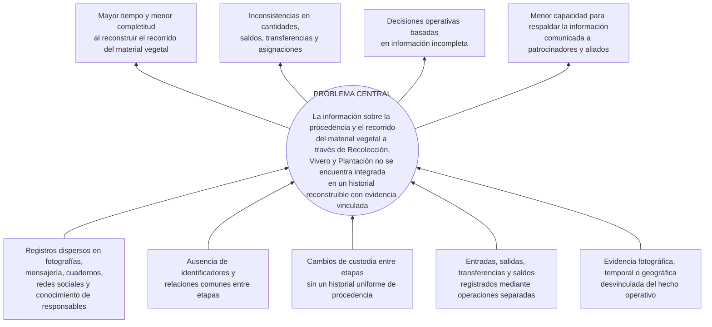

# CAPÍTULO I — MARCO INTRODUCTORIO

> **Estado:** primera versión redactada para revisión con la tutora. Conserva el problema, los objetivos y el alcance del Perfil. El resumen ejecutivo de R3Foresta del 23 de agosto de 2026 se utiliza únicamente para el contexto institucional que respalda de forma directa y no redefine el problema ni las decisiones académicas. La introducción será una sección independiente y se redactará al finalizar el documento.

## 1.1. Antecedentes

### 1.1.1. Antecedentes institucionales de R3Foresta

La **Fundación R3Foresta para la Bioregeneración de Ecosistemas y la Economía Circular** se presenta como una iniciativa y plataforma de acción socioambiental creada en 2019, dedicada a la bioregeneración de ecosistemas estratégicos y al fortalecimiento de las comunidades vinculadas con ellos. La institución no limita su acción a la plantación de árboles o a la compensación de emisiones, sino que propone integrar naturaleza, personas, ciencia, tecnología, economía circular y oportunidades económicas en un modelo de bioregeneración (R3Foresta, 2026).

Su misión oficial es desarrollar, implementar y expandir un modelo integral de bioregeneración que fortalezca ecosistemas y comunidades mediante soluciones ambientales medibles, innovadoras, participativas y económicamente sostenibles. Su visión es convertirse en un referente regional e internacional mediante una red de territorios, comunidades y proyectos capaces de generar beneficios ambientales sostenibles, integrando naturaleza, tecnología, innovación, economía circular y desarrollo humano (R3Foresta, 2026).

El modelo institucional reúne cuatro dimensiones: ecológica, comunitaria, científico-tecnológica y económica. Entre sus componentes se encuentran R3Carbon, R3Water, R3Bio y R3F10 — Reciclaje y Economía Circular. El vínculo directo con el Proyecto de Grado se encuentra en R3Carbon y en la dimensión científico-tecnológica, que contempla medición, monitoreo, trazabilidad, digitalización e innovación aplicada a los procesos ambientales. Las demás líneas aportan contexto institucional y no amplían el alcance funcional del sistema.

La estructura institucional se presenta mediante el organigrama entregado directamente por la Fundación R3Foresta.

**Figura 1. Estructura institucional de R3Foresta.**

*Fuente: organigrama institucional proporcionado por la Fundación R3Foresta.*

R3Carbon es el componente institucional dedicado a la medición, el seguimiento y la valorización de la captura de carbono. Para R3Foresta, la generación futura de bonos de carbono constituye un objetivo estratégico de largo plazo. Alcanzarlo requerirá trabajos posteriores de monitoreo, medición, validación y verificación que exceden el alcance de este Proyecto de Grado (R3Foresta, 2026). Sin embargo, antes de esos procesos, existe una necesidad inmediata: organizar y relacionar la información que se genera durante las actividades de reforestación.

El resumen oficial informa que, dentro de R3Carbon, se desarrolla una aplicación para registrar la historia del material vegetal desde la recolección hasta la plantación, el seguimiento y la medición (R3Foresta, 2026). El nombre oficial de la aplicación es **R3foresta App**. En el presente Proyecto de Grado se delimita como un sistema de trazabilidad del material vegetal hasta el registro de la plantación. La expresión *con proyección hacia bonos de carbono* del título reconoce posibles usos institucionales posteriores de los registros; no describe capacidades implementadas o evaluadas de seguimiento, medición, MRV, certificación ni emisión de créditos.

### 1.1.2. Antecedentes del proceso y de la práctica de registro

La experiencia institucional no comenzó con la aplicación. El resumen ejecutivo confirma que R3Foresta fue creada en 2019 y describe una evolución desde la acción ambiental directa hacia un modelo que integra reforestación, agua, biodiversidad, residuos, alimentación, tecnología y comunidades. También documenta líneas de economía circular relacionadas con residuos orgánicos, plásticos, papel, cartón y aluminio (R3Foresta, 2026).

Una declaración institucional previa mencionó pruebas piloto de acopio y clasificación de aproximadamente diecinueve categorías. Como la fuente oficial revisada no confirma ese número, el lugar, el periodo ni los responsables, el detalle permanece en la ficha de investigación pendiente de respaldo y no se incorpora como hecho validado en este capítulo. La economía circular constituye un antecedente institucional indirecto: clasificar o transformar residuos no equivale a reconstruir la cadena de custodia del material vegetal.

Actualmente, parte de la información y las evidencias de las actividades de reforestación se conservan en fotografías, publicaciones en redes sociales, conversaciones de mensajería, cuadernos, notas y el conocimiento de las personas involucradas. Estos registros se encuentran dispersos y no comparten una estructura, identificadores ni relaciones comunes. Por ello, resulta difícil responder preguntas básicas sobre el material vegetal: de dónde provino, quién estuvo a cargo, qué ocurrió durante su paso por el vivero, cuántas unidades fueron movilizadas y dónde terminó siendo plantado.

Esta fragmentación limita la gestión interna y la presentación de información consistente a empresas patrocinadoras y aliados. R3foresta App responde a esta necesidad mediante una estructura común que relaciona los hechos operativos del material vegetal desde su recolección o su ingreso externo hasta el registro de su plantación.

El proceso operativo considerado comienza con la recolección de semillas o con el ingreso de material vegetal adquirido o recibido de terceros en Vivero o Plantación. Continúa, cuando corresponda, con el manejo y la transformación biológica observada en vivero y concluye con la asignación y el registro de la plantación. Durante el recorrido pueden cambiar la ubicación, el responsable, el estado, la agrupación y la unidad de medida. También pueden ocurrir mermas, descartes, devoluciones, cierres y asignaciones parciales. Por ello, el sistema necesita conservar no solo los estados actuales, sino también los hechos y relaciones que expliquen cómo se obtuvieron.

### 1.1.3. Trabajos académicos y sistemas similares

En Bolivia, Limachi Mamani (2020) desarrolló un sistema de registro y geolocalización de viveros para la Autoridad de Fiscalización y Control Social de Bosques y Tierra. La solución administra viveros, especies y volúmenes de producción y demuestra la pertinencia de emplear información geográfica en la gestión forestal. Su unidad principal es el vivero, por lo que no reconstruye el recorrido del material vegetal desde su procedencia hasta una plantación específica.

En el contexto latinoamericano, Salamanca Contreras (2024) implementó un sistema web para el control interno y el seguimiento del inventario de un vivero comercial. El trabajo reportó mejoras en exactitud de inventario y cumplimiento de despachos. Mayorga Vásquez et al. (2022) propusieron un sistema web para procesos administrativos y productivos de viveros. Ambos antecedentes muestran que la producción, las existencias y los despachos pueden gestionarse digitalmente, pero permanecen centrados en la administración interna del vivero y no relacionan de extremo a extremo la procedencia, las transferencias hacia actividades de reforestación y la evidencia geográfica de la plantación.

La literatura internacional aporta fundamentos transferibles al problema. Moe (1998) distinguió la trazabilidad interna de la trazabilidad entre etapas y resaltó la necesidad de definir unidades rastreables. Olsen y Borit (2013) relacionaron la trazabilidad con el acceso a información sobre objetos a lo largo de su ciclo de vida. Dabbene et al. (2014) examinaron identificación, granularidad, transformación y recuperación de genealogía en cadenas físicas. Aunque estos trabajos proceden principalmente del ámbito agroalimentario, muestran que reconstruir una cadena exige conservar unidades, atributos y relaciones producidas cuando el material cambia, se agrupa o se transfiere.

Thakur et al. (2011) representaron estados, movimientos y transformaciones mediante eventos, separando los datos maestros de los hechos ocurridos. Solanki y Brewster (2014) profundizaron este enfoque al relacionar unidades de entrada y salida de una transformación. Este principio resulta útil para R3Foresta porque un historial enlazado puede explicar el origen de los lotes y sus cambios de cantidad. Sin embargo, debe adaptarse a procesos biológicos, mermas, asignaciones parciales y ubicaciones de plantación, sin asumir equivalencias automáticas entre semillas y plantas ni comprometer la adopción literal de EPCIS.

ISO 22095:2020 aporta terminología y modelos generales de cadena de custodia y establece límites sobre las declaraciones que un sistema puede respaldar (International Organization for Standardization, 2020). Donnelly et al. (2012), por su parte, evaluaron la trazabilidad mediante un ejercicio de reconstrucción que exigía recuperar el origen y la información asociada a los lotes. Este principio respalda que la capacidad de R3Foresta debe evaluarse intentando reconstruir trazas y registrando fuentes, vacíos y tiempo empleado, en lugar de presumirse por la existencia de la plataforma.

### 1.1.4. Brecha identificada

Los antecedentes revisados cubren parcialmente el inventario de viveros, la geolocalización, la digitalización de existencias, la identificación de unidades, los eventos de transformación y los ejercicios de recuperación de trazas. No obstante, dentro del alcance de la búsqueda no se identificó una solución que integrara en un mismo flujo:

- la procedencia del material vegetal recolectado o recibido;
- los eventos y relaciones entre Recolección, Vivero y Plantación;
- las transformaciones biológicas observadas;
- la consistencia de cantidades y saldos por etapa;
- la evidencia vinculada con responsables, fechas y ubicaciones;
- la reconstrucción posterior de la cadena de custodia.

Esta brecha no afirma que no exista ninguna solución similar. Delimita la combinación de capacidades no encontrada en las fuentes revisadas y justifica su análisis, diseño, implementación y comprobación en R3Foresta.

## 1.2. Planteamiento del problema

### 1.2.1. Situación problemática

Para construir un historial integrado del material vegetal, R3Foresta necesita relacionar la información que se genera durante cada etapa de sus actividades de reforestación. Sin embargo, actualmente estos registros se encuentran distribuidos entre fotografías, redes sociales, servicios de mensajería, cuadernos, notas y el conocimiento de las personas involucradas.

Esta dispersión dificulta relacionar información que pertenece a un mismo recorrido. Una fotografía, por ejemplo, puede mostrar el resultado de una plantación, pero, de forma aislada, no permite determinar con claridad cuántas plantas fueron utilizadas, qué especies participaron, cuándo ocurrió la actividad, dónde se realizó o quiénes estuvieron involucrados.

En el vivero, es necesario conocer qué material de propagación se encuentra disponible, qué cantidad está en proceso de germinación, qué plantas continúan en desarrollo y cuáles pueden destinarse a una futura plantación. Sin esta información relacionada, resulta difícil conocer la disponibilidad real del material vegetal y tomar decisiones sobre su utilización.

La plantación presenta una necesidad similar. Al planificar una plantación, se debe definir cuántas plantas se utilizarán y qué especies la compondrán, incluso estableciendo su distribución porcentual cuando corresponda. Para ello es necesario conocer previamente qué material está disponible y si será necesario complementarlo con plantas adquiridas o recibidas externamente.

A medida que se realizan nuevas recolecciones, procesos de vivero y plantaciones, aumenta también la cantidad de información que debe administrarse y relacionarse. Cuando estos registros permanecen separados, reconstruir posteriormente el recorrido del material requiere revisar distintas fuentes y recurrir al conocimiento de las personas que participaron en los procesos.

Esta situación dificulta tanto la administración interna de las actividades de reforestación como la presentación de historiales organizados a comunidades, patrocinadores y otras partes interesadas. También limita la posibilidad de conservar desde ahora antecedentes que, complementados posteriormente con procesos de monitoreo, medición y verificación, puedan evaluarse como parte de futuras iniciativas relacionadas con carbono.

### 1.2.2. Causas y efectos

**Figura 2. Árbol de causas y efectos.**

La primera causa representa la dispersión de la información entre fuentes y responsables. La segunda señala la ausencia de identificadores que relacionen una recolección, un lote de vivero, una asignación y una plantación. La tercera comprende los cambios de custodia que no conservan una referencia uniforme de procedencia. La cuarta se relaciona con operaciones cuantitativas registradas en fuentes o momentos distintos. La quinta alude a evidencia existente pero separada del evento al que debe dar contexto.

### 1.2.3. Problema central

> En la práctica actual de R3Foresta, los registros relacionados con el material vegetal en las actividades de Recolección, Vivero y Plantación permanecen dispersos y no están vinculados entre sí; por ello, la organización no dispone de un historial integrado que le permita reconstruir, a partir de sus registros, el recorrido del material vegetal desde su origen registrado hasta el registro de su plantación.

### 1.2.4. Formulación del problema

#### 1.2.4.1. Pregunta general

> ¿Cómo puede R3Foresta organizar y relacionar la información generada durante sus actividades de reforestación para reconstruir, a partir de sus registros, el recorrido del material vegetal desde la recolección hasta el registro de su plantación?

#### 1.2.4.2. Preguntas específicas

1. ¿Qué información se genera y cómo se gestiona actualmente en las actividades de Recolección, Vivero y Plantación de R3Foresta?
2. ¿Qué información y relaciones deben registrarse para reconstruir el recorrido registrado del material vegetal desde su origen hasta el registro de su plantación?
3. ¿Qué debe permitir el sistema en Recolección, Vivero y Plantación para mantener vinculada la información del material vegetal durante su recorrido?
4. ¿Cómo verificar que lo implementado cumple los requerimientos definidos y que los registros conservan coherencia entre las cantidades y los movimientos del material vegetal?
5. ¿En qué medida el sistema permite reconstruir, a partir de sus registros y evidencias, el recorrido del material vegetal en escenarios operativos representativos de R3Foresta?

## 1.3. Objetivos

### 1.3.1. Objetivo general

Desarrollar un sistema web que permita a R3Foresta registrar, organizar y relacionar la información generada en las actividades de Recolección, Vivero y Plantación, para reconstruir, a partir de sus registros, el recorrido del material vegetal desde su origen hasta el registro de su plantación.

### 1.3.2. Objetivos específicos

1. **Analizar** la información que se genera y cómo se gestiona actualmente en las actividades de Recolección, Vivero y Plantación de R3Foresta.
2. **Diseñar** la organización de la información y las relaciones necesarias para reconstruir el recorrido registrado del material vegetal desde su origen hasta el registro de su plantación.
3. **Implementar** en el sistema las funciones de Recolección, Vivero y Plantación necesarias para mantener vinculada la información del material vegetal durante su recorrido.
4. **Verificar** que las funciones implementadas cumplan los requerimientos definidos y que los registros mantengan coherencia entre las cantidades y los movimientos del material vegetal.
5. **Evaluar**, mediante escenarios operativos representativos, en qué medida el sistema permite reconstruir, a partir de sus registros y evidencias, el recorrido del material vegetal.

## 1.4. Justificación

### 1.4.1. Justificación práctica y social

R3Foresta necesita reconstruir el recorrido del material vegetal que recibe o produce para conocer su procedencia, las cantidades disponibles, las pérdidas ocurridas, las asignaciones y transferencias realizadas y su destino final (Olsen & Borit, 2013; International Organization for Standardization, 2020). Cuando la información se conserva en registros independientes, resulta difícil establecer posteriormente qué ocurrió con un lote a medida que atravesó Recolección, Vivero y Plantación.

Una estructura común permitirá relacionar cantidades, responsables, fechas, ubicaciones y evidencia y recuperar esa información como partes de un mismo recorrido. La utilidad prevista comprende el apoyo a la gestión interna y la presentación de información consistente ante comunidades, voluntarios, empresas patrocinadoras y aliados. Estos beneficios deberán evaluarse en la práctica; no se presupone que el sistema reduzca siempre el tiempo o la carga de trabajo.

### 1.4.2. Justificación tecnológica

El problema requiere una solución informática porque no consiste únicamente en digitalizar formularios. Es necesario conservar identidad, relaciones y cambios entre etapas; explicar cantidades y saldos mediante hechos anteriores; diferenciar transferencias de transformaciones; y asociar evidencia con el evento correspondiente.

El aporte tecnológico se concentra en integrar los datos y las reglas necesarias para impedir inconsistencias lógicas y reconstruir la historia registrada. Las tecnologías y mecanismos específicos se seleccionarán y justificarán durante el análisis, diseño e implementación, sin convertir una herramienta particular en el propósito del proyecto.

### 1.4.3. Justificación académica

El proyecto permite aplicar de forma documentada análisis, diseño, construcción, integración, verificación y validación de un producto informático para resolver un problema organizacional. Su contribución académica comprende la caracterización del dominio, la formalización de un modelo de trazabilidad e integridad, la implementación de tres módulos relacionados y la conservación de evidencia técnica y operativa.

La comprobación admitirá resultados conformes y no conformes. Un defecto, una invariante incumplida o un flujo que requiera más pasos deberá registrarse y corregirse o aceptarse explícitamente como limitación; no se presentará como demostrada una mejora que no haya sido observada.

### 1.4.4. Consideración económica

La ejecución aprovecha infraestructura y herramientas disponibles y concentra los gastos monetarios en conectividad, actividades operativas y recursos de apoyo. Los posibles beneficios de tiempo, costo o financiamiento no se asumirán de antemano. Solo se presentarán como resultados económicos cuando exista una forma definida de medirlos y evidencia suficiente.

## 1.5. Alcances y límites

### 1.5.1. Alcance funcional

El proyecto comprende tres módulos operativos:

1. **Recolección:** registro de semillas o unidades de propagación, especie, cantidad y unidad de medida, fecha, responsable, ubicación y evidencia.
2. **Vivero:** recepción y manejo del material, transformación biológica observada, mermas, descartes, saldo vivo, asignaciones, despachos, devoluciones y cierre.
3. **Plantación:** organización de campañas y subcampañas, asignación de plantas y registro de cantidad plantada, responsables, fecha, ubicación y evidencia.

También forman parte del alcance:

- el ingreso directo en Vivero o Plantación de material vegetal adquirido o recibido de terceros, con el registro de la procedencia disponible;
- la reconstrucción del origen y recorrido registrado del material vegetal;
- el historial de eventos que explique cambios de estado, cantidad y ubicación;
- reglas para prevenir saldos negativos y consumos o asignaciones superiores a lo disponible;
- la coherencia de cantidades durante transferencias y transformaciones;
- evidencia fotográfica, temporal, documental y geográfica vinculada con eventos.

### 1.5.2. Alcance de la verificación, validación y aceptación

La verificación técnica comprobará requerimientos e invariantes mediante pruebas funcionales, de integración, concurrencia y fallo inducido. Incluirá, como mínimo, saldo no negativo, rechazo de consumo superior a lo disponible, prevención de doble consumo, operaciones críticas sin estados parciales y reconstrucción de una traza entre los tres módulos.

La validación utilizará escenarios operativos y criterios de aceptación para comprobar la reconstrucción de trazas, la coherencia de los datos y la evidencia vinculada. Los resultados se limitarán a las funciones y condiciones realmente comprobadas; no se interpretarán como una comparación causal con la práctica anterior.

### 1.5.3. Fuera del alcance

La expresión *con proyección hacia bonos de carbono* del título se refiere exclusivamente al posible uso institucional futuro de la información trazable producida por los módulos de Recolección, Vivero y Plantación. Esta proyección no incorpora funciones de carbono al sistema académico ni permite afirmar que sus registros sean suficientes para generar o certificar créditos.

El proyecto no comprende:

- monitoreo posterior de supervivencia, crecimiento, mantenimiento o estado ecológico después del registro de plantación;
- registro o cálculo de biomasa, captura de dióxido de carbono o toneladas de CO₂ equivalente;
- implementación de una metodología de monitoreo, reporte y verificación de carbono;
- validación, verificación, certificación, generación, emisión o comercialización de bonos o créditos de carbono;
- certificación forestal o ambiental por un tercero acreditado;
- autenticidad forense de fotografías, coordenadas o declaraciones;
- adopción de blockchain, NFT, contratos inteligentes o IPFS;
- interoperabilidad completa con organizaciones externas;
- despliegue masivo o generalización estadística de los resultados.

### 1.5.4. Limitaciones

La cobertura de la validación dependerá de las actividades, datos, responsables, sitios y conectividad disponibles durante el periodo académico. Las rutas que no ocurran en una operación real se comprobarán mediante escenarios controlados y se identificarán como tales.

La información registrada representa declaraciones y observaciones conservadas por el sistema; no demuestra automáticamente su correspondencia con la realidad física. Las fotografías y coordenadas respaldan un registro, pero no prueban por sí solas cantidad, identidad, supervivencia o captura de carbono. La aceptación del software no equivale a certificación ambiental ni permite generalizar su desempeño a condiciones que no fueron validadas.

## 1.6. Aportes esperados del proyecto

### 1.6.1. Aporte práctico

Un artefacto utilizable por R3Foresta para registrar y reconstruir el recorrido del material vegetal entre Recolección, Vivero y Plantación, con información de procedencia, cantidades, responsables, ubicaciones y evidencia asociada.

### 1.6.2. Aporte de ingeniería

Un modelo de entidades, eventos, relaciones, cantidades, saldos, responsables y evidencias, acompañado de reglas de integridad, contratos entre módulos y pruebas que comprueben propiedades críticas. El aporte se expresa en el modelo y en su verificación, no en la sola utilización de una tecnología determinada.

### 1.6.3. Aporte académico

Un proceso de ingeniería documentado que vincule el problema con requisitos, especificaciones, decisiones de diseño, incrementos ejecutables, integraciones, pruebas y aceptación. El trabajo expondrá el grado de cumplimiento de los objetivos, las decisiones y riesgos gestionados, los resultados técnicos, la capacidad de reconstrucción y las limitaciones identificadas.

## 1.7. Metodología de desarrollo

El proyecto adopta un **proceso de desarrollo basado en Rational Unified Process (RUP), complementado con Spec-Driven Development (SDD) asistido por inteligencia artificial**. RUP aporta la estructura del ciclo de vida; el enfoque iterativo e incremental determina cómo crece el producto; SDD organiza el trabajo desde especificaciones versionadas; y la IA actúa como herramienta de apoyo bajo control humano. No se incorpora un marco investigativo independiente ni se organiza el trabajo mediante sprints. La expresión *caso R3Foresta* del título identifica el contexto de aplicación y no equivale a adoptar un diseño de estudio de caso.

### 1.7.1. RUP como proceso rector

RUP es un proceso de ingeniería de software dirigido por casos de uso, centrado en la arquitectura e iterativo e incremental. Ordena el proyecto completo en cuatro fases: Inicio, Elaboración, Construcción y Transición; los riesgos prioritarios orientan el contenido de sus iteraciones. Cada fase termina en un hito que permite decidir si existe evidencia suficiente para avanzar (Kruchten, 2004; IBM, s. f.).

En **Inicio** se delimitarán el problema, los actores, el alcance, los requisitos iniciales, los riesgos y la viabilidad. En **Elaboración** se estabilizarán los requisitos significativos, el modelo de trazabilidad, la arquitectura base y los contratos entre módulos, y se comprobará una línea vertical arquitectónica mínima M1→M2→M3 para reducir los riesgos de integración. En **Construcción** se producirán los incrementos ejecutables. En **Transición** se completarán la validación, las correcciones, el despliegue, los manuales y la aceptación del producto.

### 1.7.2. Adaptación de RUP al proyecto

La adaptación conserva los principios, fases, hitos, disciplinas y evidencia de RUP, pero reduce la carga administrativa de un proceso pensado para equipos mayores. El postulante asumirá los roles de analista, arquitecto, desarrollador, responsable de pruebas y responsable de configuración; la tutora y los responsables autorizados de R3Foresta intervendrán en revisiones y aceptación dentro de sus competencias. Solo se producirán artefactos que contribuyan al control y a la defensa del proyecto.

Los hitos adaptados serán: objetivos del ciclo de vida o **LCO**, arquitectura del ciclo de vida o **LCA**, capacidad operativa inicial o **IOC** y liberación del producto o **PR**. Para aprobarlos se revisarán artefactos y resultados, no solo el cumplimiento de una fecha.

### 1.7.3. Iteraciones, incrementos e integraciones

RUP ya es iterativo e incremental; por ello no se agrega Scrum ni una capa de sprints. Una **iteración** es un intervalo planificado que recorre las disciplinas pertinentes y concluye con una revisión; el **incremento** es la versión ejecutable obtenida al cerrarla. Las fases RUP describen la evolución del proyecto completo. Se realizará una iteración de Inicio (IN-1), una de Elaboración (EL-1), cuatro de Construcción (CO-1 a CO-4) y una de Transición (TR-1). Las iteraciones de Construcción producirán estos incrementos:

1. M1 Recolección funcional y probado;
2. M2 Vivero e integración M1→M2;
3. M3 Plantación e integración M2→M3;
4. trazabilidad transversal, integración completa, regresión y versión candidata.

Cada iteración incluirá objetivos, riesgos, productos y una revisión; cada incremento incluirá especificación, diseño detallado, implementación, pruebas, integración y demostración. Un incremento posterior podrá corregir decisiones anteriores cuando aparezca nueva evidencia técnica, pero deberá conservarse la razón del cambio y ejecutarse regresión sobre lo ya integrado. Consultas, reportes, historial y reconstrucción son capacidades transversales y no un cuarto módulo.

### 1.7.4. Spec-Driven Development

SDD se utilizará como un protocolo propio basado en el flujo central de GitHub Spec Kit para que la especificación preceda y gobierne el cambio de software; no se declarará adopción completa de la herramienta. Para cada capacidad se seguirá la cadena `necesidad → requisito → especificación → diseño → tareas → implementación → pruebas → resultado → aceptación`. Antes de programar se definirán comportamiento esperado, reglas, datos, interfaces, casos límite y criterios de aceptación. Después se elaborarán el plan técnico y las tareas; el código y las pruebas deberán corresponder a esa especificación.

Si la implementación revela una ambigüedad, primero se actualizará y revisará la especificación y luego se modificará el producto. De esta forma, la especificación no será una descripción redactada después del código, sino una fuente versionada para coordinar análisis, diseño, construcción y comprobación. Los artefactos SDD materializarán requisitos, diseño detallado y tareas de cada capacidad; no sustituirán la visión, la arquitectura, los riesgos, la configuración, la revisión de iteraciones, los hitos ni el despliegue de RUP.

### 1.7.5. Asistencia de inteligencia artificial

La IA apoyará la identificación de ambigüedades, la descomposición de especificaciones, la exploración de alternativas de diseño, la generación y revisión de código, la propuesta de pruebas y la actualización documental. SDD no cuenta con una definición normativa única; el referente adoptado, GitHub Spec Kit, es explícitamente agentic. La expresión **asistido por IA** se mantiene para declarar esa variante y hacer visibles sus controles (GitHub, 2026).

Toda salida de IA será considerada una propuesta. El postulante deberá revisar su correspondencia con las reglas del dominio, ejecutar las pruebas, resolver discrepancias y aceptar o rechazar el resultado. No se delegarán a la IA la aprobación del alcance, las decisiones institucionales, la autoría, la validación final ni la responsabilidad por el producto. Para cada aporte material se registrarán fecha, herramienta y modelo o versión disponible, tarea, artefacto afectado, salida adoptada, modificada o rechazada, revisión humana, prueba y referencia al cambio; no será necesario publicar conversaciones privadas completas.

### 1.7.6. Verificación, validación y aceptación

La **verificación** comprobará si el producto fue construido de acuerdo con sus requisitos, especificaciones e invariantes mediante pruebas unitarias, de integración, funcionales, de regresión, concurrencia y fallos críticos. La **validación operativa** ejecutará escenarios representativos para determinar si los flujos permiten registrar y reconstruir la cadena prevista. La **aceptación** confrontará los resultados con criterios previamente definidos para cada incremento y para el sistema integrado.

La validación podrá utilizar operaciones reales autorizadas o escenarios controlados claramente identificados. Se registrarán precondiciones, datos, pasos, resultado esperado, resultado obtenido, evidencia, defectos y decisión. Estas actividades forman parte de la ingeniería del producto y no se presentarán como diseño experimental, estudio de caso o certificación externa.

### 1.7.7. Seguimiento y cadena de evidencia

El seguimiento confrontará por fase e iteración lo planificado con lo realizado y registrará el incremento o resultado, los artefactos, riesgos, decisiones, incidencias, pruebas, riesgo residual y estado de aceptación. Se conservarán dos cadenas complementarias:

1. `necesidad → requisito → especificación → decisión de diseño → tarea → cambio → prueba → resultado → aceptación`;
2. `requisito → regla → invariante → mecanismo → prueba → resultado`.

La metodología se consolidó documentalmente el 25 de agosto de 2026, dentro de la ventana autorizada del 6 de julio al 15 de noviembre. La construcción parte de una referencia identificable del repositorio y de un inventario del software preexistente. Los componentes anteriores podrán consultarse como referencia técnica, pero no se fabricarán retrospectivamente artefactos, commits, pruebas, resultados, participantes ni aprobaciones. Las actividades reconstruidas de forma controlada conservarán su fecha real, citarán sus fuentes y se identificarán como tales.

### 1.7.8. Periodización

- Inicio, iteración IN-1: 6–19 de julio;
- Elaboración, iteración EL-1: 20 de julio–16 de agosto;
- Construcción, iteración CO-1 e incremento 1: 17 de agosto–6 de septiembre;
- Construcción, iteración CO-2 e incremento 2: 7–27 de septiembre;
- Construcción, iteración CO-3 e incremento 3: 28 de septiembre–18 de octubre;
- Construcción, iteración CO-4 e incremento 4: 19 de octubre–1 de noviembre;
- Transición, iteración TR-1: 2–15 de noviembre.

## 1.8. Organización del documento

La introducción se presentará como una sección independiente y se redactará al finalizar todos los capítulos. El Capítulo I reúne antecedentes, problema, objetivos, justificaciones, alcances y metodología de desarrollo. El Capítulo II desarrolla los fundamentos teóricos y conceptuales de trazabilidad, RUP, SDD y asistencia de IA, y delimita la proyección hacia bonos de carbono. El Capítulo III corresponde al Marco aplicativo y expondrá análisis, diseño, implementación, integración, verificación, validación y resultados. Después se presentarán las conclusiones y recomendaciones.
