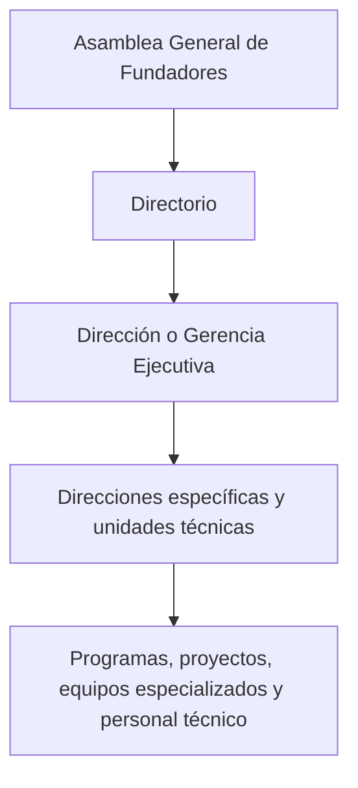
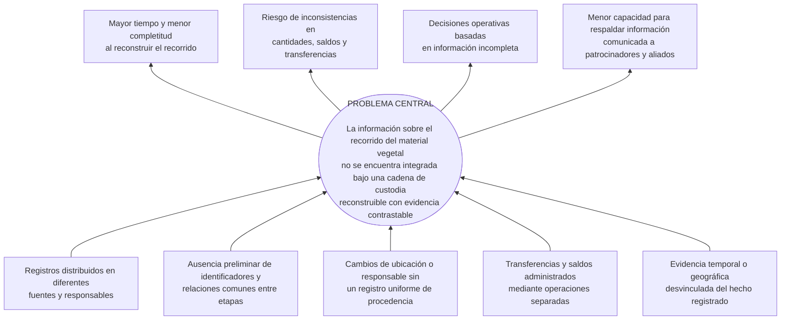

# CAPÍTULO I — MARCO INTRODUCTORIO

> **Estado:** primera versión redactada para revisión con la tutora. Conserva el problema, los objetivos y el alcance del Perfil. La misión, la visión, el inicio institucional en 2019 y el contexto tecnológico se actualizaron con el resumen ejecutivo oficial de R3Foresta del 23 de agosto de 2026; los datos de la práctica actual permanecen sujetos al diagnóstico documental y de campo. La introducción será una sección independiente y se redactará al finalizar el documento.

## 1.1. Antecedentes

### 1.1.1. Antecedentes institucionales de R3Foresta

La **Fundación R3Foresta para la Bioregeneración de Ecosistemas y la Economía Circular** se presenta como una iniciativa y plataforma de acción socioambiental creada en 2019, dedicada a la bioregeneración de ecosistemas estratégicos y al fortalecimiento de las comunidades vinculadas con ellos. La institución no limita su acción a la plantación de árboles o a la compensación de emisiones, sino que propone integrar naturaleza, personas, ciencia, tecnología, economía circular y oportunidades económicas en un modelo de bioregeneración (R3Foresta, 2026).

Su misión oficial es desarrollar, implementar y expandir un modelo integral de bioregeneración que fortalezca ecosistemas y comunidades mediante soluciones ambientales medibles, innovadoras, participativas y económicamente sostenibles. Su visión es convertirse en un referente regional e internacional mediante una red de territorios, comunidades y proyectos capaces de generar beneficios ambientales sostenibles, integrando naturaleza, tecnología, innovación, economía circular y desarrollo humano (R3Foresta, 2026).

El modelo institucional reúne cuatro dimensiones: ecológica, comunitaria, científico-tecnológica y económica. Entre sus componentes se encuentran R3Carbon, R3Water, R3Bio y R3F10 — Reciclaje y Economía Circular. El vínculo directo con el Proyecto de Grado se encuentra en R3Carbon y en la dimensión científico-tecnológica, que contempla medición, monitoreo, trazabilidad, digitalización e innovación aplicada a los procesos ambientales. Las demás líneas aportan contexto institucional y no amplían el alcance funcional del sistema.

Según la información institucional proporcionada, el Estatuto Orgánico establece una estructura compuesta por los siguientes niveles:

**Figura 1. Estructura general declarada de R3Foresta.**

_Nota._ La denominación de los niveles deberá verificarse con el Estatuto Orgánico antes de cerrar la figura.

R3Carbon es el componente institucional dedicado a la medición, el seguimiento y la valorización de la captura de carbono. El resumen oficial informa que, dentro de este componente, se desarrolla una aplicación para registrar la historia del material vegetal desde la recolección hasta la plantación, el seguimiento y la medición (R3Foresta, 2026). El nombre oficial de la aplicación es **R3foresta App**. En el presente Proyecto de Grado se delimita como un sistema de trazabilidad del material vegetal hasta el registro de la plantación. Los posibles usos posteriores en seguimiento y medición de carbono se reconocen únicamente como contexto institucional y no como capacidades implementadas o evaluadas.

### 1.1.2. Antecedentes del proceso y de la práctica de registro

La experiencia institucional no comenzó con la aplicación. El resumen ejecutivo confirma que R3Foresta fue creada en 2019 y describe una evolución desde la acción ambiental directa hacia un modelo que integra reforestación, agua, biodiversidad, residuos, alimentación, tecnología y comunidades. También documenta líneas de economía circular relacionadas con residuos orgánicos, plásticos, papel, cartón y aluminio (R3Foresta, 2026).

Una declaración institucional previa mencionó pruebas piloto de acopio y clasificación de aproximadamente diecinueve categorías. Como la fuente oficial revisada no confirma ese número, el lugar, el periodo ni los responsables, el detalle permanece en la ficha de investigación pendiente de respaldo y no se incorpora como hecho validado en este capítulo. La economía circular constituye un antecedente institucional indirecto: clasificar o transformar residuos no equivale a reconstruir la cadena de custodia del material vegetal.

Con el crecimiento de los proyectos surgió la necesidad de pasar de registros operativos distribuidos a una estructura de información común. Según el diagnóstico preliminar proporcionado, el seguimiento anterior a R3foresta App dependía de registros individuales, documentación de campo y diferentes fuentes de información. La institución identifica como posibles dificultades la dispersión, el riesgo de pérdida o duplicación, la dependencia de registros manuales, la dificultad para relacionar una planta con su origen y las limitaciones para reconstruir historiales o consolidar información de distintos proyectos.

Estas dificultades todavía deben validarse. El diagnóstico del Proyecto de Grado inventariará las actividades y fuentes accesibles dentro de un periodo definido, aplicará criterios de inclusión y exclusión y reconstruirá las trazas elegibles. En una primera pasada se utilizarán solamente documentos; en una segunda podrán incorporarse explicaciones de los responsables. De esta manera será posible distinguir lo recuperable mediante evidencia de aquello que depende de la memoria o permanece ausente, parcial o contradictorio.

El proceso operativo considerado comienza con la recolección de semillas o con el ingreso externo de material vegetal, continúa con el manejo y la transformación biológica observada en vivero y concluye con la asignación y el registro de la plantación. Durante el recorrido pueden cambiar la ubicación, el responsable, el estado, la agrupación y la unidad de medida. También pueden ocurrir mermas, descartes, devoluciones, cierres y asignaciones parciales. Por ello, el sistema necesita conservar no solo los estados actuales, sino también los hechos y relaciones que expliquen cómo se obtuvieron.

### 1.1.3. Trabajos académicos y sistemas similares

En Bolivia, Limachi Mamani (2020) desarrolló un sistema de registro y geolocalización de viveros para la Autoridad de Fiscalización y Control Social de Bosques y Tierra. La solución administra viveros, especies y volúmenes de producción y demuestra la pertinencia de emplear información geográfica en la gestión forestal. Su unidad principal es el vivero, por lo que no reconstruye el recorrido del material vegetal desde su procedencia hasta una plantación específica.

En el contexto latinoamericano, Salamanca Contreras (2024) implementó un sistema web para el control interno y el seguimiento del inventario de un vivero comercial. El trabajo reportó mejoras en exactitud de inventario y cumplimiento de despachos. Mayorga Vásquez et al. (2022) propusieron un sistema web para procesos administrativos y productivos de viveros. Ambos antecedentes muestran que la producción, las existencias y los despachos pueden gestionarse digitalmente, pero permanecen centrados en la administración interna del vivero y no relacionan de extremo a extremo la procedencia, las transferencias hacia actividades de reforestación y la evidencia geográfica de la plantación.

La literatura internacional aporta fundamentos transferibles al problema. Moe (1998) distinguió la trazabilidad interna de la trazabilidad entre etapas y resaltó la necesidad de definir unidades rastreables. Olsen y Borit (2013) relacionaron la trazabilidad con el acceso a información sobre objetos a lo largo de su ciclo de vida. Dabbene et al. (2014) examinaron identificación, granularidad, transformación y recuperación de genealogía en cadenas físicas. Aunque estos trabajos proceden principalmente del ámbito agroalimentario, muestran que reconstruir una cadena exige conservar unidades, atributos y relaciones producidas cuando el material cambia, se agrupa o se transfiere.

Thakur et al. (2011) representaron estados, movimientos y transformaciones mediante eventos, separando los datos maestros de los hechos ocurridos. Solanki y Brewster (2014) profundizaron este enfoque al relacionar unidades de entrada y salida de una transformación. Este principio resulta útil para R3Foresta porque un historial enlazado puede explicar el origen de los lotes y sus cambios de cantidad. Sin embargo, debe adaptarse a procesos biológicos, mermas, asignaciones parciales y ubicaciones de plantación, sin asumir equivalencias automáticas entre semillas y plantas ni comprometer la adopción literal de EPCIS.

ISO 22095:2020 aporta terminología y modelos generales de cadena de custodia y establece límites sobre las declaraciones que un sistema puede respaldar (ISO, 2020). Donnelly et al. (2012), por su parte, evaluaron la trazabilidad mediante un ejercicio de reconstrucción que exigía recuperar el origen y la información asociada a los lotes. Este principio respalda que la capacidad de R3Foresta debe evaluarse intentando reconstruir trazas y registrando fuentes, vacíos y tiempo empleado, en lugar de presumirse por la existencia de la plataforma.

### 1.1.4. Brecha identificada

Los antecedentes revisados cubren parcialmente el inventario de viveros, la geolocalización, la digitalización de existencias, la identificación de unidades, los eventos de transformación y los ejercicios de recuperación de trazas. No obstante, dentro del alcance de la búsqueda no se identificó una solución que integrara en un mismo flujo:

- la procedencia del material vegetal recolectado o recibido;
- los eventos y relaciones entre Recolección, Vivero y Plantación;
- las transformaciones biológicas observadas;
- la consistencia de cantidades y saldos por etapa;
- la evidencia vinculada con responsables, fechas y ubicaciones;
- la reconstrucción posterior de la cadena de custodia.

Esta brecha no afirma que no exista ninguna solución similar. Delimita la combinación de capacidades no encontrada en las fuentes revisadas y justifica estudiar su diseño, implementación y evaluación en el caso R3Foresta.

## 1.2. Planteamiento del problema

### 1.2.1. Situación problemática

R3Foresta realiza actividades de reforestación con comunidades, voluntarios y organizaciones patrocinadoras. Según la caracterización institucional preliminar, la evidencia de esas actividades puede encontrarse en fotografías, publicaciones, conversaciones de mensajería, cuadernos, notas, documentación de campo y conocimiento de los responsables. Estas fuentes pueden respaldar hechos particulares, pero todavía debe determinarse si comparten identificadores, unidades y relaciones suficientes para reconstruir el recorrido completo del material vegetal.

El recorrido principal comienza con la recolección, continúa con el manejo en vivero y concluye con la plantación. También puede ingresar material vegetal adquirido o recibido de terceros directamente en Vivero o Plantación. En estos casos, su historial no puede atribuir una recolección inexistente: debe comenzar con el hecho de ingreso y conservar la información de procedencia disponible.

Durante el recorrido cambian la ubicación, el responsable, el estado, la agrupación y, en algunos procesos, la unidad de medida. Una cantidad recolectada puede expresarse en gramos o unidades de propagación, mientras que las plantas vivas se registran en unidades. El paso de semillas a plantas no representa una conversión aritmética automática, sino un resultado biológico observado. En consecuencia, la consistencia debe preservarse dentro de cada etapa y unidad compatible y mediante relaciones explícitas entre el material de entrada y el resultado observado.

Si las salidas y entradas se registran de forma separada, o si un saldo cambia sin conservar el hecho que lo explica, pueden producirse registros incompletos, doble asignación, doble consumo o cantidades difíciles de conciliar. De forma semejante, una fotografía o coordenada almacenada fuera del hecho operativo puede perder su relación con la especie, la cantidad, la fecha y el responsable que debía respaldar.

La consecuencia planteada es una capacidad limitada para reconstruir la cadena de custodia con evidencia contrastable. Esto puede afectar las decisiones internas sobre disponibilidad y pérdidas y la información comunicada a patrocinadores y aliados. La frecuencia y gravedad de estas dificultades se determinarán durante el diagnóstico; no se asumirán como resultados ya demostrados.

El problema es informacional. Un sistema puede relacionar registros, preservar reglas de consistencia y facilitar su recuperación, pero no puede garantizar por sí solo que una declaración coincida con la realidad física.

### 1.2.2. Causas y efectos

Las causas y efectos de la Figura 2 constituyen planteamientos preliminares por comprobar. Serán confirmados, modificados o descartados mediante entrevistas, inventario documental y reconstrucción de trazas históricas.

**Figura 2. Árbol preliminar de causas y efectos.**

La primera causa se refiere a la distribución de la información en fuentes que pueden tener diferentes responsables y formatos. La segunda señala la posible ausencia de identificadores que permitan relacionar una recolección, un lote de vivero, una asignación y una plantación. La tercera comprende los cambios de custodia, ubicación o responsabilidad que no conservan una referencia uniforme de procedencia. La cuarta se relaciona con operaciones cuantitativas que podrían quedar registradas en momentos o módulos distintos. La quinta alude a evidencia existente pero separada del evento al que debería dar contexto.

Estas causas pueden producir vacíos o demoras de recuperación, inconsistencias cuantitativas y menor capacidad para presentar información relacionada. El diagnóstico deberá establecer cuáles ocurren efectivamente, bajo qué condiciones y con qué evidencia.

### 1.2.3. Problema central

> En la práctica actual de R3Foresta, la información sobre el recorrido del material vegetal, desde su origen o ingreso al proceso hasta su plantación, se conserva en registros dispersos que no comparten una estructura ni relaciones comunes; esta fragmentación limita la reconstrucción de la cadena de custodia, la comprobación de la consistencia de cantidades y saldos y la presentación de evidencia contrastable a los actores interesados.

### 1.2.4. Formulación del problema

#### 1.2.4.1. Pregunta general

> ¿Cómo desarrollar, en el caso R3Foresta, un sistema de trazabilidad que permita reconstruir con evidencia contrastable el recorrido del material vegetal desde su origen o ingreso al proceso hasta el registro de su plantación, y qué diferencias presenta frente a la práctica de registro actual en capacidad de reconstrucción y carga operativa?

#### 1.2.4.2. Preguntas específicas

1. ¿Qué procesos, actores, datos, estados, eventos, unidades de medida y reglas de negocio intervienen en Recolección, Vivero y Plantación, incluidas las variantes de ingreso de material vegetal adquirido o recibido de terceros?
2. ¿Qué modelo de información y reglas de integridad permite relacionar los orígenes, movimientos, transformaciones, saldos, responsables y evidencias de la cadena de custodia?
3. ¿Cómo implementar e integrar los módulos de Recolección, Vivero y Plantación y sus variantes de ingreso externo sin perder la historia de procedencia del material vegetal?
4. ¿En qué medida la solución cumple los requerimientos y preserva las invariantes definidas mediante pruebas funcionales y técnicas?
5. ¿Qué capacidad presenta la solución para reconstruir trazas con evidencia contrastable y qué carga operativa genera respecto de la práctica actual de R3Foresta?

## 1.3. Objetivos

### 1.3.1. Objetivo general

Desarrollar y evaluar un sistema de trazabilidad para la cadena de custodia del material vegetal utilizado por R3Foresta, desde su recolección o recepción externa hasta su manejo en vivero y plantación, que permita reconstruir con evidencia contrastable su procedencia, movimientos, cantidades, responsables y destino.

### 1.3.2. Objetivos específicos

1. **Analizar** los procesos, actores, datos, estados, eventos, unidades de medida, requerimientos y reglas de negocio de Recolección, Vivero y Plantación, incluidas las variantes de ingreso de material vegetal adquirido o recibido de terceros.
2. **Diseñar** un modelo de trazabilidad e integridad que relacione orígenes, entidades, eventos, transformaciones, cantidades, saldos, responsables y evidencias, y que formalice las reglas aplicables a las transferencias y transformaciones entre etapas.
3. **Implementar** los módulos de Recolección, Vivero y Plantación, incorporando el ingreso de material vegetal adquirido o recibido de terceros directamente en Vivero o Plantación, con sus datos de procedencia y su registro en el historial.
4. **Verificar** el cumplimiento de los requerimientos y de las invariantes de consistencia mediante pruebas funcionales y técnicas.
5. **Evaluar**, en el contexto del estudio de caso, la capacidad de reconstrucción con evidencia contrastable y la carga operativa de la solución, comparándolas con la práctica actual caracterizada en R3Foresta.

## 1.4. Justificación

### 1.4.1. Justificación práctica y social

R3Foresta necesita reconstruir el recorrido del material vegetal que recibe o produce para conocer su procedencia, las cantidades disponibles, las pérdidas ocurridas, las asignaciones y transferencias realizadas y su destino final. Cuando la información se conserva en registros independientes, resulta difícil establecer posteriormente qué ocurrió con un lote a medida que atravesó Recolección, Vivero y Plantación.

Una estructura común permitirá relacionar cantidades, responsables, fechas, ubicaciones y evidencia y recuperar esa información como partes de un mismo recorrido. La utilidad prevista comprende el apoyo a la gestión interna y la presentación de información consistente ante comunidades, voluntarios, empresas patrocinadoras y aliados. Estos beneficios deberán evaluarse en la práctica; no se presupone que el sistema reduzca siempre el tiempo o la carga de trabajo.

### 1.4.2. Justificación tecnológica

El problema requiere una solución informática porque no consiste únicamente en digitalizar formularios. Es necesario conservar identidad, relaciones y cambios entre etapas; explicar cantidades y saldos mediante hechos anteriores; diferenciar transferencias de transformaciones; y asociar evidencia con el evento correspondiente.

El aporte tecnológico se concentra en integrar los datos y las reglas necesarias para impedir inconsistencias lógicas y reconstruir la historia registrada. Las tecnologías y mecanismos específicos se seleccionarán y justificarán durante el análisis, diseño e implementación, sin convertir una herramienta particular en el propósito del proyecto.

### 1.4.3. Justificación académica

El proyecto permite relacionar el estudio de un problema organizacional con el diseño, construcción y evaluación de un artefacto informático. Su contribución académica comprende la caracterización del dominio, la formalización de un modelo de trazabilidad e integridad, la implementación de tres módulos relacionados y la obtención de evidencia técnica y operativa.

La evaluación admitirá resultados positivos, negativos o mixtos. Por ejemplo, un registro más estructurado podría aumentar el esfuerzo inicial y, al mismo tiempo, mejorar la recuperación posterior. Informar ambos efectos fortalece la validez del estudio y evita presentar como demostrada una mejora que todavía debe observarse.

### 1.4.4. Consideración económica

La ejecución aprovecha infraestructura y herramientas disponibles y concentra los gastos monetarios en conectividad, trabajo de campo y recursos de apoyo. Los posibles beneficios de tiempo, costo o financiamiento no se asumirán de antemano. Solo se presentarán como resultados económicos cuando exista una forma definida de medirlos y evidencia obtenida durante el caso.

## 1.5. Alcances y límites

### 1.5.1. Alcance funcional

El proyecto comprende tres módulos operativos:

1. **Recolección:** registro de semillas o unidades de propagación, especie, cantidad y unidad de medida, fecha, responsable, ubicación y evidencia.
2. **Vivero:** recepción y manejo del material, transformación biológica observada, mermas, descartes, saldo vivo, asignaciones, despachos, devoluciones y cierre.
3. **Plantación:** organización de campañas y subcampañas, asignación de plantas y registro de cantidad plantada, responsables, fecha, ubicación y evidencia.

El sistema podrá registrar material adquirido o recibido de terceros directamente en Vivero o Plantación. El historial distinguirá ese ingreso de una recolección efectuada por R3Foresta y conservará la información de procedencia disponible. Estas variantes permanecerán dentro de los tres módulos y no constituirán un cuarto módulo.

También forman parte del alcance:

- la reconstrucción del origen y recorrido registrado del material vegetal;
- el historial de eventos que explique cambios de estado, cantidad y ubicación;
- reglas para prevenir saldos negativos y consumos o asignaciones superiores a lo disponible;
- la coherencia de cantidades durante transferencias y transformaciones;
- evidencia fotográfica, temporal, documental y geográfica vinculada con eventos.

### 1.5.2. Alcance de la verificación y evaluación

La verificación técnica comprobará requerimientos e invariantes mediante pruebas funcionales, de integración, concurrencia y fallo inducido. Incluirá, como mínimo, saldo no negativo, rechazo de consumo superior a lo disponible, prevención de doble consumo, operaciones críticas sin estados parciales y reconstrucción de una traza entre los tres módulos.

La evaluación del caso utilizará una guía común para comparar la información recuperable en la práctica actual y en la propuesta. Considerará completitud, coherencia, evidencia vinculada, tiempo de reconstrucción y carga de registro. Los resultados serán descriptivos y se limitarán al caso y a las trazas efectivamente disponibles.

### 1.5.3. Fuera del alcance

El proyecto no comprende:

- seguimiento ecológico o de supervivencia posterior al registro de plantación;
- medición o certificación de captura de carbono;
- cálculo, emisión o comercialización de créditos de carbono;
- certificación forestal o ambiental por un tercero acreditado;
- autenticidad forense de fotografías, coordenadas o declaraciones;
- adopción de blockchain, NFT, contratos inteligentes o IPFS;
- interoperabilidad completa con organizaciones externas;
- despliegue masivo o generalización estadística de los resultados.

### 1.5.4. Limitaciones

La caracterización de la práctica actual dependerá de la disponibilidad, integridad y autorización de los documentos institucionales. La cobertura del piloto dependerá de las actividades reales, los participantes, los sitios y la conectividad disponibles durante el periodo académico. Las rutas que no ocurran en campo se comprobarán mediante casos controlados y se identificarán como tales.

La información registrada representa declaraciones y observaciones conservadas por el sistema; no demuestra automáticamente su correspondencia con la realidad física. Las fotografías y coordenadas respaldan un registro, pero no prueban por sí solas cantidad, identidad, supervivencia o captura de carbono. Los resultados describirán un estudio de caso único y no se generalizarán sin considerar diferencias organizacionales y operativas.

## 1.6. Aportes esperados del proyecto

### 1.6.1. Aporte práctico

Un artefacto utilizable por R3Foresta para registrar y reconstruir el recorrido del material vegetal entre Recolección, Vivero y Plantación, con información de procedencia, cantidades, responsables, ubicaciones y evidencia asociada.

### 1.6.2. Aporte de ingeniería

Un modelo de entidades, eventos, relaciones, cantidades, saldos, responsables y evidencias, acompañado de reglas de integridad, contratos entre módulos y pruebas que comprueben propiedades críticas. El aporte se expresa en el modelo y en su verificación, no en la sola utilización de una tecnología determinada.

### 1.6.3. Aporte académico

Evidencia obtenida al construir y evaluar la solución mediante ciencia del diseño y un estudio de caso. El trabajo documentará el grado de cumplimiento de los objetivos, los resultados técnicos, la capacidad de reconstrucción, la carga operativa, las limitaciones y los hallazgos negativos o mixtos que se presenten.

## 1.7. Diseño metodológico

### 1.7.1. Tipo de investigación y ciencia del diseño

La investigación es aplicada porque aborda una necesidad concreta de R3Foresta y tecnológica porque produce y estudia un artefacto informático. Se adopta la ciencia del diseño, que vincula un problema relevante con la construcción y evaluación rigurosa de un artefacto (Hevner et al., 2004). El artefacto académico comprende el modelo de trazabilidad e integridad, sus reglas e invariantes, los tres módulos integrados, el mecanismo de reconstrucción y la evidencia producida al verificar y evaluar la solución; no se limita a la interfaz o al código ejecutable.

La contribución se analizará mediante la relación entre problema, conocimiento previo, requisitos de diseño, componentes del artefacto, demostraciones, evaluación y hallazgos. De esta manera, la construcción de software se convierte en investigación cuando produce evidencia y conocimiento comunicable sobre su adecuación, sus límites y las decisiones que permitieron obtenerla.

### 1.7.2. Proceso DSRM

DSRM operacionaliza la ciencia del diseño mediante seis actividades: identificación del problema y motivación, definición de objetivos, diseño y desarrollo, demostración, evaluación y comunicación (Peffers et al., 2007). En R3Foresta, el diagnóstico y el inventario documental sustentan el problema; las preguntas, requisitos e invariantes expresan los objetivos; los sprints construyen el artefacto; las revisiones y recorridos integrados lo demuestran; las pruebas y el piloto lo evalúan; y los repositorios, capítulos, anexos y defensa comunican el trabajo.

Estas actividades no forman una secuencia rígida ni reemplazan el proceso de desarrollo. Un hallazgo de demostración o evaluación podrá devolver el trabajo a objetivos, diseño o construcción, siempre que la iteración y su justificación queden registradas.

### 1.7.3. Diseño de caso único embebido

R3Foresta se estudia como un caso único embebido. El caso es el diseño, construcción y evaluación del proceso digital de trazabilidad del material vegetal en R3Foresta durante la ventana académica formal; la Fundación constituye el contexto organizacional y las trazas de cadena de custodia son las unidades embebidas. La elección de un solo caso responde a su relación directa con el problema, el acceso autorizado a sus procesos y registros y la profundidad requerida para estudiar la interacción entre organización, operación y artefacto.

Antes de recolectar datos se delimitarán el periodo, los procesos, los sitios, los actores y las fuentes incluidas. Se conservarán los criterios de inclusión y exclusión y se analizarán las trazas elegibles antes de sintetizar el caso completo. Si solo resultara disponible una unidad de análisis, se revisará la denominación de caso embebido en vez de mantener una clasificación que la evidencia no sostenga.

### 1.7.4. Enfoque, fuentes y análisis

El enfoque es mixto y descriptivo. El componente cuantitativo utilizará conteos, porcentajes, medianas, rangos, tiempos y resultados de pruebas; el componente cualitativo utilizará documentos, entrevistas, observación y dificultades reportadas. Ambos componentes se integrarán por traza para interpretar cada medida junto con sus fuentes, interrupciones y condiciones de obtención.

No se realizarán pruebas de significación ni inferencias estadísticas hacia otras organizaciones. Los hallazgos cualitativos se organizarán mediante categorías iniciales relacionadas con claridad, carga, dificultades, interrupciones y confianza en la reconstrucción, con apertura a categorías emergentes y conservación de la cadena entre fuente, código, hallazgo y conclusión.

### 1.7.5. Metodología de desarrollo

El desarrollo será iterativo e incremental mediante ocho sprints. Partirá de una referencia inicial académica del repositorio y conservará evidencia de los requerimientos abordados, cambios principales, migraciones, pruebas, demostraciones y decisiones de cada incremento. Cada sprint comprenderá, según su alcance, selección de requisitos y riesgos, análisis, diseño, construcción, integración, pruebas, demostración, actualización documental y retrospectiva.

Los prototipos anteriores se utilizarán como referencia técnica y evidencia de factibilidad, pero no sustituirán la construcción formal realizada durante el periodo académico. La utilización de sprints no implica la adopción de Scrum completo, porque no se atribuirán al proyecto roles o artefactos de ese marco que no hayan sido definidos y utilizados.

### 1.7.6. Estrategia de verificación y evaluación

La estrategia integra tres componentes:

1. **caracterización de la práctica actual**, mediante inventario documental, entrevistas y reconstrucción de trazas;
2. **verificación técnica**, mediante pruebas de requerimientos, invariantes, concurrencia y fallos críticos;
3. **evaluación de la propuesta**, mediante ejercicios de reconstrucción, contraste descriptivo y observación de la carga operativa.

Antes de la recolección de datos se definirán los criterios para clasificar cada ítem como completo, parcial, ausente o contradictorio; la evidencia recuperable; el inicio y final del cronometraje; y los errores, reintentos o solicitudes de ayuda. Como no existirá un capítulo metodológico independiente, esta sección se ampliará progresivamente con los instrumentos, las consideraciones éticas y las amenazas a la validez realmente aplicadas.

La evaluación avanzará desde verificaciones formativas y controladas durante la construcción hacia una evaluación operativa más naturalista y sumativa en el piloto. Los resultados técnicos y operativos se mantendrán separados para no presentar una prueba de software como validación de campo ni una percepción favorable como demostración de integridad.

### 1.7.7. Seguimiento y cadena de evidencia

El seguimiento confrontará por sprint lo planificado con lo realizado y registrará evidencia, desviaciones, decisiones, incidencias, riesgos y horas académicas. Se conservarán dos cadenas complementarias:

1. `problema → fuente → requisito de diseño → artefacto → demostración → evaluación → conclusión`;
2. `requerimiento → regla → invariante → mecanismo → prueba → resultado`.

Estos controles permiten reconstruir el proceso académico y técnico, pero no constituyen una metodología de investigación adicional.

### 1.7.8. Ética y amenazas a la validez

Las entrevistas y observaciones requerirán consentimiento informado y autorización para utilizar datos operativos. El protocolo distinguirá datos operativos, personales, sensibles y controlados; definirá acceso, seudonimización, conservación, retiro y eliminación. Las principales amenazas previstas incluyen un corpus pequeño, registros históricos desiguales, aprendizaje entre mediciones, disponibilidad de campo, sesgo del registrador y rutas no ejercitadas en producción. Se mitigarán mediante instrumentos comunes, reconstrucción independiente cuando sea viable, separación entre casos reales y controlados, versión congelada para el piloto y declaración explícita de limitaciones.

## 1.8. Organización del documento

La introducción se presentará como una sección independiente y se redactará al finalizar todos los capítulos. El Capítulo I reúne los antecedentes, el problema, los objetivos, las justificaciones, los alcances y el diseño metodológico. El Capítulo II desarrolla los fundamentos teóricos y conceptuales necesarios para comprender la trazabilidad propuesta. El Capítulo III corresponde al Marco aplicativo y expondrá el análisis, diseño, construcción e integración de la solución; su estructura interna se definirá posteriormente. La denominación y numeración de los capítulos de verificación, evaluación, conclusiones y recomendaciones permanecen pendientes de definición.
