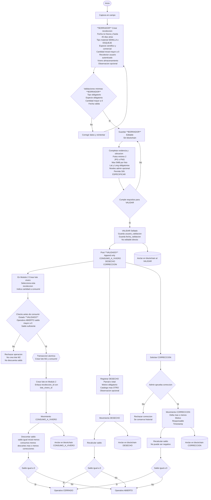
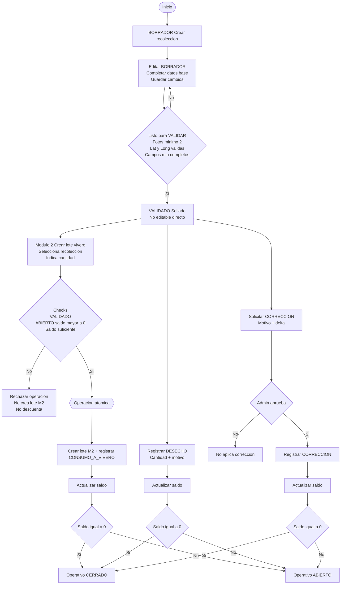
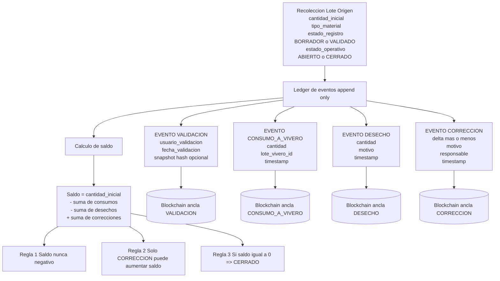
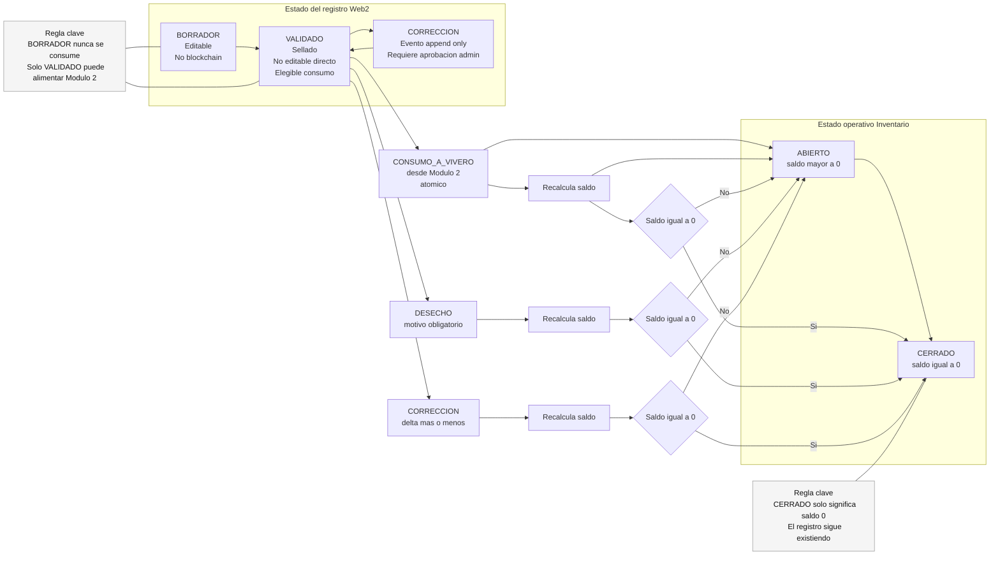

**diagrama Mermaid** en base a **proceso del Módulo 1 — Recolección**

---

## 2) Diagrama Mermaid — Proceso operativo (BORRADOR → VALIDADO → consumo/descarte/corrección)

---

## 3) Diagrama Mermaid — Modelo de eventos (append-only + cálculo de saldo)

Este diagrama muestra que **no editamos el pasado**: solo agregas eventos, y el saldo sale de sumar/restar.

---
## 4) **Estado del registro (Web2)** vs **Estado operativo (inventario)**.
La idea clave: **VALIDADO no significa agotado**, y **CERRADO no significa borrado**.

