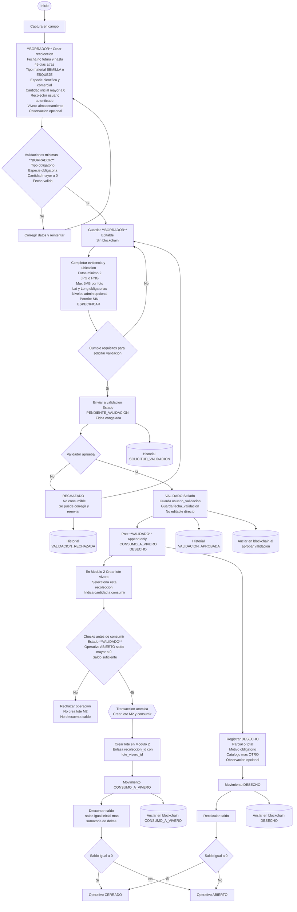
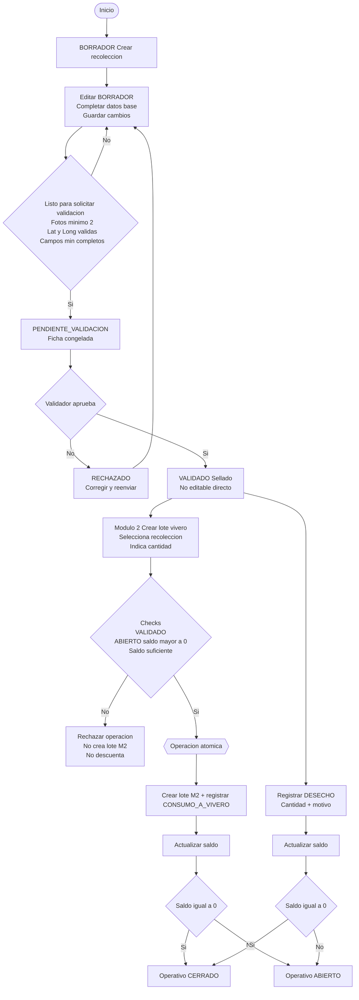
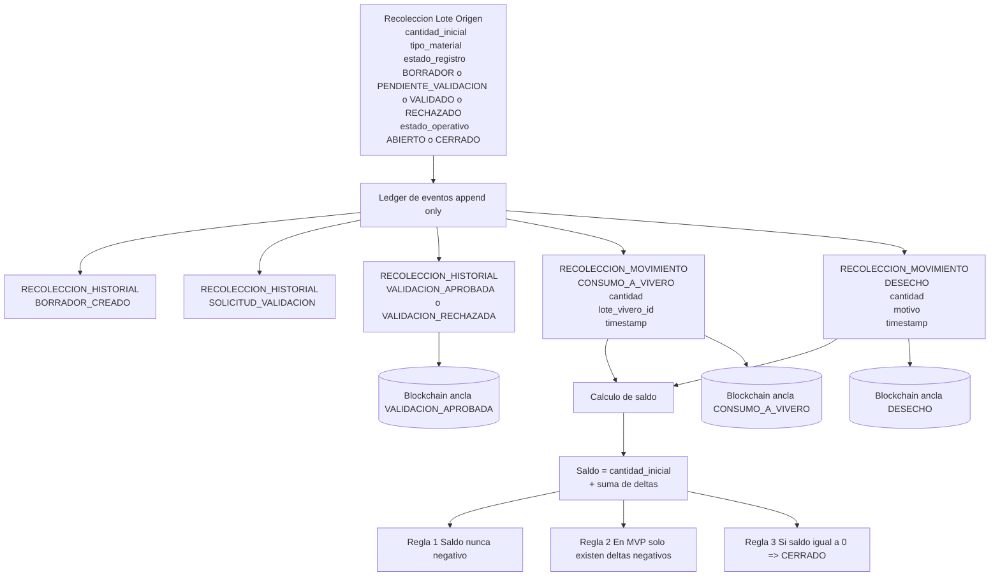
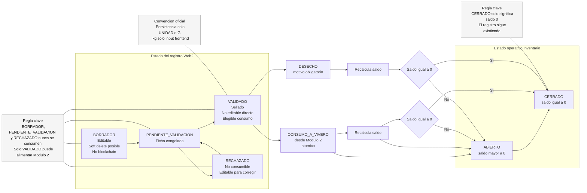

**diagrama Mermaid** en base a **proceso del Módulo 1 — Recolección**

```mermaid
flowchart TD
  %% =========================
  %% MODULO 1 — RECOLECCION (LOTE ORIGEN)
  %% =========================

  start([Inicio]) --> b0[Captura en campo]

  b0 --> b1[**BORRADOR** Crear recoleccion
  Fecha no futura y hasta 45 dias atras
  Tipo material SEMILLA o ESQUEJE
  Especie cientifico y comercial
  Cantidad inicial mayor a 0
  Recolector usuario autenticado
  Vivero almacenamiento
  Observacion opcional]

  b1 --> vmin{Validaciones minimas **BORRADOR**
  Tipo obligatorio
  Especie obligatoria
  Cantidad mayor a 0
  Fecha valida}

  vmin -- No --> fix1[Corregir datos y reintentar]
  fix1 --> b1
  vmin -- Si --> b2[Guardar **BORRADOR**
  Editable
  Sin blockchain]

  b2 --> evloc[Completar evidencia y ubicacion
  Fotos minimo 2
  JPG o PNG
  Max 5MB por foto
  Lat y Long obligatorias
  Niveles admin opcional
  Permite SIN ESPECIFICAR]

  evloc --> reqVal{Cumple requisitos para solicitar validacion}
  reqVal -- No --> b2
  reqVal -- Si --> pend[Enviar a validacion
  Estado PENDIENTE_VALIDACION
  Ficha congelada]

  pend --> rev{Validador aprueba}
  rev -- No --> rej[RECHAZADO
  No consumible
  Se puede corregir y reenviar]
  rej --> b2
  rev -- Si --> val[VALIDADO Sellado
  Guarda usuario_validacion
  Guarda fecha_validacion
  No editable directo]

  val --> post[Post **VALIDADO** Append only
  CONSUMO_A_VIVERO
  DESECHO]

  %% =========================
  %% CONSUMO AUTOMATICO HACIA MODULO 2
  %% =========================
  post --> m2[En Modulo 2 Crear lote vivero
  Selecciona esta recoleccion
  Indica cantidad a consumir]

  m2 --> check{Checks antes de consumir
  Estado **VALIDADO**
  Operativo ABIERTO saldo mayor a 0
  Saldo suficiente}

  check -- No --> err1[Rechazar operacion
  No crea lote M2
  No descuenta saldo]

  check -- Si --> atomic{{Transaccion atomica
  Crear lote M2 y consumir}}

  atomic --> ok1[Crear lote en Modulo 2
  Enlaza recoleccion_id con lote_vivero_id]

  ok1 --> mov1[Movimiento CONSUMO_A_VIVERO]
  mov1 --> saldo1[Descontar saldo
  saldo igual inicial mas sumatoria de deltas]

  saldo1 --> close1{Saldo igual a 0}
  close1 -- Si --> cerr[Operativo CERRADO]
  close1 -- No --> ab[Operativo ABIERTO]

  %% =========================
  %% DESECHO
  %% =========================
  post --> des[Registrar DESECHO
  Parcial o total
  Motivo obligatorio
  Catalogo mas OTRO
  Observacion opcional]

  des --> mov2[Movimiento DESECHO]
  mov2 --> saldo2[Recalcular saldo]
  saldo2 --> close2{Saldo igual a 0}
  close2 -- Si --> cerr
  close2 -- No --> ab

  %% =========================
  %% BLOCKCHAIN MVP
  %% =========================
  pend --> ev1[(Historial SOLICITUD_VALIDACION)]
  rej --> ev2[(Historial VALIDACION_RECHAZADA)]
  val --> ev3[(Historial VALIDACION_APROBADA)]
  val --> bc1[(Anclar en blockchain al aprobar validacion)]
  mov1 --> bc2[(Anclar en blockchain CONSUMO_A_VIVERO)]
  mov2 --> bc3[(Anclar en blockchain DESECHO)]
```

---

## 2) Diagrama Mermaid — Proceso operativo (BORRADOR → PENDIENTE_VALIDACION → VALIDADO/RECHAZADO)

```mermaid id="op_m1_recoleccion"
flowchart TD
  start([Inicio]) --> b0[BORRADOR Crear recoleccion]
  b0 --> b1[Editar BORRADOR
  Completar datos base
  Guardar cambios]

  b1 --> req{Listo para solicitar validacion
  Fotos minimo 2
  Lat y Long validas
  Campos min completos}

  req -- No --> b1
  req -- Si --> pend[PENDIENTE_VALIDACION
  Ficha congelada]

  pend --> dec{Validador aprueba}
  dec -- No --> rejState[RECHAZADO
  Corregir y reenviar]
  rejState --> b1
  dec -- Si --> val[VALIDADO Sellado
  No editable directo]

  %% Consumo automatico hacia Modulo 2
  val --> m2[Modulo 2 Crear lote vivero
  Selecciona recoleccion
  Indica cantidad]

  m2 --> check{Checks
  VALIDADO
  ABIERTO saldo mayor a 0
  Saldo suficiente}

  check -- No --> rej[Rechazar operacion
  No crea lote M2
  No descuenta]
  check -- Si --> atom{{Operacion atomica}}
  atom --> ok[Crear lote M2 + registrar CONSUMO_A_VIVERO]
  ok --> sal1[Actualizar saldo]
  sal1 --> s0{Saldo igual a 0}
  s0 -- Si --> cerr[Operativo CERRADO]
  s0 -- No --> ab[Operativo ABIERTO]

  %% Descarte
  val --> des[Registrar DESECHO
  Cantidad + motivo]
  des --> sal2[Actualizar saldo]
  sal2 --> s1{Saldo igual a 0}
  s1 -- Si --> cerr
  s1 -- No --> ab

```

---

## 3) Diagrama Mermaid — Ciclo de vida + movimientos de saldo

Este diagrama muestra la separación entre:

- historial del registro (`RECOLECCION_HISTORIAL`)
- y ledger de inventario (`RECOLECCION_MOVIMIENTO`)

```mermaid id="eventos_m1_recoleccion"
flowchart TD
  a0[Recoleccion Lote Origen
  cantidad_inicial
  tipo_material
  estado_registro BORRADOR o PENDIENTE_VALIDACION o VALIDADO o RECHAZADO
  estado_operativo ABIERTO o CERRADO] --> a1[Ledger de eventos append only]

  a1 --> e1[RECOLECCION_HISTORIAL
  BORRADOR_CREADO]

  a1 --> e2[RECOLECCION_HISTORIAL
  SOLICITUD_VALIDACION]

  a1 --> e3[RECOLECCION_HISTORIAL
  VALIDACION_APROBADA o VALIDACION_RECHAZADA]

  a1 --> e4[RECOLECCION_MOVIMIENTO
  CONSUMO_A_VIVERO
  cantidad
  lote_vivero_id
  timestamp]

  a1 --> e5[RECOLECCION_MOVIMIENTO
  DESECHO
  cantidad
  motivo
  timestamp]

  %% Reglas de saldo
  e4 --> calc[Calculo de saldo]
  e5 --> calc
  calc --> formula[Saldo = cantidad_inicial
  + suma de deltas]

  formula --> rule1[Regla 1 Saldo nunca negativo]
  formula --> rule2[Regla 2 En MVP solo existen deltas negativos]
  formula --> rule3[Regla 3 Si saldo igual a 0 => CERRADO]

  %% Blockchain MVP
  e3 --> bc1[(Blockchain ancla VALIDACION_APROBADA)]
  e4 --> bc2[(Blockchain ancla CONSUMO_A_VIVERO)]
  e5 --> bc3[(Blockchain ancla DESECHO)]
```

---
## 4) **Estado del registro (Web2)** vs **Estado operativo (inventario)**.
La idea clave: `RECOLECCION_HISTORIAL` y `RECOLECCION_MOVIMIENTO` coexisten.  
`VALIDADO` no significa agotado, y `CERRADO` no significa borrado.

```mermaid id="maquina_estados_m1"
flowchart LR
  %% =========================
  %% DIMENSION 1: ESTADO DEL REGISTRO (WEB2)
  %% =========================
  subgraph R[Estado del registro Web2]
    r0[BORRADOR
    Editable
    Soft delete posible
    No blockchain] --> r05[PENDIENTE_VALIDACION
    Ficha congelada]
    r05 --> r1[VALIDADO
    Sellado
    No editable directo
    Elegible consumo]
    r05 --> r2[RECHAZADO
    No consumible
    Editable para corregir]
    r2 --> r05
  end

  %% =========================
  %% DIMENSION 2: ESTADO OPERATIVO (INVENTARIO)
  %% =========================
  subgraph O[Estado operativo Inventario]
    o0[ABIERTO
    saldo mayor a 0] --> o1[CERRADO
    saldo igual a 0]
  end

  %% =========================
  %% TRANSICIONES QUE AFECTAN INVENTARIO (EVENTOS)
  %% =========================
  r1 --> c1[CONSUMO_A_VIVERO
  desde Modulo 2
  atomico] --> o0
  c1 --> t1[Recalcula saldo] --> o0
  t1 --> z1{Saldo igual a 0}
  z1 -- Si --> o1
  z1 -- No --> o0

  r1 --> d1[DESECHO
  motivo obligatorio] --> t2[Recalcula saldo] --> z2{Saldo igual a 0}
  z2 -- Si --> o1
  z2 -- No --> o0

  %% =========================
  %% REGLAS CLAVE
  %% =========================
  note1[Regla clave
  BORRADOR, PENDIENTE_VALIDACION y RECHAZADO nunca se consumen
  Solo VALIDADO puede alimentar Modulo 2]:::note
  note2[Regla clave
  CERRADO solo significa saldo 0
  El registro sigue existiendo]:::note
  note3[Convencion oficial
  Persistencia solo UNIDAD o G
  kg solo input frontend]:::note

  note1 --- r0
  note1 --- r05
  note1 --- r1
  note1 --- r2
  note2 --- o1
  note3 --- r1

  classDef note fill:#f5f5f5,stroke:#999,stroke-width:1px,color:#111;
```
