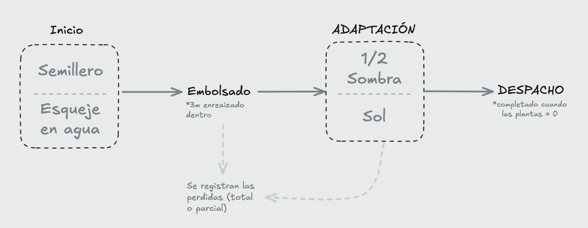

# Módulo 2 — Vivero (Maduración y trazabilidad pre-plantación)

## 1. Propósito

El **Módulo 2 (Vivero)** registra el proceso de **maduración y fortalecimiento** de material biológico (semillas o esquejes) **antes** de su plantación en campo (Módulo 3).
Su objetivo es generar un historial auditable de:

* **cuánta “vida” entra y sale** del proceso,
* **qué mermas ocurren** y por qué,
* **qué evidencias existen** (fotos y notas),
* y qué decisiones fueron **validadas** (aprobaciones y correcciones).

Este módulo aporta trazabilidad operativa y datos para auditoría. La conexión con bonos de carbono se fortalece cuando se integra con **Plantación y Monitoreo** (módulos posteriores).

---

## 2. Conceptos clave

### 2.1. Lote de vivero (regla principal de trazabilidad)

* Un **lote de vivero** se crea usando material biológico proveniente de **un solo lote origen** del Módulo 1.
* **No se permite mezclar** varios lotes origen en un mismo lote de vivero.

✅ Esto mantiene trazabilidad fuerte: mermas y despachos parciales siempre se atribuyen a un origen único.

### 2.2. No división ni fusión en vivero

* En vivero **no se divide** un lote en sub-lotes.
* En vivero **no se fusionan** lotes.

> En cambio, en Módulo 3 (Plantación) sí se permite usar **1 a N lotes** y realizar **despachos parciales** de cada lote.

### 2.3. “Vida” y unidades

* En **Inicio**, se registran **unidades iniciales en proceso**:

  * semillas (en semillero) o
  * esquejes (en agua)
* La contabilidad estricta de **plantas vivas** comienza desde **Embolsado**, cuando ya existe planta en bolsa/maceta.

---

## 3. Flujo del proceso (etapas)

El lote atraviesa 4 etapas obligatorias:

### 3.1. Inicio

Registro del arranque del lote según material:

* Semilla → semillero (germinación)
* Esqueje → agua (enraizamiento inicial)

Datos mínimos esperados:

* fecha_evento (inicio)
* responsable
* vivero
* unidades_iniciales
* observaciones
* (ideal) evidencia fotográfica

### 3.2. Embolsado

La planta pasa a bolsa/maceta para fortalecer raíz en entorno controlado.
Desde aquí se gestiona “vida” como **plantas vivas**.

Se registra:

* plantas_vivas_iniciales (al entrar a la etapa)
* mermas (eventos)
* observaciones
* evidencia por evento

### 3.3. Adaptación (flexible)

La adaptación se registra como **cambios de ambiente** (eventos), no como un camino rígido.

Ambientes posibles (no obligatorios):

* Media Sombra
* Sol Directo
* (opcional) Sombra, si aplica

Reglas:

* Puede ir directo a Sol Directo, quedarse en Media Sombra o alternar.
* Permite “ida y vuelta” entre ambientes.
* Estos cambios son para **análisis histórico y manejo agronómico**; su anclaje en blockchain es “nice to have”, no “must”.

### 3.4. Despacho

Marca plantas listas para plantarse. Se permiten **despachos parciales** (porque en campo no siempre se planta todo en una sola salida).

Cada despacho registra:

* cantidad_despachada
* fecha_evento
* destino (ideal: referencia a Plantación/Módulo 3)
* evidencia / notas si aplica

El lote queda finalizado cuando:

* la cantidad viva llega a **cero**, o
* se registra la **salida total** del vivero.

---

## 4. Eventos (modelo audit-friendly)

El sistema se basa en eventos “append-only” (se agregan, no se reescriben) para mantener trazabilidad.

Eventos típicos:

* **MERMA**: pérdida con causa (hongos, hídrico, mecánico, etc.), cantidad y notas.
* **DESPACHO_PARCIAL / DESPACHO_TOTAL**
* **CAMBIO_AMBIENTE** (Adaptación)
* **EVIDENCIA** (foto/adjunto por evento)
* **NOTA / OBSERVACIÓN**
* **CORRECCIÓN** (evento correctivo con delta y motivo)
* (futuro) **TRASLADO_VIVERO** (evento de cambio de vivero físico)

---

## 5. Estados del registro: PENDIENTE, COMPLETO y CORRECCIÓN

### 5.1. PENDIENTE (borrador)

* Permite registrar datos mínimos y seguir completando información.
* Mientras esté PENDIENTE, se pueden **editar campos operativos** (porque aún no es registro “final”).

Mínimo sugerido para permitir PENDIENTE:

* lote seleccionado (origen único)
* fecha_evento
* responsable
* vivero
* cantidad/unidades base

### 5.2. COMPLETO (validado)

* No se permite edición.
* Debe cumplir validaciones y requisitos.
* Generalmente es el punto donde se puede **anclar** (hash) a blockchain (según estrategia).

### 5.3. CORRECCIÓN (post-validación)

Si se detecta un error después de COMPLETO:

* No se edita el registro original.
* Se crea un **Evento Correctivo** con:

  * delta (+/-)
  * motivo
  * responsable
  * aprobación (si aplica)
* El correctivo también puede anclarse a blockchain.

---

## 6. Evidencia fotográfica y excepciones

* La evidencia fotográfica se registra **por evento**, no solo por etapa.
* Para pasar a COMPLETO se requiere:

  * evidencia, **o**
  * una **Excepción aprobada por supervisor** (motivo + fecha + responsable + aprobador)

Si luego se obtiene la foto:

* se carga como **evidencia tardía**, quedando en el historial.

---

## 7. Reglas temporales (operación real)

Para reflejar limitaciones de campo:

* `fecha_evento` puede ser en el pasado dentro de un margen definido (ej. **≤ 10 días**)
* `created_at` siempre es la fecha/hora real del registro (ahora)

Restricción:

* no se permiten eventos con `fecha_evento` anterior al inicio de la etapa,
  salvo correcciones justificadas.

---

## 8. Reglas de consistencia de cantidades (conservación de vivos)

* En operación normal, la cantidad de plantas vivas **solo se mantiene o disminuye**.
* Solo puede aumentar por **corrección** (auditada).

Relación conceptual:

> vivas_final = vivas_inicial − mermas − despachos (+/− ajustes correctivos)

El sistema permite mermas elevadas sin bloquear el proceso (porque pueden ocurrir y deben quedar registradas).

---

## 9. Auditoría y estrategia blockchain (MVP)

Para evitar costos de gas innecesarios:

* Se registran eventos en la base de datos (append-only).
* Un **supervisor** decide cuándo cerrar/validar y cuándo anclar en blockchain:

  * recomendado: anclaje por **cierre de etapa** o hitos relevantes (no por cada evento)

Roles sugeridos:

* Responsable: registra y completa datos (PENDIENTE)
* Supervisor: valida (COMPLETO) y autoriza anclaje
* Auditor/Consulta: solo lectura

(En futuro: multi-aprobación por varias personas antes de anclaje).

---

## 10. Alcance MVP y futuro

**MVP incluye**

* Origen único por lote vivero
* Eventos append-only
* Estados PENDIENTE/COMPLETO/CORRECCIÓN
* Mermas con causa + evidencia por evento
* Adaptación flexible por cambios de ambiente
* Despachos parciales (para conexión con Módulo 3)
* Aprobación por supervisor para completar/anclar

**Futuro**

* Traslado de vivero físico como evento
* Multi-aprobación antes de blockchain
* Sincronización offline-first de evidencias (foto local → subida posterior)

